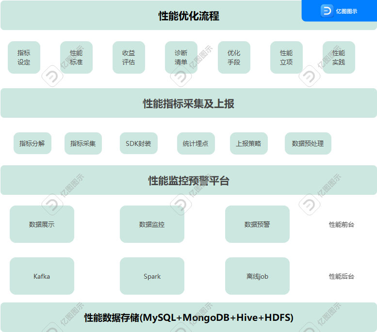

## 体系总览--性能优化体系及关键指标设定

### 性能优化体系概览

包括3个方面：性能优化流程，性能指标采集及上报，性能监控预警平台

### 性能优化流程

`指标设定--性能标准--收益评估--诊断清单--优化手段--性能立项--性能实践`

`指标设定：`我们要选择什么样的指标

`性能标准：`性能优化目标是怎么样的，优化到什么程度合适。比如优化app里面的H5页面打开速度，确定的指标是秒开率，在1秒内可以打开的请求比例就是它的性能指标。

`收益评估：`需要关联产品模板进行收益评估。比如列表页到详情页的转化率能不能提升，用户跳出率可不可以降低

`诊断清单：`把业务代码接入性能监控预警平台，根据性能标准给出诊断清单。比如诊断出性能问题，就可以结合性能标准和诊断清单，确定响应的优化手段。

`性能项目立项：`赢得产品经理，后端同事支持，让优化顺利执行下去

`性能实践：`经过优化之后发起项目上线，并跟踪进行效果评估，结合场景把这些项目成果以文档或代码的形式沉淀下来。

制定优化实践，确保新人也可以执行是优化成果得以长期保持的必要保障。

### 性能指标采集与上报

主要内容就是把前面提到的性能指标以代码的形式分解落地确保可以采集，然后在SDK封装后集合统计埋点，最后根据实际情况，制定上报策略。

在上报之前，我们还需要将一些脏数据，明显异常的数据丢弃掉。

### 性能监控预警平台

当指标超过某一监控阈值时，性能监控预警平台会通过邮件或短信给我们发送预警信息。

在构造上，性能监控预警平台分为后台和前台两部分，

`性能数据处理后台：`

主要是在性能采集数据上报到性能平台后，对数据进行预处理，数据清晰和数据计算，然后生成前台可视化所需数据。

`性能数据处理前台：`

主要是对核心数据指标进行可视化展现，对性能数据波动进行监控，对超出阈值的数据给出短信或邮件报警。

### 如何设定性能关键指标

关注什么样的指标以及关键指标的设定和标准问题

关注什么样的指标呢？

关注指标需要满足两点：

一是可衡量，就是可以通过代码来度量

二是关注以用户为中心的关键结果和真实体验

关注结果--就是用户真正关心什么，我们就需要在哪个方向上努力。

比如当用户进入商品详情页面，他关心的是这个商品怎么样，具体到页面上就是商品描述，商品头图，商品价格和购买按钮这些关键信息。

真实体验---就是用户使用产品的感受。

比如当用户进入列表页，在滑动过程中，页面加载突然跳出一个弹窗，会很影响用户体验。

所以根据以上分析，性能优化关键指标设定3个方面：`加载，交互，视觉稳定指标`

`加载：`主要集中在加载方面。特别是白屏时间和首屏时间。

`交互`:FID指标，首次输入延迟，指标必须精良少于100ms，有的公司使用PSI，石军变化率，衡量标准是小于20%

`视觉稳定性指标`:(CLS:布局偏移量，是指页面从一帧切换到另外一帧时，视线中不稳定元素的偏移情况)。采集方法除了依赖Google的Lighthouse做本地采集，目前还没有好的方案。

  
**`白屏时间`**

指的是从输入内容回撤(包括刷新，跳转等方式)后到页面开始出现第一个字符的时间。这个过程包括查缓存，dns查询，tcp连接，发送http请求，返回html文档，解析html文档。

`标准时间是300ms`

`哪些因素会导致白屏时间过长呢？原因有很多，主要有：`

DNS查询时间长，建立TCP请求，链接太慢，服务器处理请求速度太慢，客户端下载，解析，渲染时长过长，没有做Gzip压缩，缺乏本地离线化处理等等。

首屏时间：可以拆分为白屏时间，数据接口响应时间，图片资源加载等

白屏时间：数据接口响应时间可以直接从后端服务中获取不需要前端再重复计算。

