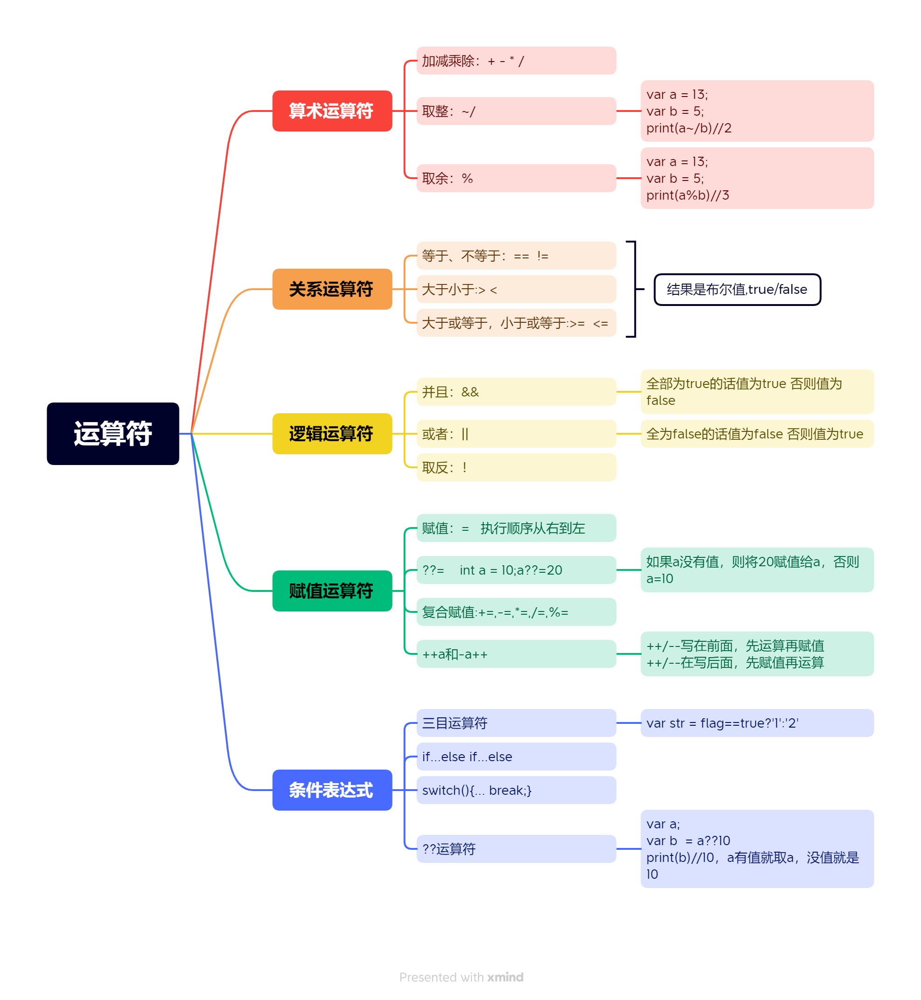

## Dart 运算符,条件表达式,类型转换



### Dart类型转换

**1、Number类型与String类型之间转换---toString()**

```dart
main(){
  int num = 123;
  var myStr = num.toString();
  print(myStr)//'123'
  print(myStr is String)//true
}
```

**2、String类型转换成Number类型----`int.parse()/double.parse()`**

```dart
main(){
  String str='123';
  var myNum = int.parse(str);
  print(myNum)//123
  print(myNum is double)//true
} 
```

**3、其他类型转换为Booleans类型---通过判断条件判断**

(1)、isEmpty：判断字符串是否为空

(2)、isNaN:判断是否为NaN

```dart
main(){
  var myNum = 0/0;
  if(myNum.isNaN){
    print('这是NaN');
  }
}
```

**4、使用try...catch(e){}**

如果从服务器获取的数据为空，程序就不会执行，就有可能会导致转换失败，这时候我们需要使用try...catch方法来判断.所以为了代码更具完整，建议使用try...catch

```dart
main(){
  String str='';
  try{
    var myNum = double.parse(str);
    print(myNum is double);
  }catch(err){
    print('报错了')
  }
}
```

