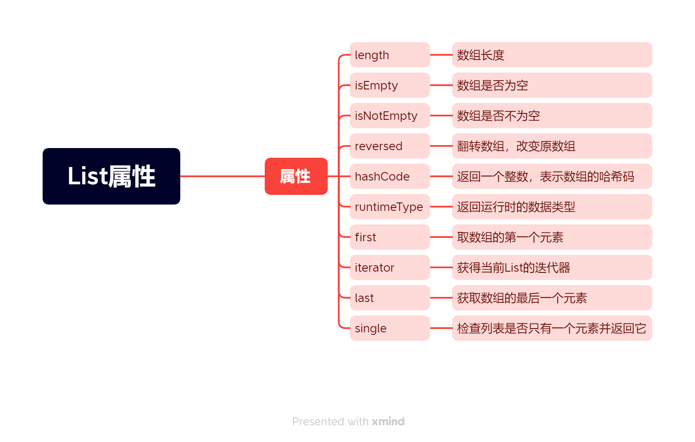
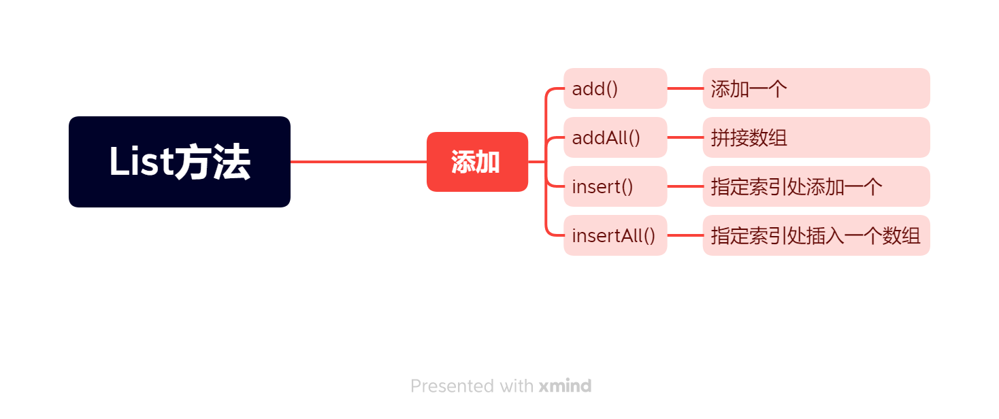
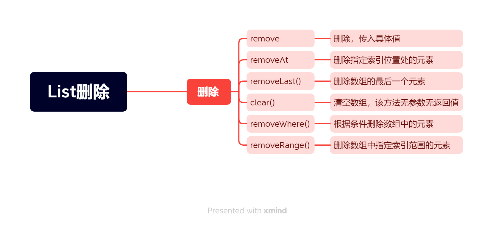
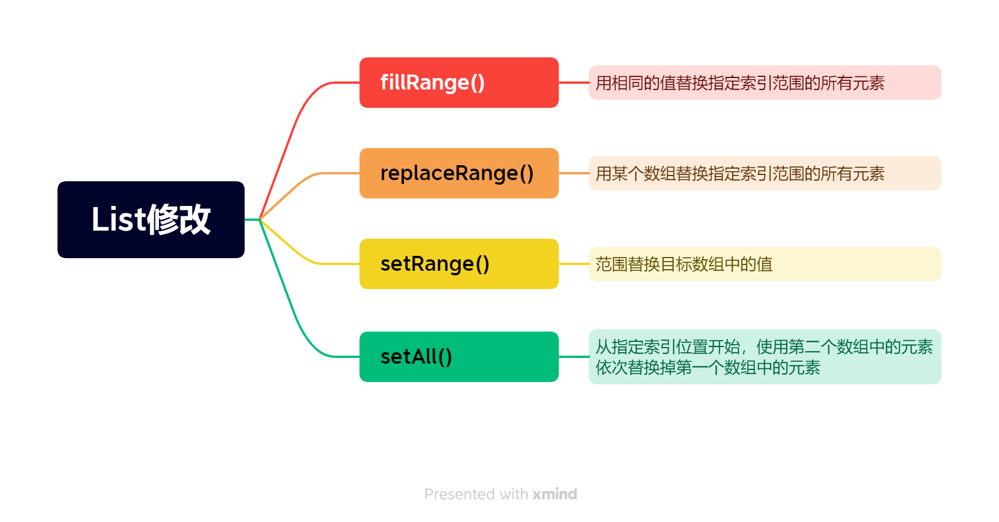
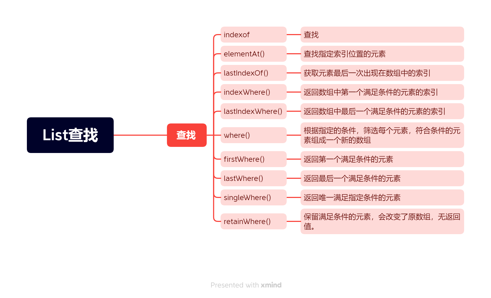
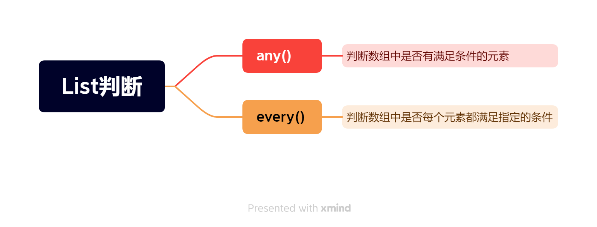
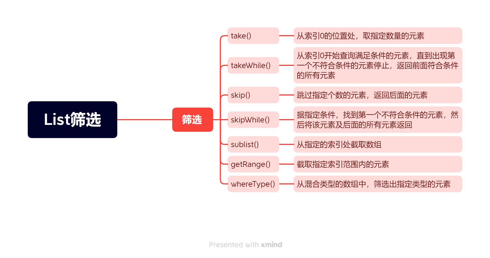
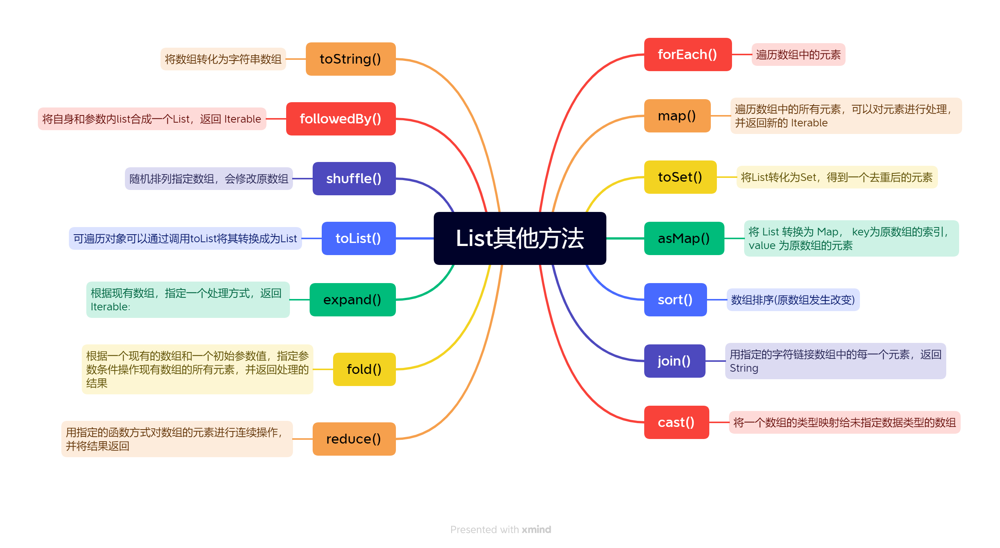

## List数据类型用法

### List定义

1、静态定义

```dart
List list = [1,2,3];
```
2、动态定义

```dart
List list = new List();
```

当声明List数据类型时，用List关键词去声明是最保险的，尽量不要使用var，因为使用var声明的List，需要看后面的值，才能推测出来变量类型。

## List属性



### List的属性---length

1、List的length属性

```dart
main(){
  List arr = [1,2,3];
  print(arr.length);//3
}
```

### 翻转数组---reversed

```dart
List arr = [1,2,3];
print(arr.reversed);//1,2,3
```

> 使用reversed翻转数组，得到的并不是一个数组，该属性也不会改变原数组。需要使用toList方法才能成为一个新数组.

```dart
main(){
  List arr = [1,2,3,4];
  List arr1 = arr.reversed.toList();
  print(arr1);//[4,3,2,1]
  print(arr==arr1);//false
}
```

### 是否为空/是否不为空---isEmpty/isNotEmpty

```dart
main(){
  List arr = [1,2,3];
  print(arr.isEmpty);//false
  List arr1 = [];
  print(arr1.isEmpty);//true
  print(arr1.isNotEmpty);//false
}
```

> 判断数组是否为空或不为空，还可以使用`arr.length!=0`来进行判断

### hashCode---返回数组的哈希码

```dart
main(){
  List arr = [1,2,3];
  print(arr.hashCode);//122730370
}
```

### runtimeType---返回数组运行时的数据类型

```dart
main(){
  List<String> arr = ['1','2'];
  List<int> arr1 = [4,5,6];
  print(arr.runtimeType);//List<String>
  print(arr1.runtimeType);//List<int>
}
```

### first/last---获取数组第一个元素/获取数组最后一个元素

```dart
main(){
  List arr = ['周一','周二','周三'];
  print(arr.first);//周一
  print(arr.last);//周三
}
```

> 获取数组第一个元素，还可以使用arr[0];获取最后一个

### iterator --- 获取当前List迭代器

```dart
main(){
  List arr = [1,2,3];
  print(arr.iterator);//Instance of 'ListIterator<dynamic>'
}
```

### single---检查数组是否只有一个元素并返回它

```dart
main(){
  List arr = [1];
  print(ar.single);//1
}
```
> 如果有多个元素，使用single，则会引发exception

```dart
main(){
  List arr = [1,2,3];
  print(arr.single);//Bad state: Too many elements
}
```

## List的方法--添加方法



### add()---向结尾添加一个元素

```dart
main(){
  List arr = [1,2,3];
  arr.add(4);
  print(arr);//[1,2,3,4]
}
```
> 不能向一个固定长度的数组使用add()，否则会抛出异常

```dart
main(){
  List<String> arr = List.filled(1,'');
  arr.add('2');//Unsupported operation: Cannot add to a fixed-length list
}
```

### addAll()---合并两个数组,会改变合并的数组

```dart
main(){
  List arr = [1,2,3];
  List arr1 = ['1','2','3'];
  arr.addAll(arr1);
  print(arr);//[1,2,3,'1','2','3']
  print(arr1);//['1','2','3']
}
```

### insert()---在指定索引处添加一个值

```dart
main(){
  List arr = ['1','2','3'];
  // 在索引为2的地方插入123 
  arr.insert(2,'123');
  print(arr);//['1','2','123','3']
}
```

### insertAll()---在指定索引处添加一个数组

```dart
main(){
  List arr = ['1','2','3'];
  List arr1 = [5,6];

  // 在索引为2的地方插入123 
  arr.insertAll(2,arr1);
  print(arr);//['1','2',5,6,'3']
}
```
> 使用insert/insertAll需要注意：被添加的数组必须是非固定长度；第一个参数必须是非负的，且不大于添加数据前数据的长度

## List的方法--删除方法



### remove---删除指定元素

删除后数组的长度减 1 ，即原数组会发生改变。`该方法不能运用于固定长度的数组`

```dart
main(){
  List<String> list = ["周一", "周二"];
  list.remove("周一");
  print(list); // ['周二']
}
```

删除元素时，如果数组中有多个符合条件的值,`会删除数组中第一个符合条件的元素`

```dart
main(){
  List<String> list = ["周一", "周一", "周二"];
  list.remove("周一");
  print(list); // [周一, 周二]
}
```

### removeAt()---删除指定索引位置处的元素，参数为 int 类型，代表索引值

```dart
List<String> list = ["周一", "周一", "周二"];
print(list.removeAt(0)); // 周一
print(list); // ['周一', '周二']
```

> 使用 removeAt() 方法,参数的范围必须在 [ 0 , List.length - 1 ] 之间。

### removeLast()---删除数组的最后一个元素,会改变原数组

该方法没有参数，返回被删除的元素，和 list.removeAt(list.length - 1) 是一样的，dart提供了更加简单方便的方法.

```dart
List<String> list = ['周三', '周四', '周五', '周六', '周天'];
print(list.removeLast()); // 周天
print(list); // ['周三', '周四', '周五', '周六']
```

> 使用removeLast方法，不能为固定长度的数组，不能是空数组

### removeWhere()---根据条件删除数组中的元素

该方法无返回值，参数的返回值为 bool 类型:

```dart
List<String> list2 = ['周三', '周四', '周五', '周六', '周天'];
// 删除数组中等于周六的元素
list2.removeWhere((e) => e == '周六'); 
print(list2); // ['周三', '周四', '周五', '周天']

// 删除数组元素中包含周的元素
list2.removeWhere((e) => e.contains('周'));
print(list2); // []
```

### removeRange()---删除数组中指定索引范围的元素

该方法无返回值，第一个参数 start 为开始删除元素的索引，第二个参数 end 为结束删除元素的索引，取值范围为 (start, end)，也就是含头不含尾

> 语法： void removeRange(int start, int end);

```dart
List<String> list2 = ['周三', '周四', '周五', '周六', '周天'];
list2.removeRange(1, 3); 
print(list2); // ['周三', '周六', '周天'];
```

使用 removeRange 方法有两点需要注意，否则会抛出异常:start 和 end 必须是有效的，取值范围为 0 <= start <= end <= length。被操作的数组不能是固定长度的数组。

## List的方法--修改



### fillRange()---用相同的值替换指定索引范围的所有元素

取值范围 (start, end)，也就是`含头不含尾`,`索引的长度不能超过数组的长度`，否则会报错

```dart
List<String> list = ["周一", "周一", "周二"];
list.fillRange(1, 3, '周末');
print(list); //  ["周一", "周末", "周末"]
```

上面的代码中，起始位置为1，结束位置是3，但遵循含头不含尾。那就是在索引为1的位置和索引为2的位置上替换。结束的值减去起始位置的值不能超过数组的长度，否则会报错.

### replaceRange()---某个数组替换指定索引范围的所有元素，含头不含尾

```dart
List<String> list = ["周一", "周一", "周二"];
list.replaceRange(1, 3, ['周末', 'hah', 'sss']);
print(list); // [周一, 周末, hah, sss]

List<String> list2 = ['周三', '周四', '周五', '周六', '周天'];
list2.replaceRange(1, 3, ['周末', 'hah', 'sss']);
print(list2); // [周三, 周末, hah, sss, 周六, 周天]
```

### setRange()---范围替换目标数组中的值，含头不含尾。

1、start 和 end 表示需要修改的元素索引范围，包含start，不包含end。从索引start开始，用end减去start的值表示需要替换元素的个数

2、第三个参数是个数组，用此数组的部分元素替换目标数组中的索引范围的元素，如果此数组中的元素个数不够需要替换的元素个数，会报错。

3、如果第三个参数中数组的长度大于需要替换的元素个数，可以设置第四个参数skipCount，表示跳过 iterable 中的前面几个元素，默认为 0。

```dart
// 例1：skipCount默认为0
List<String> list = ["周1", "周2", "周3"];
List<String> list2 = ['周三', '周四', '周五', '周六', '周天'];
List<String> targetArr = ['周末', 'hah', 'sss'];
// 下面表示用targetArr中第一个和第二个元素替换list和list2中下标1-3（不包含end）的元素
// 
list.setRange(1, 3, targetArr);
print(list); // [周1, 周末, hah]
//start,end是针对目标数组，第四个参数是针对需要替换的数组的，是其索引，从替换数组的哪个位置开始替换
list2.setRange(1, 3,targetArr, 1);
print(list2); // [周三, hah, sss, 周六, 周天]

// 例2：设置第四个参数skipCount
list.setRange(0, 2, list2, 2);
// 将 list 中 下标0和1 的元素替换成list2中跳过2个的元素，即下标为2和3的元素
print(list); // [sss, 周六, hah]
```

### setAll()---从指定索引位置开始，使用第二个数组中的元素依次替换掉第一个数组中的元素。

> 语法： void setAll(int index, Iterable<E> iterable)

```dart
List<String> list = ["周1", "周2", "周3"];
List<String> list2 = ['周三', '周四', '周五', '周六', '周天'];
//从list2的第二个元素开始，用list的数据替换list2的元素
list2.setAll(1, list);
print(list2); // [周三, 周1, 周2, 周3, 周天]
```

使用setAll()注意：

1、此方法不会增加数组的长度

2、index必须为非负且不大于目标数组的length

3、index + list.length <= list2.length ,否则会报错。即 iterable的长度 + index 不能大于要修改的数组的长度。

## List的方法---查找方法



### elementAt()---查找指定索引位置的元素

> 语法： E elementAt(int index)

参数为索引，返回指定位置的值

```dart
List<String> list2 = ['周三', '周四', '周五', '周六', '周天'];
print(list2.elementAt(2)); // 周五
```

### contains()---判断数组中是否含有指定的元素,是百分百匹配,返回true/false

```dart
List<String> list = ["周1", "周2", "周3"];
print(list.contains('周1')); // true
print(list.contains('周')); // false
```

### indexOf()---获取指定元素在数组中的索引

> 语法： int indexOf(E element, [int start = 0]);

返回值为 int ，第一个参数为要查找的元素，第二个参数为从哪个索引开始查找，是可选参数，默认为 0。`如果没有找到，则返回-1`

```dart
List<String> list2 = ['周三', '周四', '周五', '周六', '周天'];
int Fri = list2.indexOf('周五'); 
int Sun = list2.indexOf('周天', 2); 
int Mon = list2.indexof('周一');
print(Fri); // 2 
print(Sun); // 4
print(Mon);//-1
```

### lastIndexOf()---获取元素最后一次出现在数组中的索引

> 语法： int lastIndexOf(E element, [int start]);

和 indexOf 方法一样，只不过是可以认为从后向前倒序查找。找到了就不会再执行了。返回的是索引值，依然是从左到右数的

```dart
List<String> list2 = ['周三', '周四', '周五', '周三', '周六', '周天'];
int Wed = list2.lastIndexOf('周三');
int Sat = list2.lastIndexOf('周六');
print(Wed); // 3
print(Sat);//4
```

### indexWhere()---返回数组中第一个满足条件的元素的索引

> 语法： int lastIndexWhere(bool test(E element), [int? start])

返回值为 int ，第一个参数为要查找的条件，返回 bool，如果存在满足条件的元素返回 true，反之返回 false 。第二个参数为从哪个索引开始查找，是可选参数，默认为 0。

```dart
List<String> list2 = ['周三', '周四', '周五', '周三', '周六', '周天'];
int a = list2.indexWhere((e) => e == "周三");
int b = list2.indexWhere((e) => e == "周三", 2);
int c = list2.indexWhere((e) => e == "周日");
print(a); // 0
print(b); // 3
print(c); // -1
```

### lastIndexWhere()---返回数组中最后一个满足条件的元素的索引

> int lastIndexWhere(bool test(E element), [int? start]);

```dart
List<String> list2 = ['周三', '周四', '周五', '周三', '周六', '周天'];
print(list2.lastIndexWhere((element) => element == "周三")); // 3
```

### where()---根据指定的条件，筛选每个元素，符合条件的元素组成一个新的数组

> Iterable<E> where(bool test(E element)) => WhereIterable<E>(this, test);

返回值为 Iterable，参数返回值为 bool 类型，符合条件的为 true ，将元素添加到一个新的 Iterable 中。

```dart
List<int> arr = [5, 8, 7, 12, 1, 13, 2, 88];
Iterable<int> li1 = arr.where((e) => e > 10); 
// 注意li1是Iterable 类型的
print(li1); // (12, 13, 88)
List<int> li2 = arr.where((e) => e > 10).toList();//需要使用toList转化为数组
print(li2); // [12, 13, 88]
```

### firstWhere()---返回第一个满足条件的元素：

> E firstWhere(bool test(E element), {E orElse()}) 

返回值为泛型。参数 test 为指定的条件，返回值为 bool ，第二个 orElse 为可选参数，是当数组中没有满足指定条件的元素设置的自定义值。

```dart
List<int> arr = [5, 8, 7, 12, 1, 13, 2, 88];
print(arr.firstWhere((e) => e > 10)); // 12
print(arr.firstWhere((e) => e > 10, orElse: () => 999)); // 12
print(arr.firstWhere((e) => e > 100, orElse: () => 999)); // 999
```

### lastWhere()---返回最后一个满足条件的元素

> E lastWhere(bool test(E element), {E orElse()})

```dart
List<int> arr = [5, 8, 7, 12, 1, 13, 2, 88];
print(arr.lastWhere((e) => e > 10)); // 88
print(arr.lastWhere((e) => e > 10, orElse: () => 999)); // 88
print(arr.lastWhere((e) => e > 100, orElse: () => 999)); // 999
```

### singleWhere()---返回唯一满足指定条件的元素

返回值为泛型，参数 test 为指定的条件，返回值为 bool，第二个参数 orElse 为可选参数，是当数组中没有满足指定条件的元素设置的自定义值。

```dart
List<int> arr = [5, 8, 7, 12, 1, 13, 2, 88];
print(arr.singleWhere((e) => e > 70)); // 88
print(arr.singleWhere((e) => e > 10)); // 报错：Bad state: Too many elements
print(arr.singleWhere(
  (e) => e > 10,
  orElse: () => 110,
)); // 报错
 print(arr.singleWhere((e) => e > 100, orElse: () => 110)); // 110
```

### retainWhere()---保留满足条件的元素，会改变了原数组，无返回值

> void retainWhere(bool test(E element));

```dart
List<int> arr = [5, 8, 7, 12, 1, 13, 2, 88];
arr.retainWhere((e) => e > 10); 
print(arr); // [12, 13, 88]

List<int> arr = [5, 8, 7, 12, 1, 13, 2, 88];
arr.retainWhere((e) => e > 90); 
print(arr); // []
```

## List的方法--判断的方法



### any()---判断数组中是否有满足条件的元素，返回值bool，参数的返回值也为 bool

> bool any(bool test(E element))

any 方法迭代判断数组中的每一个元素，只要有一个元素符合指定的条件则返回 true，反之，只要有一个元素不符合指定的条件则返回 false 。

```dart
List<int> arr = [5, 8, 7, 12, 1, 13, 2, 88];
bool a = arr.any((e) => e > 90); 
print(a); // false
print(arr.any((e) => e > 10)); // true
```

### every()---判断数组中是否每个元素都满足指定的条件

方法的返回值为 bool，参数的返回值也是 bool 。

every 方法迭代判断数组中的每一个元素，如果每个元素都符合指定的条件则返回 true，反之，只要有一个元素不符合指定的条件则返回 false 。和 js 中 every() 方法相似。

```dart
List<int> arr = [5, 8, 7, 12, 1, 13, 2, 88];
bool a = arr.every(e => e > 0);
print(a); // true
```

## List的方法--筛选的方法



### take()---从索引0的位置处，取指定数量的元素

>Iterable<E> take(int count) {
>  return TakeIterable<E>(this, count);
>}

返回值为 Iterable，参数为从索引 0 位置处，取多少个元素。

```dart
List<int> arr = [5, 8, 7, 12, 1, 13, 2, 88];
Iterable<int> a = arr.take(3);
print(a); // (5, 8, 7)
```
如果获取的长度超过了数组的长度，也不会报错，会返回数组中的所有元素。

```dart
List<int> arr = [5, 8, 7, 12, 1, 13, 2, 88];
Iterable<int> a = arr.take(100);
print(a); // (5, 8, 7, 12, 1, 13, 2, 88)
```

### takeWhile()---从索引0开始查询满足条件的元素，直到出现第一个不符合条件的元素停止，返回前面符合条件的所有元素

返回值为 Iterable ， 参数 test 为指定条件，满足返回 true，反之返回 false。

```dart
List<int> arr = [5, 8, 7, 12, 1, 13, 2, 88];
Iterable<int> a = arr.takeWhile((e) => e > 1);
print(a); // (5, 8, 7, 12)
```

### skip()---跳过指定个数的元素，返回后面的元素

```dart
List<int> arr = [5, 8, 7, 12, 1, 13, 2, 88];
Iterable<int> a = arr.skip(3);
print(a); // (12, 1, 13, 2, 88)
```

### skipWhile()---根据指定条件，找到第一个不符合条件的元素，然后将该元素及后面的所有元素返回

```dart
List<int> arr = [5, 8, 7, 12, 1, 13, 2, 88];
Iterable<int> a = arr.skipWhile((e) => e < 10);
print(a); // (12, 1, 13, 2, 88)
```

### sublist()---从指定的索引处截取数组。含头不含尾

```dart
List<int> arr = [5, 8, 7, 12, 1, 13, 2, 88];
List<int> a = arr.sublist(3);
print(a); // [12, 1, 13, 2, 88]

List<int> b = arr.sublist(2, 5);
print(b); // [7, 12, 1]
```

### getRange()---截取指定索引范围内的元素:含头不含尾

```dart
List<int> arr = [5, 8, 7, 12, 1, 13, 2, 88];
Iterable<int> a = arr.getRange(2, 5);
print(a); // (7, 12, 1)
```

### whereType()---从混合类型的数组中，筛选出指定类型的元素

```dart
list blendArr = ["a", 1, 8, true, "20", {'a': 1}];
Iterable<String> str = blendArr.whereType();
print(str); // (a, 20)

Iterable<bool> boolean = blendArr.whereType();
print(boolean); // (true)

Iterable<int> number = blendArr.whereType();
print(number); // (1, 8)

Iterable<Map> obj = blendArr.whereType();
print(obj); // ({a: 1})
```

## List的方法--其他方法



### forEach()---遍历数组中的元素

```dart
List<int> arr = [5, 8, 7, 12, 1, 13, 2, 88];
arr.forEach((e) => print(e)); // 5, 8, 7, 12, 1, 13, 2, 88
```

### map()---遍历数组中的所有元素，可以对元素进行处理，并返回新的 Iterable

```dart
List<int> arr = [5, 8, 7, 12, 1, 13, 2, 88];
Iterable a = arr.map((e) => e > 10);
print(a); // (false, false, false, true, false, true, false, true)

Iterable b = arr.map((e) => e % 2 == 0 ? '偶数' : '奇数');
print(b); // (奇数, 偶数, 奇数, 偶数, 奇数, 奇数, 偶数, 偶数)
```

### toSet()---去重后的元素

```dart
List<int> arr1 = [1, 3, 5, 2, 3, 1];
print(arr1.toSet()); // {1, 3, 5, 2}
print(arr1.toList());//[1,3,5,2]
```

### asMap()---将 List 转换为 Map， key为原数组的索引，value 为原数组的元素

```dart
List<int> arr = [5, 8, 7, 12, 1, 13, 2, 88];
Map map = arr.asMap();
print(map); // {0: 5, 1: 8, 2: 7, 3: 12, 4: 1, 5: 13, 6: 2, 7: 88}
```

### sort()---数组排序(原数组发生改变)

```dart
List<int> arr = [5, 8, 7, 12, 1, 13, 2, 88];
arr.sort();
print(arr); // [1, 2, 5, 7, 8, 12, 13, 88]
```

### join()---用指定的字符链接数组中的每一个元素，返回String

```dart
List<int> arr = [5, 8, 7, 12, 1, 13, 2, 88];
print(arr.join()); // 58712113288
print(arr.join('/')); // 5/8/7/12/1/13/2/88
print(arr.join('-')); // 5-8-7-12-1-13-2-88
```

### cast()---将一个数组的类型映射给未指定数据类型的数组

```dart
List<int> arr = [5, 8, 7, 12, 1, 13, 2, 88];
var newArr = arr.cast();
newArr.add(2);
print(arr); // [5, 8, 7, 12, 1, 13, 2, 88, 2]
newArr.add('add');
// 提示无法将 String 类型的数添加到 int 类型的数组中
print(arr); // Unhandled exception:type 'String' is not a subtype of type 'int' in type cast
```

### reduce()---用指定的函数方式对数组的元素进行连续操作，并将结果返回

```dart
List<int> arr = [1, 2, 3, 4];
var total = arr.reduce((a, b) => a + b);
print(total);//10
```

### fold()---根据一个现有的数组和一个初始参数值，指定参数条件操作现有数组的所有元素，并返回处理的结果

```dart
List<int> arr = [1, 2, 3, 4];
int total = arr.fold(5, (a, b) => (a + b));
print(total); // 15
```
### expand()---根据现有数组，指定一个处理方式，返回 Iterable

```dart
List<int> arr = [1, 2, 3, 4];
print(arr.expand((e) => [e + 1])) // (2, 3, 4, 5)
print(arr.expand((e) => [e + 1, e + 2])); // (2, 3, 3, 4, 4, 5, 5, 6)
```

### toList()---可遍历对象可以通过调用toList将其转换成为List

```dart
List<int> arr = [1, 2, 3, 4];
print(arr.expand((e) => [e + 1]).toList()); // [2, 3, 4, 5]
```

### shuffle()---随机排列指定数组，会修改原数组

```dart
List<int> arr = [1, 2, 3, 4];
arr.shuffle();
print(arr); // [3, 1, 2, 4]
```

### followedBy()---将自身和参数内list合成一个List，返回 Iterable

```dart
List<int> arr = [1, 2, 3, 4];
List<int> arr = [5, 6, 7];
var ot = arr.followedBy(arr2);
print(ot); // (1, 2, 3, 4, 5, 6, 7)
```

### toString()---将数组转化为字符串数组

```dart
List<int> arr = [1, 2, 3, 4];
print(arr.toString()); // [1, 2, 3, 4]
```
