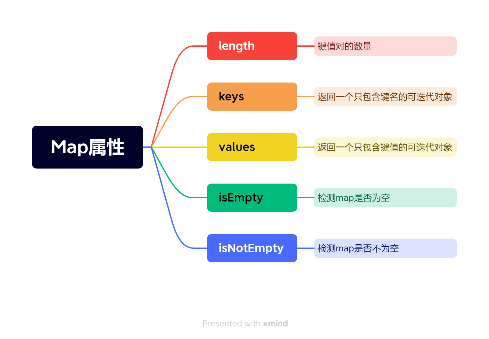
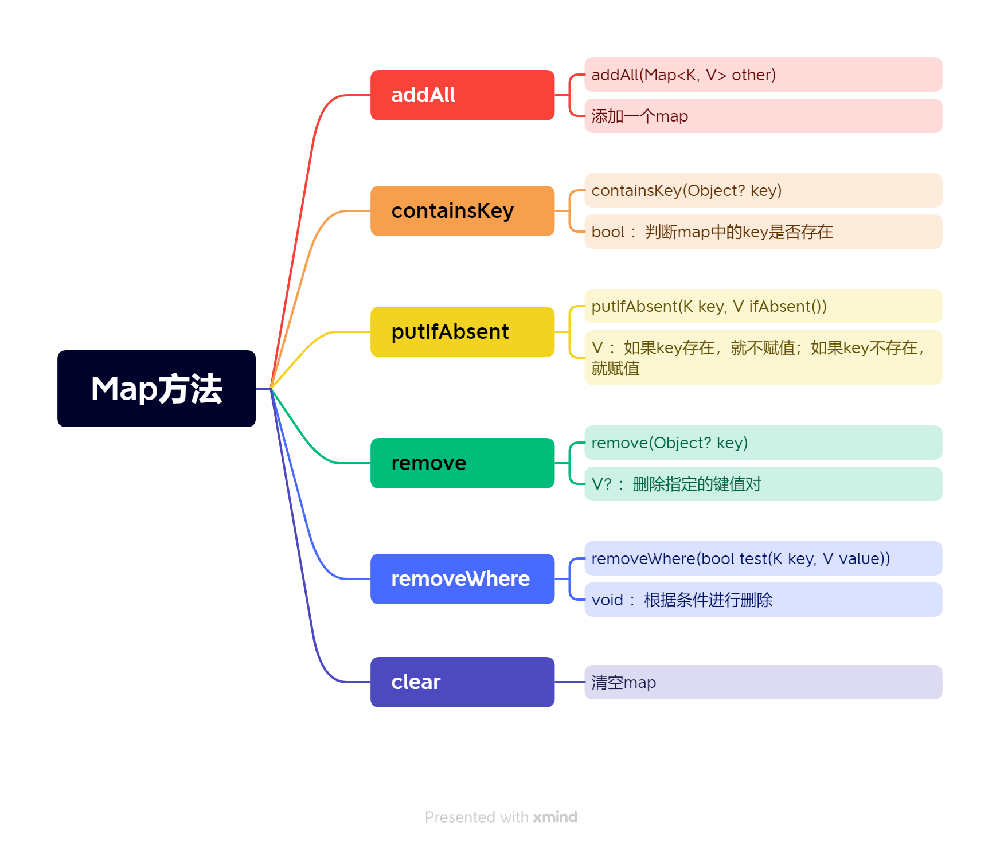
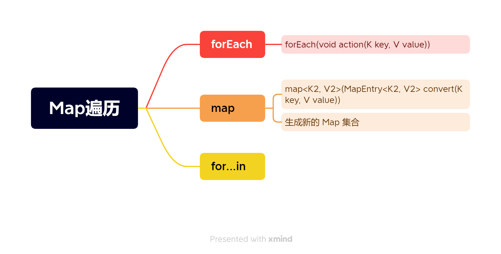

## Dart中的Map数据类型

### Map数据类型

Map 是一个无序的键值对（key-value）映射，通常被称为哈希或字典。在Dart中，键名必须使用引号

### Map数据类型声明方式

1、字面量方式

> var map = { 'key1': 'value1', 'key2': 'value2' };
> Map person = { 'key1': 'value1', 'key2': 'value2' };

```dart
Map map = {'name': 'admin'};
var map1 = {'name':'admin1'};
print(map);//{name:'admin'}
print(map1);//{name:'admin1'}
```

2、构造函数方式

```dart
var p = new Map();
p['name'] = 'admin';
p['age'] = 42;
print(p); // {name: admin, age: 42}
```

## Map数据类型的属性



```dart
Map person={"name":"admin","age":20};
// 访问属性
print(person['name']); // admin
// 返回键值对的数量
print(person.length); // 2
// 返回一个只包含键名的可迭代对象
print(person.keys); // (name, age)
// 返回一个只包含键值的可迭代对象
print(person.values); // (admin, 20)
// 检测map是否为空
bool isEmpty = person.isEmpty;
print(isEmpty); // false
```

## Map 数据类型的方法



```dart
Map person = {"name":"admin","age":20}
// addAll()
  person.addAll({'city': 'beijing', 'country': 'china'});
  print(person); // {name: admin, age: 20, city: beijing, country: china}

  // containsKey()
  bool hasCity = person.containsKey('city');
  print(hasCity); // true

  // putIfAbsent()
  person.putIfAbsent('city', () => 'hangzhou');
  print(person); // {name: admin, age: 20, city: beijing, country: china}
  person.putIfAbsent('gender', () => 'male');
  print(person); // {name: admin, age: 20, city: beijing, country: china, gender: male}

  // remove()
  final removedValue = person.remove('country');
  print(removedValue); // china
  print(person); // {name: admin, age: 20, city: beijing, gender: male}

  // removeWhere()
  person.removeWhere((key, value) => key == 'gender');
  print(person); // {name: bob, age: 20, city: beijing}

  // clear()
  person.clear();
  print(person); // {}
```

## Map数据类型的遍历方法

**1、forEach方法**

```dart
main() {
  Map person = {"name": "admin", "age": 20};
  person.forEach((key, value) {
    print('$key:$value');//name:admin,age:20
  });
}
```

**2、map方法**



```dart
final score = {'chinese': 145, 'math': 138, 'english': 142};
// map() 给每一科成绩都加5分
final newScore = score.map((key, value) => new MapEntry(key, value + 5));
print(newScore); // {chinese: 150, math: 143, english: 147}
```

**3、for...in方法**

```dart
Map person={"name":'admin','age':20}
// 调用 Map 对象的 keys 成员 , 返回一个由 键 Key 组成的数组
for (var key in person.keys){
  //Key:name,Value:admin
  //Key:age,Value:20
  print("for 循环遍历 : Key : $key , Value : ${person[key]}");
}
```

