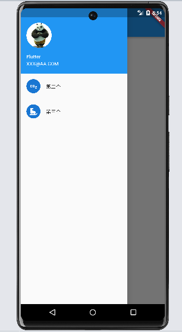

## Scaffold属性

### Scaffold属性详解

在Flutter中，Scaffold属性是一个Widget，它提供了一个基本的应用程序结构，并且可以非常容易地扩展和定制。它作为应用程序的主要容器，提供了一个AppBar（应用栏），一个Drawer（抽屉菜单），一个底部导航栏（BottomNavigationBar）和一个可滚动的主体（body）。

Scaffold属性有几个重要的属性，其中包括：

`- appBar：`指定一个AppBar的Widget，用于显示在顶部的应用程序栏。

`- body：`指定一个Widget作为主体内容，可以是任何您想展示的内容，比如文本、图像或其他自定义内容。

`- drawer：`指定一个Widget，用于在左侧显示一个抽屉菜单。

`- bottomNavigationBar：`指定一个底部导航栏的Widget，通常用于导航应用程序的不同部分。

通常，每个页面通常只有一个Scaffold小部件，这是因为Scaffold提供了一个应用程序的基本结构。

如果一个页面有多个Scaffold，会导致代码结构更加混乱和难以维护。如果确实需要同一个页面中有多Scaffold，可以考虑将每个Scaffold封装为一个单独的Widget，并根据需要切换。

```dart
import 'package:flutter/material.dart';

void main() {
  runApp(MyApp());
}

class MyApp extends StatelessWidget {
  @override
  Widget build(BuildContext context) {
    return MaterialApp(
      home: MyHomePage(),
    );
  }
}

class MyHomePage extends StatelessWidget {
  @override
  Widget build(BuildContext context) {
    return Scaffold(
      appBar: AppBar(
        title: Text('Scaffold Demo'),
      ),
      drawer: Drawer(
        child: ListView(
          children: <Widget>[
            ListTile(
              title: Text('Menu Item 1'),
              onTap: () {
                // 处理菜单项1的点击事件
              },
            ),
            ListTile(
              title: Text('Menu Item 2'),
              onTap: () {
                // 处理菜单项2的点击事件
              },
            ),
          ],
        ),
      ),
      body: Center(
        child: Text(
          'Hello, World!',
          style: TextStyle(fontSize: 24),
        ),
      ),
      bottomNavigationBar: BottomNavigationBar(
        items: [
          BottomNavigationBarItem(
            icon: Icon(Icons.home),
            label: 'Home',
          ),
          BottomNavigationBarItem(
            icon: Icon(Icons.settings),
            label: 'Settings',
          ),
        ],
      ),
    );
  }
}
```

上面是一个简单的demo，它包括一个带有标题的AppBar，一个抽屉菜单，一个居中显示的文本内容，以及一个底部导航栏。

### BottomNavigationBar 组件介绍

BottomNavigationBar 是底部导航条，可以让我们定义底部Tab切换，常见的属性有：

1、items---List底部导航按钮集合

2、iconSize---icon

3、currentIndex---默认选中几个

4、onTap---选中变化函数

5、fixedColor---选中的函数

6、type---BottomNavigationBarType.fixed BottomNavigationBarType.shifting

下面展示点击底部导航跳转不同页面

```dart
import 'package:flutter/material.dart';

void main() {
  runApp(MyApp());
}

class MyApp extends StatelessWidget {
  @override
  Widget build(BuildContext context) {
    return MaterialApp(
      home: MyHomePage(),
    );
  }
}

class MyHomePage extends StatefulWidget {
  @override
  _MyHomePageState createState() => _MyHomePageState();
}

class _MyHomePageState extends State<MyHomePage> {
  int _selectedIndex = 0;

  List<Widget> _pages = [
    // 在这里添加您要显示的不同页面
    Page1(),
    Page2(),
    Page3(),
  ];

  void _onItemTapped(int index) {
    setState(() {
      _selectedIndex = index;
    });
  }

  @override
  Widget build(BuildContext context) {
    return Scaffold(
      appBar: AppBar(
        title: Text('Bottom Navigation Demo'),
      ),
      body: _pages[_selectedIndex],
      bottomNavigationBar: BottomNavigationBar(
        items: [
          BottomNavigationBarItem(
            icon: Icon(Icons.home),
            label: 'Page 1',
          ),
          BottomNavigationBarItem(
            icon: Icon(Icons.search),
            label: 'Page 2',
          ),
          BottomNavigationBarItem(
            icon: Icon(Icons.settings),
            label: 'Page 3',
          ),
        ],
        currentIndex: _selectedIndex,
        onTap: _onItemTapped,
      ),
    );
  }
}

class Page1 extends StatelessWidget {
  @override
  Widget build(BuildContext context) {
    return Center(
      child: Text(
        'Page 1',
        style: TextStyle(fontSize: 24),
      ),
    );
  }
}

class Page2 extends StatelessWidget {
  @override
  Widget build(BuildContext context) {
    return Center(
      child: Text(
        'Page 2',
        style: TextStyle(fontSize: 24),
      ),
    );
  }
}

class Page3 extends StatelessWidget {
  @override
  Widget build(BuildContext context) {
    return Center(
      child: Text(
        'Page 3',
        style: TextStyle(fontSize: 24),
      ),
    );
  }
}
```

当底部导航栏的项被点击时，我们调用 _onItemTapped 方法来更新 _selectedIndex 的值，并通过使用 _selectedIndex 来选择要显示的页面。

[![视频文件]](../../media/dart/2023-07-19.mp4)

### FloatingActionButton实现底部导航凸起按钮

FloatingActionButton简称FAB ,可以实现浮动按钮

属性:

1、child----子视图，一般为Icon，不推荐使用文字

2、tooltip----FAB被长按时显示，也是无障碍功能

3、backgroundColor---背景颜色

4、elevation----未点击的时候的阴影

5、hignlightElevation----点击时阴影值，默认12.0

6、onPressed----点击事件回调

7、shape----可以定义FAB的形状等

8、mini----是否是mini类型默认false

```dart
import 'package:flutter/material.dart';

void main() {
  runApp(MyApp());
}

class MyApp extends StatelessWidget {
  @override
  Widget build(BuildContext context) {
    return MaterialApp(
      home: MyHomePage(),
    );
  }
}

class MyHomePage extends StatefulWidget {
  @override
  _MyHomePageState createState() => _MyHomePageState();

}

class _MyHomePageState extends State<MyHomePage> {
  int _selectedIndex = 0;

  List<Widget> _pages = [
    // 在这里添加您要显示的不同页面
    Page1(),
    Page2(),
    Page3(),
  ];

  void _onItemTapped(int index) {
    setState(() {
      _selectedIndex = index;
    });
  }

  @override
  Widget build(BuildContext context) {
    return Scaffold(
      appBar: AppBar(
        title: Text('Bottom Navigation Demo'),
      ),
      body: _pages[_selectedIndex],
      bottomNavigationBar: BottomNavigationBar(
        items: [
          BottomNavigationBarItem(
            icon: Icon(Icons.home),
            label: 'Page 1',
          ),
          BottomNavigationBarItem(
            icon: Icon(Icons.search),
            label: 'Page 2',
          ),
          BottomNavigationBarItem(
            icon: Icon(Icons.settings),
            label: 'Page 3',
          ),
        ],
        currentIndex: _selectedIndex,
        onTap: _onItemTapped,

      ),
      floatingActionButton: FloatingActionButton(
        onPressed: (){},
        child: Icon(Icons.add),
      ),
      floatingActionButtonLocation: FloatingActionButtonLocation.centerDocked,
    );
  }
}

class Page1 extends StatelessWidget {
  @override
  Widget build(BuildContext context) {
    return Center(
      child: Text(
        'Page 1',
        style: TextStyle(fontSize: 24),
      ),
    );
  }
}

class Page2 extends StatelessWidget {
  @override
  Widget build(BuildContext context) {
    return Center(
      child: Text(
        'Page 2',
        style: TextStyle(fontSize: 24),
      ),
    );
  }
}

class Page3 extends StatelessWidget {
  @override
  Widget build(BuildContext context) {
    return Center(
      child: Text(
        'Page 3',
        style: TextStyle(fontSize: 24),
      ),
    );
  }
}
```

### 抽屉菜单Drawer

在Scaffold组件里面传入drawer参数可以定义左侧边栏，传入endDrawer可以定义右侧边栏。侧边栏默
认是隐藏的，我们可以通过手指滑动显示侧边栏，也可以通过点击按钮显示侧边栏。

DrawerHeader常见属性

1、decoration---设置顶部背景颜色

2、child---配置子元素

3、padding---内边距

4、margin---外边距

```dart
class MyHomePage extends StatelessWidget {
  @override
  Widget build(BuildContext context) {
    return Scaffold(
      appBar: AppBar(
        title: Text('Scaffold Demo'),
      ),
      drawer: Drawer(
        child: Column(
          children: <Widget>[
            DrawerHeader(
              decoration: BoxDecoration(color: Colors.yellow),
                child: ListView(
                  children: [Text('头部')],
                )
            ),
            const ListTile(
              title: Text('第二个'),
              leading: CircleAvatar(child: Icon(Icons.co2),),
            ),
            const Divider(),
            const ListTile(
              title: Text('第三个'),
              leading: CircleAvatar(child: Icon(Icons.ice_skating),),
            )
          ],
        )
      ),
    );
  }
}
```

### UserAccountsDrawerHeader

1、decoration---设置顶部背景颜色

2、accountName---账户名称

3、accountEmail---账户邮箱

4、currentAccountPicture---用户头像

5、otherAccountsPictures---用来设置当前账户其他账户头像

6、margin

```dart
class MyHomePage extends StatelessWidget {
  @override
  Widget build(BuildContext context) {
    return Scaffold(
      appBar: AppBar(
        title: Text('Scaffold Demo'),
      ),
      drawer: Drawer(
        child: Column(
          children: <Widget>[
            UserAccountsDrawerHeader(
                accountName: Text('Flutter'),
                accountEmail: Text('XXX@AA.COM'),
                currentAccountPicture:const CircleAvatar(
                  backgroundImage: AssetImage('assets/images/11.jpg'),
                )
            ),
            const ListTile(
              title: Text('第二个'),
              leading: CircleAvatar(child: Icon(Icons.co2),),
            ),
            const Divider(),
            const ListTile(
              title: Text('第三个'),
              leading: CircleAvatar(child: Icon(Icons.ice_skating),),
            )
          ],
        )
      ),
    );
  }
}
```



