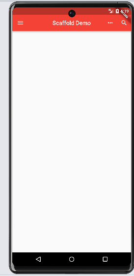

## AppBar、TabBar、TabBarView

### AppBar----自定义顶部区域

常用属性：

1、leading----在标题前面显示的一个控件，在首页通常显示应用的 logo；在其他界面通
常显示为返回按钮

2、title---标题，通常显示为当前界面的标题文字，可以放组件

3、actions----通常使用 IconButton 来表示，可以放按钮组

4、bottom----通常放tabBar，标题下面显示一个Tab导航栏

5、backgroundColor----导航背景颜色

6、iconTheme---图标样式

7、centerTitle----标题是否居中显示(true/false,默认为false)

```dart
class MyHomePage extends StatelessWidget {
  @override
  Widget build(BuildContext context) {
    return Scaffold(
      appBar: AppBar(
        title: Text('Scaffold Demo'),
        backgroundColor: Colors.red,
        centerTitle: true,
        leading: IconButton(
          icon: Icon(Icons.menu),
          onPressed: (){},
        ),
        actions: [
          IconButton(onPressed: (){}, icon: Icon(Icons.more_horiz)),
          IconButton(onPressed: (){}, icon: Icon(Icons.search))
        ],
      ),
    );
  }
}
```


### tabBar实现顶部切换

常用属性：

1、tabs----显示的标签内容，一般使用Tab对象,也可以是其他的Widget

```dart
tabs: [
        Tab(text: 'Tab 1'),
        Tab(text: 'Tab 2'),
        Tab(text: 'Tab 3'),
      ]
```

2、controller---TabController对象

```dart
在Flutter中，TabBar的controller是一个用于控制TabBar和TabBarView之间同步的对象。它允许你以编程方式更改当前选中的标签，从而在TabBar和TabBarView之间进行切换。

TabBar的controller是一个TabController对象，通常通过创建一个TabController实例来获得。TabController类提供了一些方法和属性，用于管理选项卡的状态和交互：

TabController(length: n)：创建一个具有n个选项卡的TabController对象。

controller.index：获取当前选中选项卡的索引。

controller.animateTo(index)：将选项卡动画滚动到指定的索引。

controller.addListener(callback)：添加监听器，以便在选项卡更改时触发回调。

controller.dispose()：释放资源并销毁TabController。

使用TabBar的controller时,将其赋值给TabBar和TabBarView的controller属性。这将确保它们保持同步，并且在与TabBar进行交互时会更新TabBarView的内容。例如，当用户切换选项卡时，TabController将自动更新其索引，并相应地显示相应的TabBarView。

在使用TabBar的controller时，确保在不再需要它时调用dispose()方法进行清理，以避免内存泄漏。
```
3、isScrollable----是否可滚动

4、indicatorColor---指示器颜色

5、indicatorWeight---指示器高度

6、indicatorPadding----底部指示器的Padding

7、indicator----指示器decoration，例如边框等

8、indicatorSize----指示器大小计算方式，TabBarIndicatorSize.label跟文字等
宽,TabBarIndicatorSize.tab跟每个tab等宽

9、labelColor----选中label颜色

10、labelStyle---选中label的Style

11、labelPadding----每个label的padding值

12、unselectedLabelColor----未选中label颜色

13、unselectedLabelStyle----未选中label的Style

下面是一个是有3个tab的tabBar

```dart
import 'package:flutter/material.dart';

class MyTabBar extends StatefulWidget {
  @override
  _MyTabBarState createState() => _MyTabBarState();
}

class _MyTabBarState extends State<MyTabBar> with SingleTickerProviderStateMixin {
  late TabController _tabController;

  @override
  void initState() {
    super.initState();
    _tabController = TabController(length: 3, vsync: this);
  }

  @override
  void dispose() {
    _tabController.dispose();
    super.dispose();
  }

  @override
  Widget build(BuildContext context) {
    return Scaffold(
      appBar: AppBar(
        title: Text('Scrollable Tab Bar'),
        bottom: TabBar(
          controller: _tabController,
          tabs: [
            Tab(text: 'Tab 1'),
            Tab(text: 'Tab 2'),
            Tab(text: 'Tab 3'),
          ],
          isScrollable: true,
          labelColor: Colors.red,
            unselectedLabelColor:Colors.white
        ),
      ),
      body: TabBarView(
        controller: _tabController,
        children: [
          Container(
            color: Colors.red,
            child: Center(child: Text('Tab 1 Content')),
          ),
          Container(
            color: Colors.green,
            child: Center(child: Text('Tab 2 Content')),
          ),
          Container(
            color: Colors.blue,
            child: Center(child: Text('Tab 3 Content')),
          ),
        ],
      ),
    );
  }
}

void main() {
  runApp(MaterialApp(home: MyTabBar()));
}
```

### preferredSize组件

PreferredSize可以改变appBar的高度
```dart
appBar: PreferredSize(
        preferredSize: Size.fromHeight(250),
        child:  AppBar(
          title: Text('Scrollable Tab Bar'),
          bottom: TabBar(
              controller: _tabController,
              tabs: [
                Tab(text: 'Tab 1'),
                Tab(text: 'Tab 2'),
                Tab(text: 'Tab 3'),
              ],
              isScrollable: true,
              labelColor: Colors.red,
              unselectedLabelColor:Colors.white
          ),
      )
      ),
```

### 监听TabController改变事件

```dart
 @override
  void initState() {
    super.initState();
    _tabController = TabController(length: 3, vsync: this);
    _tabController.addListener(() {
      if(_tabController.animation!.value==_tabController.index){
        print(_tabController.index);
      }
    });
  }
```


