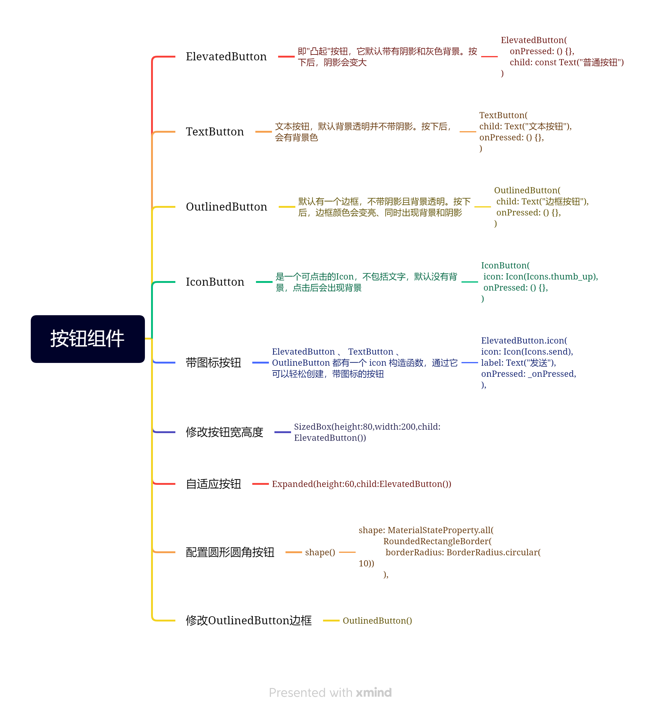

## Flutter按钮组件

### 按钮组件的属性

1、onPressed

必填参数，按下按钮时触发的回调，接收一个方法，传null表示按钮禁用，会显示禁用相关样式

2、child---子组件

3、style---通过ButtonStyle装饰

### ButtonStyle常用参数

1、foregroundColor---文本颜色

2、backgroundColor---按钮的颜色

3、shadowColor---阴影颜色

4、elevation---(值类型double)阴影的范围，值越大阴影范围越大

5、padding---内边距

6、shape---设置按钮的形状 shape: MaterialStateProperty.all(RoundedRectangleBorder(borderRadius: BorderRadius.circular(10)))

7、side---设置边框，MaterialStateProperty.all(BorderSide(width:1,color:Colors.red))

### 不同样式的Button



1、ElevatedButton---ElevatedButton 即"凸起"按钮，它默认带有阴影和灰色背景。按下后，阴影会变大

```dart
class MyApp extends StatelessWidget {
  const MyApp({Key?key}):super(key:key);
  @override
  Widget build(BuildContext context) {
    return Container(
      width: double.infinity,
      height: 600,
      alignment: Alignment.center,
      child:ElevatedButton(
        onPressed: () {},
        child: Text('你好'),)

    );
  }
}
```

2、TextButton---TextButton 即文本按钮，默认背景透明并不带阴影。按下后，会有背景色

```dart
class MyApp extends StatelessWidget {
  const MyApp({Key?key}):super(key:key);
  @override
  Widget build(BuildContext context) {
    return Container(
      width: double.infinity,
      height: 600,
      alignment: Alignment.center,
      child:TextButton(
        onPressed: () {},
        child: Text('你好'),)

    );
  }
}
```

3、OutlinedButton---OutlineButton 默认有一个边框，不带阴影且背景透明。按下后，边框颜色会变亮、同时出现背景和
阴影

```dart
class MyApp extends StatelessWidget {
  const MyApp({Key?key}):super(key:key);
  @override
  Widget build(BuildContext context) {
    return Container(
      width: double.infinity,
      height: 600,
      alignment: Alignment.center,
      child:OutlinedButton(
        onPressed: () {},
        child: Text('你好'),)

    );
  }
}
```

4、IconButton---IconButton 是一个可点击的Icon，不包括文字，默认没有背景，点击后会出现背景

```dart
class MyApp extends StatelessWidget {
  const MyApp({Key?key}):super(key:key);
  @override
  Widget build(BuildContext context) {
    return Container(
      width: double.infinity,
      height: 600,
      alignment: Alignment.center,
      child:IconButton(
        icon: const Icon(Icons.home),
        onPressed: (){},
      )
    );
  }
}
```

5、带图标的按钮---ElevatedButton 、 TextButton 、 OutlineButton 都有一个 icon 构造函数，通过它可以轻松创建
带图标的按钮

```dart
class MyApp extends StatelessWidget {
  const MyApp({Key?key}):super(key:key);
  @override
  Widget build(BuildContext context) {
    return Container(
      width: double.infinity,
      height: 600,
      alignment: Alignment.center,
      child:Row(
        mainAxisAlignment: MainAxisAlignment.center,
        crossAxisAlignment: CrossAxisAlignment.center,
        children: [
          ElevatedButton.icon(onPressed: (){}, icon: Icon(Icons.home), label: Text('elevated')),
          TextButton.icon(onPressed: (){}, icon: Icon(Icons.offline_bolt), label: Text('text')),
          OutlinedButton.icon(onPressed: (){}, icon: Icon(Icons.abc_rounded),label: Text('outline'),)
        ],
      )
    );
  }
}
```

6、修改按钮的宽度和高度，背景颜色，字体颜色---使用SizeBox/Container

```dart
class MyApp extends StatelessWidget {
  const MyApp({Key?key}):super(key:key);
  @override
  Widget build(BuildContext context) {
    return Container(
      width: double.infinity,
      height: 600,
      alignment: Alignment.center,
      child:Row(
        mainAxisAlignment: MainAxisAlignment.center,
        crossAxisAlignment: CrossAxisAlignment.center,
        children: [
         SizedBox(
           width: 200,
           height: 80,
           child: Container(
             child: ElevatedButton.icon(onPressed: (){}, icon: Icon(Icons.abc_sharp), label: Text('123'),
                 style:ButtonStyle(
                   backgroundColor: MaterialStateProperty.all(Colors.yellow),
                   foregroundColor: MaterialStateProperty.all(Colors.red)
                 )
             )
           )
         )
        ]
      )
    );
  }
}
```

7、自适应按钮---Expanded组件

Expanded的作用是填充剩余空间，设置尺寸比例，尝尝与Row/Column组合起来使用。

```dart
class MyApp extends StatelessWidget {
  const MyApp({Key?key}):super(key:key);
  @override
  Widget build(BuildContext context) {
    return Container(
      width: double.infinity,
      height: 600,
      alignment: Alignment.center,
      child:Row(
        mainAxisAlignment: MainAxisAlignment.center,
        crossAxisAlignment: CrossAxisAlignment.center,
        children: [
         Expanded(child: ElevatedButton(
           onPressed: (){},
           child: Text('按钮'),
         ))
        ]
      )
    );
  }
}
```

8、圆形圆角按钮---shape()

shape()对应ShapeBorder对象，子类有：

1、BoxBorder----BorderDirectional,Border

2、RoundedRectangleBorder----圆角类矩形

3、ContinuousRectangleBorder

4、CircleBorder---设置圆形

5、InputBorder----OutlineInputBorder、UnderlineInputBorder

```dart
import 'package:flutter/material.dart';
import 'myList.dart';
void main() {
  runApp(MaterialApp(
    home:Scaffold(
      appBar: AppBar(title: const Text('你好Flutter'),),
      body: const MyApp(),
    )
  ));
}

class MyApp extends StatelessWidget {
  const MyApp({Key?key}):super(key:key);
  @override
  Widget build(BuildContext context) {
    return Container(
      width: double.infinity,
      height: 600,
      alignment: Alignment.center,
      child:Column(
        mainAxisAlignment: MainAxisAlignment.center,
        crossAxisAlignment: CrossAxisAlignment.center,
        children: [
          SizedBox(
            width: 300,
            height: 100,
            child:ElevatedButton(onPressed: (){},
              child: Text('按钮',style: TextStyle(fontSize: 40.0),),//设置字体大小
              style: ButtonStyle(
                foregroundColor: MaterialStateProperty.all(Colors.pinkAccent),//字体颜色,如果单独对字体设置颜色，这个就不生效
                  backgroundColor: MaterialStateProperty.all(Colors.yellow),//背景颜色
                  shape:MaterialStateProperty.all(//设置按钮的形状，圆角，边框为10的黑色边框，角度为20
                      RoundedRectangleBorder(
                          side: BorderSide(width: 10,color: Colors.black),
                          borderRadius: BorderRadius.all(Radius.circular(20))
                      )
                  )
              ),
            ) ,
          ),
          SizedBox(
            height: 100,
            child: ElevatedButton(
              onPressed: (){},
              child: Text('按钮二',style: TextStyle(fontSize: 30,color: Colors.black),),
              style: ButtonStyle(
                foregroundColor: MaterialStateProperty.all(Colors.lightBlue),
                backgroundColor: MaterialStateProperty.all(Colors.pinkAccent),
                shape: MaterialStateProperty.all(
                  CircleBorder(//以height为直径，裁剪为一个圆形
                    side: BorderSide(width: 10,color: Colors.pinkAccent)
                  )
                )
              ),
            ),
          ),
        ]
      )
    );
  }
}
```

### 修改OutlinedButton边框

```dart
class MyApp extends StatelessWidget {
  const MyApp({Key?key}):super(key:key);
  @override
  Widget build(BuildContext context) {
    return Container(
      width: double.infinity,
      height: 600,
      alignment: Alignment.center,
      child:Column(
        mainAxisAlignment: MainAxisAlignment.center,
        crossAxisAlignment: CrossAxisAlignment.center,
        children: [
          Expanded(child: Container(
            margin: EdgeInsets.all(50),
            height: 50,
            child: OutlinedButton(
              onPressed: (){},
              child: Text('按钮',style: TextStyle(fontSize: 40),),
              style: ButtonStyle(
                foregroundColor: MaterialStateProperty.all(Colors.purpleAccent),
                side: MaterialStateProperty.all(BorderSide(width: 1,color: Colors.orangeAccent))
              ),
            ),
          ))
        ]
      )
    );
  }
}
```


