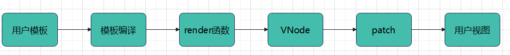

## vue渲染流程一 —— compile(模板编译)

### vue模板编译过程

vue使用了虚拟DOM，而虚拟DOM存在必须要先有VNode，那么VNode从哪里来呢？

通过模板编译，产生VNode

开发中，我们在`<template></template>`里面写的内容类似于原生的HTML，为什么说类似？因为里面的内容有原生的HTML标签属性之外，还有浏览器并不能识别的相关指令，插值等。这些依然会被浏览器识别，就归功于vue的模板编译了。

vue的模板编译就是将原生的HTML内容和非原生的HTML内容都找出来，经过一系列的逻辑处理生成render函数。这个过程就叫做模板编译过程。

vue整个渲染过程如下：



其中前三个是模板编译过程，后三个是虚拟DOM到真实DOM过程

### 从源码看编译阶段

vue模板解析其实就是将模板字符串通过一系列操作之后，解析成抽象语法树AST，然后用AST生成render函数的过程。

主要经过3个步骤：解析器——优化器——生成器

1、将模板字符串用正则的方法解析成抽象语法树AST

2、遍历AST节点，打上标记

3、将AST转换为render函数


首先是compile入口文件:src/compiler/index.js

```js
/* @flow */

import { parse } from './parser/index'
import { optimize } from './optimizer'
import { generate } from './codegen/index'
import { createCompilerCreator } from './create-compiler'

// `createCompilerCreator` allows creating compilers that use alternative
// parser/optimizer/codegen, e.g the SSR optimizing compiler.
// Here we just export a default compiler using the default parts.
export const createCompiler = createCompilerCreator(function baseCompile (
  template: string,
  options: CompilerOptions
): CompiledResult {
  const ast = parse(template.trim(), options)
  if (options.optimize !== false) {
    optimize(ast, options)
  }
  const code = generate(ast, options)
  return {
    ast,
    render: code.render,
    staticRenderFns: code.staticRenderFns
  }
})
```
baseCompile函数是模板编译3个阶段的主函数。

这段代码也是主要代码，最后retrun的结果是：ast(抽象语法树)、render(渲染函数)、staticRenderFns(静态渲染函数)

模板阶段主要使用了3个函数

* parse函数——生成抽象语法树ast

* optimize函数 —— 标记静态节点。如果是静态节点，在创建虚拟DOM时会直接跳过，减少比较过程，优化了性能。

* generate函数 —— 将 AST 转化成 render函数字符串的过程，得到结果是render函数的字符串以及 staticRenderFns 字符串

### **parse函数**

parse函数是用来解析模板字符串生成抽象语法树ast的

源码地址： src/complier/parser/index.js

parse函数是一个大函数，里面定义了一些函数为了考虑边界问题。最重要的是parseHTML这个函数。

```js
export function parse (
  template: string,
  options: CompilerOptions
): ASTElement | void {
  // ...
  parseHTML(template,{
    // ...
    start(tag, attrs, unary, start, end){
      // ...
      let element: ASTElement = createASTElement(tag, attrs, currentParent)
      // ...
    },
    end(){},
    chars(text: string, start: number, end: number){},
    comment(text: string, start, end)
  })
}
```
parseHTML函数有两个参数，一个是模板，一个是对象。对象里面有4个方法，

start()方法主要就是生成元素类型的ast节点。接收5个参数，前面3个参数分别表示标签名tag、标签属性attrs、标签是否自闭合unary。调用该方法，会调用`createASTElement`方法创建元素类型的ast节点

end()表示解析到结束标签时调用

chars()表示，如果解析到文本时调用。使用chars()函数生成文本类型的ast节点

comment()表示：当解析到注释时调用。该函数会创建一个注释类型的ast节点。

解析流程是：

先用HTML解析器进行解析(html-parser.js文件)，解析过程中如果碰到文本内容，就调用文本解析器(text-parser.js)进行解析；如果文本中有过滤器，就调用过滤器解析器解析。(filter-parser.js)


重点就是这个parseHTML函数，它到底是如何解析的呢？

`parseHTML函数`

parseHTML这个函数在html-parser.js文件里。这个文件重点就是开头定义的一些正则，然后在函数内使用while循环。

```js
// Regular Expressions for parsing tags and attributes
const attribute = /^\s*([^\s"'<>\/=]+)(?:\s*(=)\s*(?:"([^"]*)"+|'([^']*)'+|([^\s"'=<>`]+)))?/
const dynamicArgAttribute = /^\s*((?:v-[\w-]+:|@|:|#)\[[^=]+?\][^\s"'<>\/=]*)(?:\s*(=)\s*(?:"([^"]*)"+|'([^']*)'+|([^\s"'=<>`]+)))?/
const ncname = `[a-zA-Z_][\\-\\.0-9_a-zA-Z${unicodeRegExp.source}]*`
const qnameCapture = `((?:${ncname}\\:)?${ncname})`
const startTagOpen = new RegExp(`^<${qnameCapture}`)
const startTagClose = /^\s*(\/?)>/
const endTag = new RegExp(`^<\\/${qnameCapture}[^>]*>`)
const doctype = /^<!DOCTYPE [^>]+>/i
// #7298: escape - to avoid being passed as HTML comment when inlined in page
const comment = /^<!\--/
const conditionalComment = /^<!\[/
```
```js
export function parseHTML (html, options) {
  const stack = []
  const expectHTML = options.expectHTML
  const isUnaryTag = options.isUnaryTag || no
  const canBeLeftOpenTag = options.canBeLeftOpenTag || no
  let index = 0
  let last, lastTag
  while (html) {
    last = html
    // Make sure we're not in a plaintext content element like script/style
    if (!lastTag || !isPlainTextElement(lastTag)) {
      let textEnd = html.indexOf('<')
      if (textEnd === 0) {
        // Comment:
        if (comment.test(html)) {
          const commentEnd = html.indexOf('-->')

          if (commentEnd >= 0) {
            if (options.shouldKeepComment) {
              options.comment(html.substring(4, commentEnd), index, index + commentEnd + 3)
            }
            advance(commentEnd + 3)
            continue
          }
        }
      }
      // ...
    }
  }
```

其实就是不断的使用while循环对模板进行匹配，匹配注释，开始结束标记，判断条件，文本等等。根据返回结果值不同去做不同的解析。parse 函数就是不断的重复这个工作，然后将 template 转换成 AST。

如果解析时碰到了文本，就使用文本解析器。也就是使用了parseHTML函数里的chars函数。

文本解析器，源码地址 --- src/compiler/parser/text-parser.js

文本解析器重要的就是parseText函数，这个函数传入两个参数，一个是传入的待解析的文本内容text，一个包裹变量的符号delimiters

```js
const tagRE = delimiters ? buildRegex(delimiters) : defaultTagRE
```
第一个参数表示要传入的文本，第二个参数用来新建正则。这个正则表达式是用来检查文本中是否包含变量的。

文本解析器主要解析文本内容中是否包含变量，如果包含变量，则将变量提取出来进行加工，为后续生产render函数做准备


### 优化器

优化器(optimizer.js),源码地址：src/compiler/optimizer.js

优化器的目的就是从生成的ast树找出静态节点和静态根节点并打上标记，在patch的时候可以跳过它们，不渲染。

```js
export function optimize (root: ?ASTElement, options: CompilerOptions) {
  // 判断根节点是否存在
  if (!root) return
  // 判断是否是静态属性
  isStaticKey = genStaticKeysCached(options.staticKeys || '')
  // 判断是否是平台保留的标签，html 或者 svg 的
  isPlatformReservedTag = options.isReservedTag || no
  // first pass: mark all non-static nodes.
  // 第一遍遍历: 给所有静态节点打上是否是静态节点的标记
  markStatic(root)
  // second pass: mark static roots.
  // 第二遍遍历:标记所有静态根节点
  markStaticRoots(root, false)
}
```

### 代码生成器

generate()函数，源码地址：src/compiler/codegen/index.js

```js
export function generate (
  ast: ASTElement | void,
  options: CompilerOptions
): CodegenResult {
  const state = new CodegenState(options)
  // fix #11483, Root level <script> tags should not be rendered.
  const code = ast ? (ast.tag === 'script' ? 'null' : genElement(ast, state)) : '_c("div")'
  return {
    render: `with(this){return ${code}}`,
    staticRenderFns: state.staticRenderFns
  }
}
```
generate()函数最后返回的就是render函数字符串和staticRenderFns函数字符串。比较重要的就是genElement这个函数了。

genElement()这个函数，针对不同的指令、属性，我们会选择不同的代码生成函数。最后我们按照 AST 生成拼接成一个字符串

在genElement()函数里，通过不同条件调用不同的方法，比如genStatic、genOnce、genFor、genIf、genChildren等等。就对应了不同的方法。这些函数方法在core/instance/index.js 这个文件中找到这些函数。

最后依靠依靠`compileToFunctions`函数生成`render`函数


### 总结：

其实vue的编译阶段在源码里有单独的文件夹存放，内容很多。上面只是很简单的介绍了一下编译过程。简单总结一下：

1、vue编译主要经过3个阶段：

  * 解析阶段——主要是将模板解析成抽象语法树ast。

  解析阶段，优先使用HTML解析器；如果碰到文本，使用文本解析器；文本里面有过滤器，使用过滤器解析器。解析阶段主要使用正则表达式方法和不断循环生成ast。

  * 优化阶段——主要是找出静态节点和静态根节点，然后对这些静态节点打上标记。在渲染阶段可以直接跳过他们。
  
  * 生成阶段——主要针对ast树中不同的指令，属性选择不同的函数，最后拼接成一个字符串放入render。最后使用`compileToFunctions`函数内部将`render函数字符串`传给`createFunction函数`从而变成`真正的render函数`返回出去，最后将其赋值给`options.render`


vue编译最终的函数调用流程如下：


资源来源于：https://vue-js.com/learn-vue/complie/summary.html#_2-%E6%95%B4%E4%BD%93%E6%B5%81%E7%A8%8B

文章参考: [聊聊 Vue - compile](https://juejin.cn/post/6844903567359229959#heading-5)


