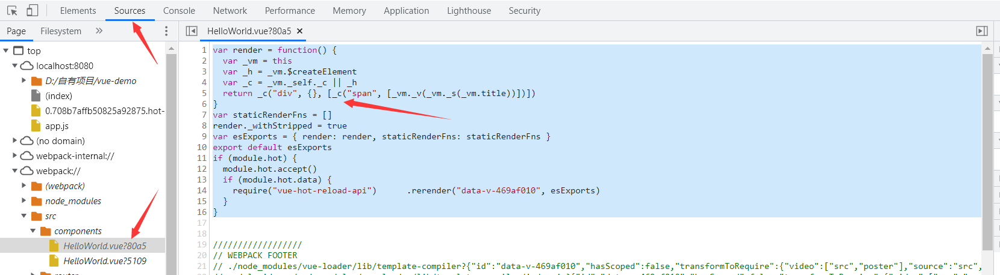
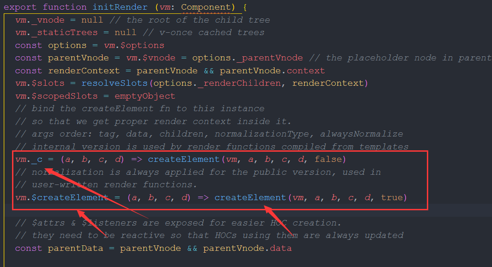
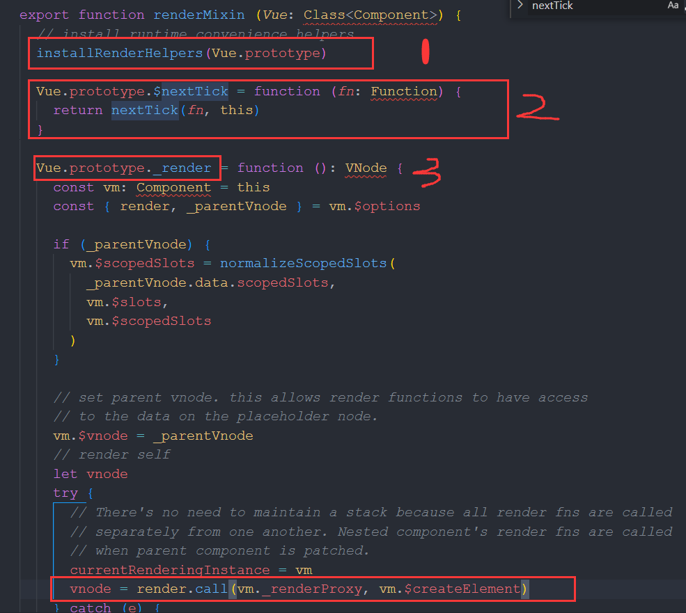
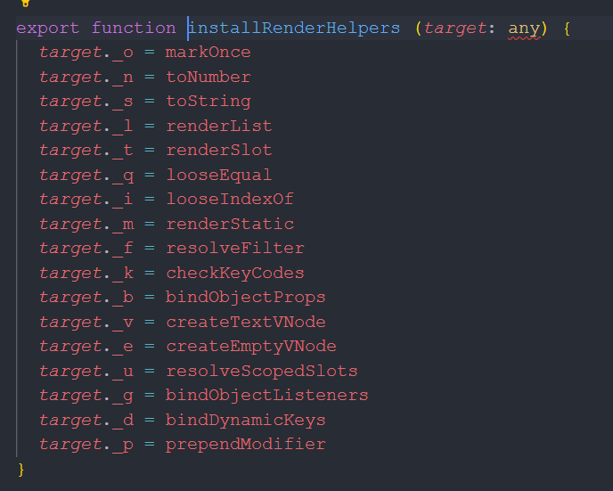
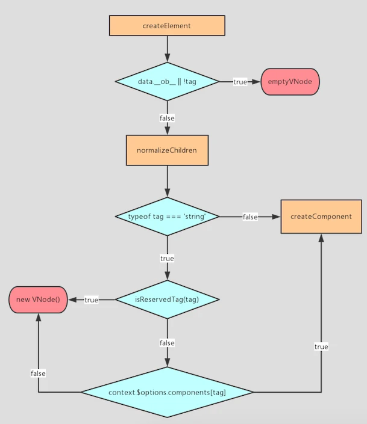

## vue原理(六)之render函数

### 一、render函数是什么？

> render函数的实质是生成template模板。

先来看看项目运行后，哪里可以看到render函数？

```html
<template>
  <div>
    <span>{{title}}</span>
  </div>
</template>
```

在vue项目HelloWorld组件里写了上面这样的代码，然后打开F12 --> Sources -->webpack:// -->src下的components文件夹下的HelloWorld.vue找到该代码



也就是说vue组件中的`template`标签中的内容最后被解析成了`render函数`。div/span标签也被编译成了一个个参数进行传递。

上面的代码可以用render函数改写如下：
```js
<script>
export default {
  data () {
    return {
      title: 'render函数'
    }
  },
  mounted () {},
  methods: {},
  render () {
    return (
      <div>
        <span>{ this.title }</span>
      </div>
    )
  }
}
</script>
```
render函数生成的内容相当于template的内容，所以使用render函数时，需要将template标签去掉。只保留js和css代码。

template底层使用的也是render函数，一个组件模板的标签只有一个，所以使用render函数就要去掉template标签。
### 二、render函数有什么作用？

rander函数的作用就是生成`Virtual DOM(虚拟DOM)`树。处于vue对DOM渲染的第二步。

render上面的一个步骤就是vue编译，将编译的模板交给render函数生成虚拟DOM树，然后交给Patch函数，负责将虚拟DOM映射到真正的DOM上。
### 三、render函数的h是什么

使用脚手架生成的项目里，在main.js文件里，最后有这样的代码：
```js
// 使用脚手架生成的项目写法
new Vue({
     el:"#app",
     render: h => h(App)
 })
//没有使用脚手架的写法
 new Vue({
     el:"#app",
     template:`<App></App>`,
     components:{App}
 })
```
相比较而言，render函数更加简洁，那么这个h是什么呢？从文章最初的那个图可以看出，对此做了定义`var _h = this.$createElement`

所以，h表示的是createElement这个函数。createElement()可以渲染html标签。官网文档的描述：

> 将 h 作为 createElement 的别名是 Vue 生态系统中的一个通用惯例,实际上也是 JSX 所要求的。从 Vue 的 Babel 插件的 3.4.0 版本开始,我们会在以 ES2015 语法声明的含有 JSX 的任何方法和 getter 中 (不是函数或箭头函数中) 自动注入 const h = this.$createElement,这样你就可以去掉 (h) 参数了。对于更早版本的插件,如果 h 在当前作用域中不可用,应用会抛错。

也可以进行改造：
```js
new Vue({
     el:"#app",
     render: h => h(App)
 })
//改造
new Vue({
  el:"#app",
  render:function(createElement){
    return creatElement('<div>','')
  }
})
// es6
new Vue({
  el:"#app",
  render:createElement => creatElement('<div>','')
})
```

### 四、render的原理

vue中DOM渲染经过3个步骤：`compile --> render生成Vnode --> 将Vnode通过update挂载到 页面上`

其中render的作用就是生成Vnode(Virtual DOM)。从源码来看看render的原理

render入口文件：`src\core\instance\index.js`

这个文件里，主要就是两个函数：`initRender`和`renderMixin`

`initRender函数`



initRender函数主要就是实例绑定了`vm._c`以及`vm.$createElement`,这两个方法就是使用`createElement`来构建虚拟DOM

`renderMixin函数`

可以根据注释，renderMinxin函数主要做了3件事：



* `执行installRenderHelpers(Vue.prototype)`

installRenderHelpers方法的作用就是生成vnode时，需要用到的几个解析函数。在执行render函数时，会调用。这就是文章刚开始看到的有几个以下划线的变量。




* 原型上调用$nextTick()函数，并返回

也就是render函数在渲染的时候，将生成的虚拟DOM推到一个队列里，执行$nextTick再触发视图更新

* 原型上扩展_render方法,`Vue.prototype._render`

render函数从vm.$options上获取，然后执行核心代码：

```js
vnode = render.call(vm._renderProxy, vm.$createElement)
```

这段代码就是调用render函数的地方，生成vnode最后返回vnode节点，之后，vnode就可以利用diff算法完成页面的数据更新了。

其中`vm._renderProxy`表示实例对象，`vm.$createElement`是调用createElement,这句代码的意思是`调用createElement来创建节点`.

### 五、createElement函数

createElement方法入口文件：src/core/vdom/create-element.js

文件中主要是这两个函数：createElement和_createElement

对源码的解析注释，以下内容来自:[Vue原理解析之Virtual Dom](https://segmentfault.com/a/1190000008291645)

```js
const SIMPLE_NORMALIZE = 1
const ALWAYS_NORMALIZE = 2

function createElement (context, tag, data, children, normalizationType, alwaysNormalize) {
  // 兼容不传data的情况
  if (Array.isArray(data) || isPrimitive(data)) {
    normalizationType = children
    children = data
    data = undefined
  }
  // 如果alwaysNormalize是true
  // 那么normalizationType应该设置为常量ALWAYS_NORMALIZE的值
  if (alwaysNormalize) normalizationType = ALWAYS_NORMALIZE
  // 调用_createElement创建虚拟节点
  return _createElement(context, tag, data, children, normalizationType)
}

function _createElement (context, tag, data, children, normalizationType) {
  /**
   * 如果存在data.__ob__，说明data是被Observer观察的数据
   * 不能用作虚拟节点的data
   * 需要抛出警告，并返回一个空节点
   * 
   * 被监控的data不能被用作vnode渲染的数据的原因是：
   * data在vnode渲染过程中可能会被改变，这样会触发监控，导致不符合预期的操作
   */
  if (data && data.__ob__) {
    process.env.NODE_ENV !== 'production' && warn(
      `Avoid using observed data object as vnode data: ${JSON.stringify(data)}\n` +
      'Always create fresh vnode data objects in each render!',
      context
    )
    return createEmptyVNode()
  }
  // 当组件的is属性被设置为一个false的值
  // Vue将不会知道要把这个组件渲染成什么
  // 所以渲染一个空节点
  if (!tag) {
    return createEmptyVNode()
  }
  // 作用域插槽
  if (Array.isArray(children) &&
      typeof children[0] === 'function') {
    data = data || {}
    data.scopedSlots = { default: children[0] }
    children.length = 0
  }
  // 根据normalizationType的值，选择不同的处理方法
  if (normalizationType === ALWAYS_NORMALIZE) {
    children = normalizeChildren(children)
  } else if (normalizationType === SIMPLE_NORMALIZE) {
    children = simpleNormalizeChildren(children)
  }
  let vnode, ns
  // 如果标签名是字符串类型
  if (typeof tag === 'string') {
    let Ctor
    // 获取标签名的命名空间
    ns = config.getTagNamespace(tag)
    // 判断是否为保留标签
    if (config.isReservedTag(tag)) {
      // 如果是保留标签,就创建一个这样的vnode
      vnode = new VNode(
        config.parsePlatformTagName(tag), data, children,
        undefined, undefined, context
      )
      // 如果不是保留标签，那么我们将尝试从vm的components上查找是否有这个标签的定义
    } else if ((Ctor = resolveAsset(context.$options, 'components', tag))) {
      // 如果找到了这个标签的定义，就以此创建虚拟组件节点
      vnode = createComponent(Ctor, data, context, children, tag)
    } else {
      // 兜底方案，正常创建一个vnode
      vnode = new VNode(
        tag, data, children,
        undefined, undefined, context
      )
    }
    // 当tag不是字符串的时候，我们认为tag是组件的构造类
    // 所以直接创建
    // 执行createComponent
  } else {
    vnode = createComponent(tag, data, context, children)
  }
  // 如果有vnode
  if (vnode) {
    // 如果有namespace，就应用下namespace，然后返回vnode
    if (ns) applyNS(vnode, ns)
    return vnode
  // 否则，返回一个空节点
  } else {
    return createEmptyVNode()
  }
}
```

createElement简单流程:



`createElement`主要就是作用调用`new VNode`构造函数创建Vnode并返回

### 六、render函数总结

1、render函数主要作用就是生成虚拟DOM(VNode)

2、render函数中主要做了3件事：调用解析函数应对不同场景；生成的实例推送到队列中；执行_render方法

2、_render方法主要就是调用createElement函数来生成DOM

3、createElement函数考虑各种边界问题后，调用new VNode函数生成DOM


