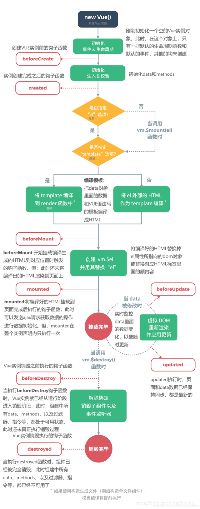

## vue的生命周期详解

### vue生命周期阶段

总共有11个：

组件里的：

beforeCreate(创建前)、

created(创建后)、

beforeMount(载入前)、

mounted(载入后)、

beforeUpdate(更新前)、

updated(更新后)、

beforeDestroy(销毁前)、

destroyed(销毁后)、

activated(keep-alive组件，缓存组件显示的时候触发)、

deactivated(keep-alive组件，缓存组件隐藏的时候触发)、

errorCaptured(来自子孙组件的错误时被调用)

### 生命周期图示

### 单个生命周期详解

`beforeCreat`

在这个钩子函数执行之前初始化事件和生命周期；在这个钩子函数里，不能获取data中的数据；不能操作DOM，因为DOM还没有生成。无法访问methods，data，computed等上的方法和数据

`created`

这个生命周期做了这些事情：数据观测、属性和方法的运算，watch/event事件回调，完成了data 数据的初始化。可以调用methods中的方法，改变data中的数据，并且修改可以通过vue的响应式绑定体现在页面上，获取computed中的计算属性等等

在这个生命周期可以获取data中的数据；但不能操作DOM；对于数据的请求可以放在这里。

这个生命周期没有什么方法来对实例化过程进行拦截，如果有某些数据必须获取才允许进入页面，并不适合在这个方法发请求，可以在组件路由钩子beforeRouteEnter中完成。

`beforeMount`

执行之前，判断是否有el,template，对页面进行编译

在这个生命周期中，模板已经在内存中编译好了，但尚未挂载到页面上，此时页面还是旧的。只是把data里的数据和模板生成html，完成了el和data初始化，但还没有挂载到html上。

`mounted`

将vue实例生成的虚拟DOM转换成真实的DOM，可以获得最终的DOM元素,

如果要通过数据来操作DOM节点，在这个生命周期中实现。

这个生命周期只会执行一次

`beforeUpdate`

当数据更新时，会调用beforeUpdate和updated函数，上面4个钩子函数不再执行；更新数据之前才执行。

在这个生命周期，页面上显示的数据还是旧的，此时data里的数据是新的，只是页面还没有和最新的数据保持一致。

`updated`

数据更新，虚拟的DOM更新，然后更新真实的DOM，最后触发这个函数

这个生命周期里，页面和data数据已经保持一致了，都是最新的。

在大多是情况下，应该避免在此期间更改状态，因为这可能会导致更新无限循环，`该钩子在服务器端渲染期间不被调用`

`beforeDestory`

组件销毁之前的钩子函数。

在这个生命周期里，实例身上的data和methods以及过滤器，指令等，都处于可用状态，此时还没有真正销毁.

在实例销毁之前调用，实例仍然可以使用，这里还可以使用this来获取实例。

一般在这个生命周期做一些重置的操作，比如清除定时器或监听dom事件

`destroyed`

销毁组件，销毁观察者，销毁事件监听者。元素的事件还在，但更改数据，视图不会再更新了。

在这个生命周期里，组件已经完全被销毁了，组件中所有的数据，方法，指令，过滤器都已经不可用了。

`activated`

当缓存组件显示出来时，会触发这个钩子函数。缓存组件时，组件上的beforCeate,ceaated,beforMount,mounted将不会触发

`deactivated`

当缓存组件隐藏时，会触发这个钩子函数。缓存组件时，组件上的beforCeate,ceaated,beforMount,mounted将不会触发

`errorCaptured`

在捕获一个来自后代组件的错误时被调用。此钩子会收到三个参数：错误对象、发生错误的组件实例以及一个包含错误来源信息的字符串。此钩子可以返回 false 以阻止该错误继续向上传播。

