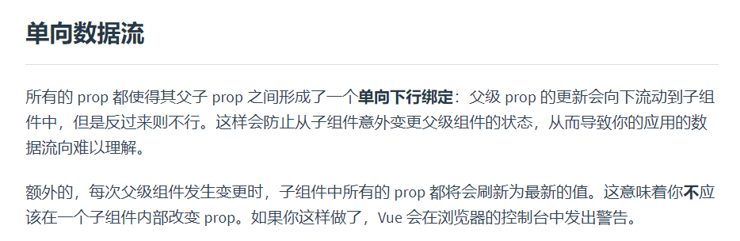

## 怎么理解Vue的单向数据流

vue官网上对单向数据流有如下定义：



总结就是：

1、vue组件间传递数据是单向的，即父组件将props传递给子组件，子组件接收数据但不能直接修改传递过来的数据。父组件的值更新时，会下行流动到子组件中，子组件的props的值也会发生更新

2、子组件不能修改父组件传递过来的数据，否则会报错


**为什么子组件不能修改父组件的值呢？**

因为父组件的值可能是不断变化的，更新时，子组件的props的值也会发生变化。如果子组件可以修改父组件传过来的值，比如子组件接收了num=1,当子组件将其改为2的时候，父组件又传递过来了3，会影响子组件的使用。因此这vue中，组件的传值是单向的。

这样做的好处：

1、多个组件可以互相解耦

2、多个子组件依赖父组件的数据时，子组件组件变化，不影响其他子组件的数据。所以 Vue 不推荐子组件修改父组件的数据，直接修改 prop 会抛出警告。

**希望子组件改变父组件的值，官网提供了两个方法**

>1、在子组件 data 中创建一个变量获取 props 中的值，再改变这个 data 中的值。

```
props: ['number'],
data() {
  return {
    counter: this.number
  }
}
```

这个方法相当于在子组件里创建了prop的副本，之后操作的都是子组件的数据，不会影响到父组件。

>2、子组件定义一个计算属性，处理 prop 的值并返回，通过$emit的方式传递给父组件

```
props: ['size'],
computed: {
  normalizedSize: function () {
    return this.size.trim().toLowerCase()
  }
}
```

这个方法trim() 会返回一个处理完成后的新字符串，同样不会影响到父组件数据（原字符串）。之后如果父组件确实要用到这个处理后的值，就通过 $emit 的方式传给父组件。

如果改变props的值，还需要注意一个问题：
>注意在 JavaScript 中对象和数组是通过引用传入的，所以对于一个数组或对象类型的 prop 来说，在子组件中改变这个对象或数组本身将会影响到父组件的状态。

父组件：

```
<template>
  <div class="hello">
    <h2>父组件数据：{{ parentData }}</h2>
    <childVue :childObj="parentData"></childVue>
  </div>
</template>
<script>
import childVue from './child.vue'
export default {
  name: 'HelloWorld',
  components: {childVue},
  data () {
    return {
      msg: 'Welcome to Your Vue.js App',
      parentData: { num: 20 }
    }
  }
}
```

子组件：

```
<template>
  <div>
    <h3>子组件数据：{{ childData }}</h3>
    <input type="text" v-model="childData.num" />
  </div>
</template>

<script>
export default {
  props: ['childObj'],
  name: '',
  data () {
    return {
      childData: this.childObj,
      //childData: Object.assign({}, this.childObj) //不会影响父组件数据
    }
  }
}
```

当我们改变子组件的值时，父组件的值也相应的改变了。因为数组或对象是引用形式，childData最后还是指向了父组件的数据。改变子组件依然会影响到父组件。

如果希望子组件改变不影响父组件，我们需要在子组件里对数据进行拷贝(浅拷贝或深拷贝以数据结构而定)


