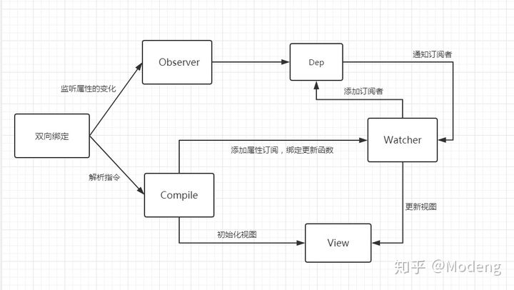

## 了解vue双向绑定原理/响应式原理

先上结论：

> vue数据双向绑定是通过数据劫持结合发布-订阅者模式的方式来实现的。

什么是数据劫持？

数据劫持是指在访问或修改对象的某个属性时，先触发一段函数进行额外的操作，再返回结果。

比较典型的就是Vue 2.x 使用的是`Object.defineProperty()`(Vue 在 3.x 版本之后改用 Proxy 进行实现)。

关于Object.defineProperty()的语法,请参考：[Object.defineProperty()](https://developer.mozilla.org/zh-CN/docs/Web/JavaScript/Reference/Global_Objects/Object/defineProperty)

### 什么是发布订阅模式？

发布订阅模式中包含3个模块：`发布者，订阅者，调度中心`。

举个例子来说，当我们喜欢某个公众号的文章时，但我们不知道这个公众号什么时候发布文章，我们就需要去关注它，当有文章推动时，会有消息及时通知我们文章更新了。

这就是典型的发布订阅模式。公众号属于发布者，用户属于订阅者，因为用户有很多，公众号发布文章后是不会直接通知用户的，而是将发布文章的这个事情发布到调度中心(消息中心)，然后调度中心(消息中心)发消息告知用户公众号更新了。

好了，我们知道了vue双向绑定的原理，来看看数据双向绑定的过程。

### vue双向绑定的过程

MVVM模式下，数据变化更新视图，视图变化更新数据。其中视图更新，我们可以通过事件监听的方式来实现，比如input监听change或input事件即可。那数据改变，如何更新视图呢？

数据更新视图，就是通过`Object.defineProperty()`对属性设置一个set函数，当数据改变了就会来触发这个函数，所以我们只要将一些需要更新的方法放在这里面就可以实现data更新view了。

结合发布订阅模式和`Object.defineProperty()`，数据双向绑定的实现过程如下：

1、设置一个监听器(Observer),用来劫持并监听所有属性，如果有变动，就进入消息订阅器(消息中心/调度中心)

2、消息订阅器收集这些订阅者并通知订阅者(Watcher)。订阅者可以接收到属性的变化并执行相应的函数

3、指令解析器Compile，对每个节点元素进行扫描和解析，将相关指令对应初始化成一个订阅者Watcher，并替换模板数据或者绑定相应的函数

4、订阅者Watcher接收到相应属性的变化，就会执行对应的更新函数，从而更新视图

请参考下图：

### 结合源码分析vue的响应式原理

首先vue主要有3个核心类。

* `1、Observer--监听器`

给对象的属性添加getter和setter，用于`依赖收集和派发更新`。getter用于依赖收集；setter用于派发更新。

* `2、Dep--一个数组`

用于收集当前响应式对象的依赖关系，每个响应式对象都有一个Dep实例，`dep.subs=watcher[]`,这个subs是watcher实例数组，当数据发生改变的时，会通过`dep.notify()`通知各个watcher

* `3、Watcher--观察者对象`

用于监听各个函数。有各种实例：render watcher,computed watch,user watcher等。

Watcher和Dep的关系：watcher 中实例化了 dep 并向 dep.subs 中添加了订阅者,dep 通过 notify 遍历了 dep.subs 通知每个 watcher 更新。

这里有几个比较重要的概念：

* `a、什么是依赖收集？`

initState:对computed属性初始化时，会触发computed watcher依赖收集；对监听属性初始化的时候，会触发user watcher依赖收集。user watcher指的是用户自己添加的watcher，比如写在watch里面的逻辑

render:会触发render watcher依赖收集

* `b、什么是派发更新`

主要是通过`Object.defineProperty`方法对数据进行处理

1、组件中对响应的数据进行修改，触发setter逻辑

2、调用dep.notify()

3、遍历所有subs(wachter实例),调用每一个watcher的update方法

### `结合上图总结：`

当创建vue实例时，vue会先遍历data里面的属性，利用object.definedProperty为属性添加getter和setter对数据的读取进行劫持。其中getter就是依赖收集；setter就是派发更新。并且在内部追踪依赖,在属性被访问和修改时通知变化。

每个组件实例会有相应的 watcher 实例,会在组件渲染的过程中记录依赖的所有数据属性（进行依赖收集,还有 computed watcher,user watcher 实例）,之后依赖项被改动时,setter 方法会通知依赖与此 data 的 watcher 实例重新计算（派发更新）,从而使它关联的组件重新渲染。

