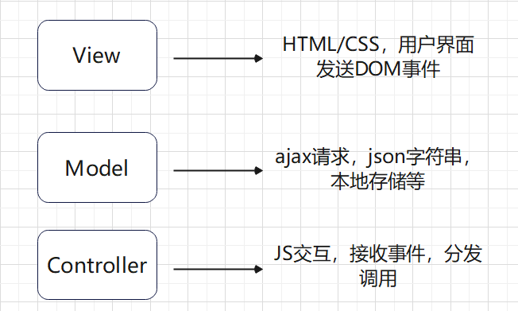
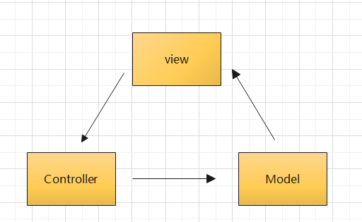
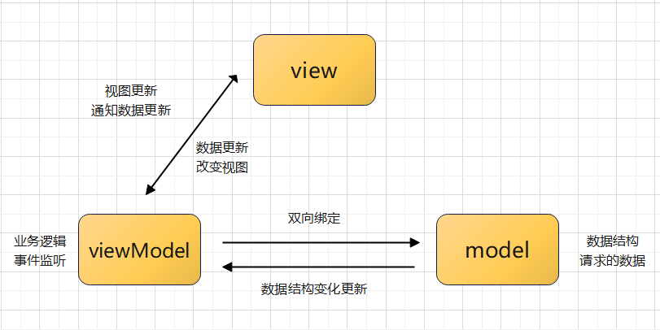
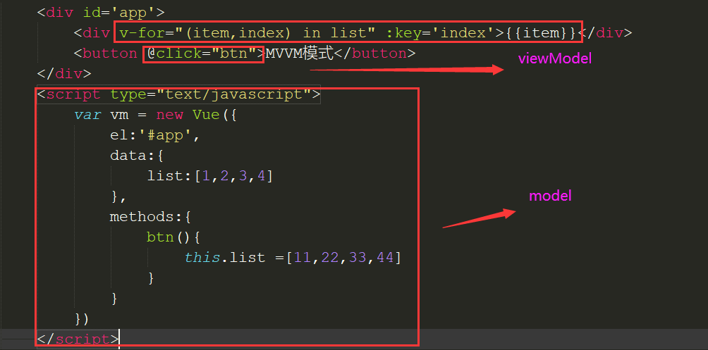

## MVVM和MVC模式的理解

### MVC的理解

1、MVC:全名是Model View Controller。即模型-视图-控制器。在前端的理解上：

模型(Model)：数据传递保存等

视图(View)：用户界面相关

控制器(Controller)：触发相应的事件，处理业务逻辑

在原生JS上，MVC可以这样简单理解：

各部分的通信方式如下：

主要流程就是：

(1)、View传送指令到Controller层。比如View接收到点击事件，触发onClick事件

(2)、Controller层处理业务逻辑后，要求Model改变状态

(3)、Model将新的数据发送到View，改变用户页面。

还有一种方式就是，用户直接操作Controller层，比如直接改变URL触发hashChange事件，此时改变model层进而改变用户界面

MVC优点：

把所有精力放在数据处理，尽可能减少对网页元素的处理。对于有一定数量功能的网页，Mvc模式下强制规范代码，简化，减少重复代码，使代码易于扩充。

MVC缺点：

1、对于小项目来说，代码复杂，降低开发效率

2、控制层和视图层耦合，没有真正的分离和复用

3、随着项目逐渐复杂，界面和逻辑复杂后，视图和模板引擎，数据解析处理变得复杂，变得难以维护。

总结，在前端使用MVC模式开发还是比较少的。有人说Jqery是MVC模式，JQ只是操作了DOM元素，就是实现了view层面，没有实现对业务逻辑的分层，维护性和扩展性较差。

### MVVM模式的理解

MVVM全名是Model-View-ViewModel。本质上是MVC的改进，即模型-视图-视图模型。差别就在于视图模型

MVVM模式的关键就在于视图模型(viewModel)，ViewModel是连接View和Model的中间件,可以绑定到不同的view上，主要做两件事：

一是将【模型】转化成【视图】，即监听到数据变化，更新视图中对应的内容。实现的方式是：数据绑定。

二是将【视图】转化成【模型】，即监听到视图变化，并能够通知数据的变化。实现的方式是：DOM 事件监听。

这两个方向都实现的，我们称之为数据的双向绑定，比如vue的双向数据绑定。

在MVVM的框架下视图和模型是不能直接通信的。它们通过ViewModel来通信，ViewModel通常要实现一个observer观察者，当数据发生变化，ViewModel能够监听到数据的这种变化，然后通知到对应的视图做自动更新，而当用户操作视图，ViewModel也能监听到视图的变化，然后通知数据做改动，这实际上就实现了数据的双向绑定。并且MVVM中的View 和 ViewModel可以互相通信。

通信方式如下：

vue就是MVVM模式，如何区分viewModel和model？

### MVVM的优点

1、双向绑定，更专注于数据变化。当Model变化时，View-Model会自动更新，View也会自动变化;当view更新时，view-model也会监听到然后更新到model。我们不需要再纠结DOM层了，更加专注于操作数据

2、对DOM和数据的监听器移到view层，对控制器大大瘦身了，不用再写庞大的控制器逻辑了。

3、因为model层和view不直接通信，对于具体业务，我们可以将model数据层抽离出来，更加简洁。

