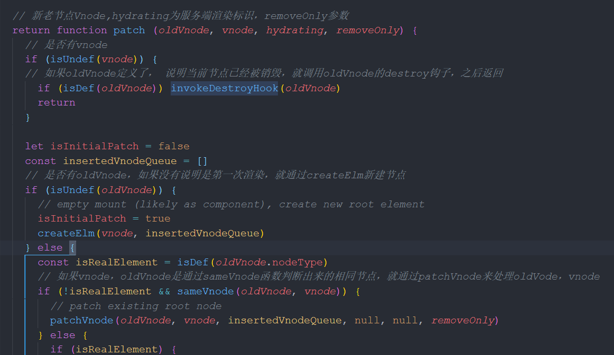
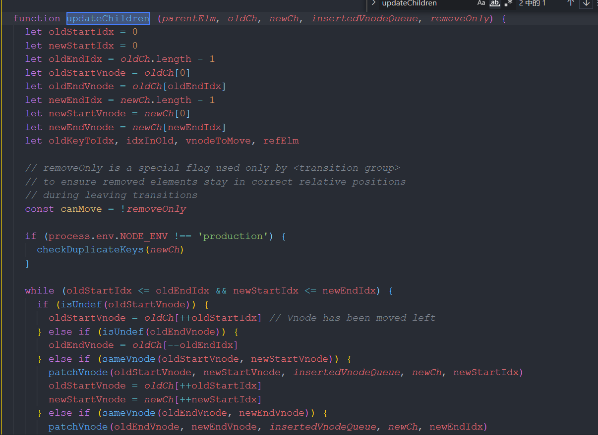

## 简单聊聊v-for循环中key的作用

key的作用：`主要是DOM的diff算法用的，高效更新虚拟DOM。提高DOM渲染效率，提升渲染速度`

### 原因

vue是数据双向绑定的，更新数据后，页面渲染。如果我们往列表里面添加一条数据，数据更新，页面上所有列表都要渲染一遍，这就带来很大的性能问题。

v-for循环上使用key，就是为了避免这个问题。循环时，给每个数据都有一个唯一的key值，表明这条数据的唯一性。会根据key值去判断某个值是否需要修改，如果要修改就重新渲染；如果不修改就使用之前的值。这样就只用渲染修改的值即可。

### 官网对v-for使用key的解释

当 Vue 正在更新使用 v-for 渲染的元素列表时，它默认使用“就地更新”的策略。如果数据项的顺序被改变，Vue 将不会移动 DOM 元素来匹配数据项的顺序，而是就地更新每个元素，并且确保它们在每个索引位置正确渲染。

这个默认的模式是高效的，但是只适用于不依赖子组件状态或临时 DOM 状态 (例如：表单输入值) 的列表渲染输出。

为了给 Vue一个提示，以便它能跟踪每个节点的身份，从而重用和重新排序现有元素，你需要为每项提供一个唯一 key attribute：

key 的特殊 attribute 主要用在 Vue 的虚拟 DOM 算法，在新旧 nodes 对比时辨识 VNodes。如果不使用key，Vue会使用一种最大限度减少动态元素并且尽可能的尝试就地修改/复用相同类型元素的算法。而使用key 时，它会基于 key 的变化重新排列元素顺序，并且会移除 key 不存在的元素。

有相同父元素的子元素必须有独特的 key。重复的key会造成渲染错误。

### 从源码分析key值

通过key值判断是否是相同节点的源码地址：src/core/vdom/patch.js

使用patch算法对比新老节点



updateChildren函数进行虚拟节点对比，遍历时通过sameVnode函数判断是否为同一节点，如果是就进入子节点比较



sameVnode函数判断是否是相同节点

```javascript
function sameVnode (a, b) {
  return (
    a.key === b.key &&
    a.asyncFactory === b.asyncFactory && (
      (
        a.tag === b.tag &&
        a.isComment === b.isComment &&
        isDef(a.data) === isDef(b.data) &&
        sameInputType(a, b)
      ) || (
        isTrue(a.isAsyncPlaceholder) &&
        isUndef(b.asyncFactory.error)
      )
    )
  )
}
function sameInputType (a, b) {
  if (a.tag !== 'input') return true
  let i
  const typeA = isDef(i = a.data) && isDef(i = i.attrs) && i.type
  const typeB = isDef(i = b.data) && isDef(i = i.attrs) && i.type
  return typeA === typeB || isTextInputType(typeA) && isTextInputType(typeB)
}
```

上面sameVnode的两个参数分别表示的是旧节点和新节点。主要的意思就是：如果没有key值，只要标签名相同就是同一个节点，然后进行节点内部元素的比较。

函数意思：

1、判断key值是否相同，这个key值就是我们在页面上循环时添加的key值。如果没有赋值，那就是undefined

2、`a.tag===b.tag`这个tag是在构造AST语法树时插入的tag元素，即为元素的标签。

3、是否同为代码注释，是否有同样的data，是否是input元素检查。


[结合源码理解vue列表渲染v-for中的key属性](https://blog.51cto.com/u_15127544/2701216)

[Diff算法](https://juejin.cn/post/6844903607913938951)


