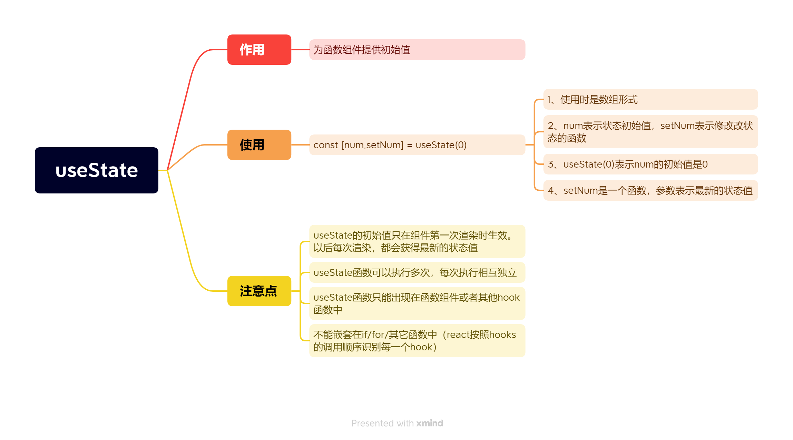

## react里的hooks详解

### hooks是什么

> hooks是能够使函数组件更强大，更灵活的钩子

react体系里，组件分为函数式组件和类组件。类组件有生命周期，函数组件没有自己的生命周期，函数组件也不能拥有自己的状态。随着多年的实践，函数组件是一个更加匹配react设计理念的，为了能让函数组件也拥有自己的状态，在react v16.8开始，hooks应运而生。

注意：

1、hooks只能在函数组件中使用

2、hooks的出现只是丰富了函数组件。类组件还是可以使用的

3、hooks为函数组件提供了状态，函数组件也再是无状态组件

### hooks解决了什么问题

> hooks解决了两个问题：组件的状态逻辑复用和class组件自身的问题

1、组件的状态逻辑复用

在hooks出现之前，react先后尝试了 mixins混入，HOC高阶组件，render-props等模式，但是都有各自的问题，比如mixin的数据来源不清晰，高阶组件的嵌套问题等等

2、class组件自身的问题

class组件的使用稍显复杂，有各种生命周期，this指向的问题。

### hooks---useState()



useState可以弥补函数组件没有state的缺陷。

useState可以接受一个初始值，也可以是一个函数action，action的返回值作为新的state。返回一个数组，第一个值为state读取值，第二个值为改变state的dispatchAction函数

#### 1、useState的使用

(1)、引入useState函数

(2)、调用useState函数，传入初始值

(3)、从useState的返回值中拿到初始值和修改状态的函数

(4)、在jsx中使用初始值和修改状态的函数

```js
// 引入useState
import {useState} from "react"
import { Button } from "antd"
function App(){
  // 调用useState函数，并传入初始值1
  const [count,setCount] =useState(1)
  return (
    <div>
      {/* 在jsx中使用初始值，并调用修改初始值的函数setCount */}
      <Button onClick={()=>setCount(count+1)} type='primary'>{count}</Button>
    </div>
  )
}
export default App
```
#### 2、useState状态的改变

依照上面，使用setCount方法修改count的值。setCount的参数，表示最新的值。调用该函数后，新值就会替代旧值，修改状态，就会引起视图的改变。

每次点击时，react内部拿到的状态值(count)都是最新的，初始值只在第一次渲染时生效。

**3、useState使用规则**

`(1)、useState函数可以执行多次，每次执行相互独立，每次调用，都会为函数组件提供一个新的状态值`

```js
// 引入useState
import {useState} from "react"
import { Button } from "antd"
function App(){
  // 调用useState函数，并传入初始值1
  const [count,setCount] =useState(1)
  const [flag,setFlag] =useState(true)
  return (
    <div>
      {/* 在jsx中使用初始值，并调用修改初始值的函数setCount */}
      <Button onClick={()=>setCount(count+1)} type='primary'>{count}</Button>
      <Button onClick={()=>setFlag(!flag)} type='primary'>{flag}</Button>
    </div>
  )
}
export default App
```
上面新增了一个useState函数，两个函数是独立的，互不干涉。

`2、useState函数只能出现在函数组件或其他hook函数中，不能嵌套在if、for循环，其他函数中`
```js
// 引入useState
import {useState} from "react"
import { Button } from "antd"
function App(){
  // 这是错误的用法，useState不能出现在其他函数中
  function setList(n){
    if(n==1){
      const [count,setCount] =useState(1)
    }else{
      const [count,setCount] =useState(0)
    }
  }
  return (
    <div>
      {/* 在jsx中使用初始值，并调用修改初始值的函数setCount */}
      <Button onClick={()=>setCount(count+1)} type='primary'>{count}</Button>
    </div>
  )
}
export default App
```

### hooks---useEffect()

作用：通过修改状态来更新组件。

默认状态,无依赖项，组件初始化的时候先执行一次，等到每次数据修改，组件更新时再次执行

useEffect可以弥补函数组件没有生命周期的缺点。在useEffect第一个参数回调函数中，做一个请求数据，事件监听等操作，第二个参数作为dep依赖项，当依赖项发生变化时，重新执行第一个函数

useEffect可以用来数据交互

```js
function App(){
  const [count,setCount] =useState(0)
  // 定义副作用
  useEffect(()=>{
    document.title=count//组件执行时，将网页标题改为count的值
  })
  return (
    <div>
      <Button onClick={()=>setCount(count+1)} type='primary'>按钮</Button>
    </div>
  )
}
export default App
```

2、添加第二个参数来控制执行，如果添加一个空数组，只在组件初始化的时候更新，其他时候不更新。
```js
function App(){
  const [count,setCount] =useState(0)
  // 定义副作用
  useEffect(()=>{
    document.title=count//组件执行时，将网页标题改为count的值
  },[])//添加第二个参数，为空数组，只在组件初始化的时候更新
  return (
    <div>
      <Button onClick={()=>setCount(count+1)} type='primary'>按钮</Button>
    </div>
  )
}
export default App
```

3、添加特定依赖项，组件初始化的时候更新，当特定依赖项改变时，组件也会再次执行
```js
function App(){
  const [count,setCount] =useState(0)
  // 定义副作用
  useEffect(()=>{
    document.title=count//组件执行时，将网页标题改为count的值
  },[count])//添加第二个参数，为count，当count发生改变时，副作用里的执行也会发生改变
  return (
    <div>
      <Button onClick={()=>setCount(count+1)} type='primary'>按钮</Button>
    </div>
  )
}
export default App
```
4、注意：在useEffect回调函数中用到的数据状态，就应该出现在依赖项的数组中，否则会有问题。

```js
function App(){
  const [count,setCount] =useState(0)
  const [name,setName]=useState('cp')
  // 定义副作用
  useEffect(()=>{
    document.title=name
    document.title=count
    
  },[count,name])//useEffect函数中，使用到了name和count，那么依赖项里必须要有这两个数据
  // 这种情况下，什么时候会执行副作用函数呢---初始化的时候，改变count和name被修改时都会执行
  return (
    <div>
      <Button onClick={()=>setCount(count+1)} type='primary'>按钮</Button>
      <Button onClick={()=>setName('op')}>{name}</Button>
    </div>
  )
}
export default App
```

5、useEffect函数中使用axios请求

上面说道，如果依赖项为空数组，那么useEffect函数只会执行一次，基于此，我们就可以在这里进行axios请求，进行初始化操作。但在useEffect中使用axios时，不能直接使用axios请求，而是需要使用函数的形式。

```js
function Count(num){
  const [count,setCount]=useState(num.count)
  useEffect(()=>{
    // 使用axios时，必须使用方法，然后再执行这个方法
    async function loadData(){
     let res=  await axios.get('xxxx')
     console.log(res);
    }
    loadData()
  },[])
  return (
    <Button onClick={()=>setCount(count+1)}>{count}</Button>    
  )
}
```

### hooks---useRef

useRef---获取组件实例。(只有类组件有组件实例，函数组件不能使用此方法)

使用:
(1)、使用`const testRef = useRef(null)`新建

(2)、在类组件上使用`ref={testRef}`

(3)、在useEffect中使用`testRef.current`获取组件实例

```js

import { useEffect, useRef } from "react";
import React from "react";
// 组件实例---类组件
// dom对象
class Test extends React.Component{
  getData=()=>{
    console.log(111);
  }
  state={
    count:0
  }
  render(){
    return (
      <div></div>
    )
  }
}
function App(){
  const testRef = useRef(null)
  useEffect(()=>{
    console.log(testRef.current);
  },[])
  // useEffect回调，是在dom渲染之后才获取到
  return(
    <div>
      <Test ref={testRef}/>
    </div>
  )
}
export default App
```

创建useRef时，会创建一个原始对象，只要函数组件不被销毁，原始对象就会一直存在，那我们可以利用这个特性，来通过useRef保存一些数据。

### hooks---useContext

作用：父组件给孙组件传值。类似Provider

```js

import React,{createContext,useContext,useState} from "react";

import { Button } from "antd";
const Context = createContext()
// context如果要传递的数据，只需要在整个应用初始化的时候传递一次就可以
// 就可以选择在当前文件里做数据提供。数据是动态的
// 如果context需要传递的数据并且将来还需要对数据做修改，底层组件也需要，跟着一起改变，就可以在app.js里面写。这样数据只用一次。是静态的。
function ComA() {
  const count = useContext(Context)
   return (
    <div>
      <ComB></ComB>
      {count}
    </div>
   ) 
}
function ComB(){
  const count = useContext(Context)
  return (
    <div>
      <Button>{count}</Button>
    </div>
  )
}
function App(){
  const [num,setNum]=useState(0)
  return (
    <div>
      <Context.Provider value={num}>
        <ComA></ComA>
      </Context.Provider>
      <Button onClick={()=>setNum(num+1)}>{num}</Button>
    </div>
  )
}
export default App
```

### hooks---useMemo

useMemo接受两个参数，第一个参数是一个函数，返回值用于产生保存值，第二个参数是一个数组，作为dep依赖项，数组里面的依赖项发生变化，重新执行第一个函数，产生新的值。

用用场景：

1、缓存一些值，避免重新执行上下文

```js
const number = useMemo(()=>{
    /** ....大量的逻辑运算 **/
   return number
},[ props.number ]) // 只有 props.number 改变的时候，重新计算number的值。
```

2、减少不必要的dom循环

```js
/* 用 useMemo包裹的list可以限定当且仅当list改变的时候才更新此list，这样就可以避免selectList重新循环 */
 {useMemo(() => (
      <div>{
          selectList.map((i, v) => (
              <span
                  className={style.listSpan}
                  key={v} >
                  {i.patentName} 
              </span>
          ))}
      </div>
), [selectList])}
```

3、减少子组件渲染

```js
/* 只有当props中，list列表改变的时候，子组件才渲染 */
const  goodListChild = useMemo(()=> <GoodList list={ props.list } /> ,[ props.list ])
```

### hooks---useCallback()

useMemo和useCallback接收的参数都是一样的，都是在其依赖项发生变化后才执行，都是返回缓存的值，区别在于useMemo返回的是函数运行的结果，useCallback返回的是函数。返回的callback可以作为props回调函数传递给子组件。

```js
/* 用react.memo */
const DemoChildren = React.memo((props)=>{
   /* 只有初始化的时候打印了 子组件更新 */
    console.log('子组件更新')
   useEffect(()=>{
       props.getInfo('子组件')
   },[])
   return <div>子组件</div>
})
const DemoUseCallback=({ id })=>{
    const [number, setNumber] = useState(1)
    /* 此时usecallback的第一参数 (sonName)=>{ console.log(sonName) }
     经过处理赋值给 getInfo */
    const getInfo  = useCallback((sonName)=>{
          console.log(sonName)
    },[id])
    return <div>
        {/* 点击按钮触发父组件更新 ，但是子组件没有更新 */}
        <button onClick={ ()=>setNumber(number+1) } >增加</button>
        <DemoChildren getInfo={getInfo} />
    </div>
}
```
### hooks---自定义hook

自定义hook，步骤：

1、定义函数

2、使用useState新建初始值

3、在useEffect中写需要实现的代码逻辑

4、最后将需要的数据返回

实现一个滑动屏幕，获取屏幕高度的hook

```js
import { useState } from "react";
export function useWindowScroll(){
  const [y,setY]=useState(0)
  window.addEventListener('scroll',()=>{
    const h = document.documentElement.scrollTop
    setY(h)
    // h的值就是y的值
    // 导出的时候，返回的是一个数组
  })
  return [y]
}
```

```js
import {useWindowScroll} from 'useWindowScroll'
function App(){
  let [y]=useWindowScroll(0)
  return(
    <div style={{height:'10000px'}}>
      {y}
    </div>
  )
}
export default App
```

自定义hooks网站

[react-use](https://github.com/streamich/react-use)