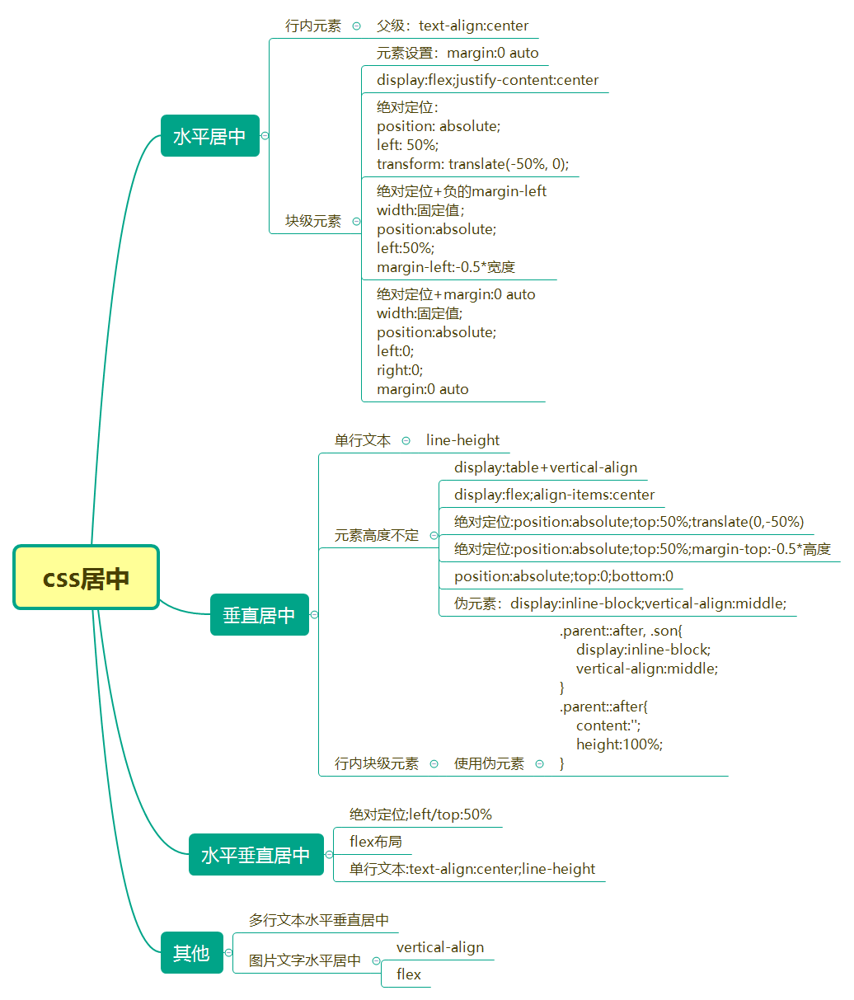

## CSS居中方法总结



### 一、水平居中

**1、行内元素**

给父级设置`text-align:center`即可

```css
.parent{
	text-align: center;
}
```

**2、块级元素**

该元素设置 margin:0 auto即可,需要设置宽度

```css
.parent {
	width: 100px;
	margin: 0 auto;
}
```

**3、flex实现**

```html
<div class="parent">
<!-- 父级使用display:flex，子级也可以居中,并且子级可以不用定宽高-->
  <div class="son">块级元素</div>
</div>

.parent {
	display: flex;
	justify-content: center;
}
```

**4、transform**

```css
.son {
	position: absolute;
	left: 50%;
	transform: translate(-50%,0);
}
```

**5、绝对定位+负值的margin-left**

```css
.son {
	position: absolute;
	left: 50%;
  width:100px;
	margin-left:-50px//负值，宽度的一半
}
```

**6、绝对定位+left/right+margin**

```
.son {
	position: absolute;
	width: 100px;
	left: 0;
	right: 0;
	margin: 0 auto;
}
```

### 垂直居中

**1、单行文本**

单行文本直接使用line-height等于父级高度即可，不论行内元素或块级元素。都可以使用

```css
.parent{
	height: 100px;
}
.son{
	line-height: 100px;
}
```

**2、行内块级元素：display: inline-block, vertical-align: middle**

```css
.parent::after, .son{
    display:inline-block;
    vertical-align:middle;
}
.parent::after{
    content:'';
    height:100px;
}
```

**3、flex实现**

```css
.parent{
	display: flex;
	align-items: center;
	height: 100px;
}
```

**4、绝对定位+top/bottom+margin**

```css
.parent{
	position: relative;
	height: 100px;
}
.son{
	position: absolute;
	height: 20px;
	top: 0;
	bottom: 0;
	margin: auto 0;
}
```

**5、绝对定位+top+负的margin-top**

```css
.parent{
	position: relative;
	height: 100px;
}
.son{
	position: absolute;
	height: 20px;
	top: 50%;
	margin-top: -10px;
}
```

**6、transform**

```css
.son{
    position:absolute;
    top:50%;
    transform: translate(0,-50%);
}
```

**7、display:table+vertival-align**

```css
.parent{
	display: table;
	height: 100px;
}
.son{
	display: table-cell;
	vertical-align: middle;
}
```

以上就是水平居中和垂直居中的各种方法，有些方法是需要作用在父级，有些是作用于子级才行。
### 垂直水平居中

根据上面水平居中8种，垂直居中8种。实现垂直水平居中也比较方便。

**1、text-align和line-height**

针对单行文本，如果是多行文本或者子级有多个，是不适用的。

```css
.parent{
	height: 100px;
	text-align: center;
}
.son{
	line-height: 100px;
}
```

**2、绝对定位+left/top/right/bottom+margin:0 auto**

需要给子级定宽，否则无法水平居中

```css
.parent{
	position: relative;
}
.son{
	position: absolute;
	width: 100px;
	left: 0;
	top: 0;
	right: 0;
	bottom: 0;
	margin: 0 auto;
}
```

**3、绝对定位+left/top:50%+transform**

```css
.parent{
	position: relative;
	height: 100px;
}
.son{
	position: absolute;
	left: 50%;
	top: 50%;
	transform: translate(-50%,-50%);
}
```

**4、绝对定位+负的margin-left和负的margin-top**

这个方法需要给子级定宽高

```css
.parent{
	position: relative;
}
.son{
	height: 100px;
	width: 100px;
	position: absolute;
	left: 50%;
	top: 50%;
	margin-left: -50px;
	margin-top: -50px;
}
```

**5、flex布局**

```css
.parent{
	display: flex;
	justify-content: center;
	align-items: center;
	height: 100px;
}
```

**6、绝对定位+calc()**

需要知道子级的宽高

```
.parent{
	position: relative;
}
.son{
	height: 100px;
	width: 100px;
	position: absolute;
	left: calc(50% - 50px);
	top: calc(50% - 50px);
}
```

总结：上述水平垂直居中方法大多都是给子级绝对定位实现的，而且需要给子级定宽或定高，在兼容性不强的情况，使用flex方法最为方便。


### 多行文本的水平垂直居中

对父级设置宽高，当文本太长时，就会出现多行文本。

**1、使用display:table**

需要对父级设置宽高，然后将父级变成table，子级使用`display:table-cell;vertical-align:middle`。

```css
.parent{
	width: 200px;
	height: 200px;
	display: table;
}
.son{
	display: table-cell;
	vertical-align: middle;
}
```

**2、display:inline-block+line-height+vertical-align**

对子元素设置display:inline-block属性，使其转化成行内块元素，模拟成单行文本。父元素设置对应的height和line-height。对子元素设置vertical-align:middle属性，使其基线对齐。添加line-height属性，覆盖继承自父元素的行高。缺点：文本的高度不能超过外部盒子的高度。

```css
.parent{
	width: 200px;
	height: 200px;
	line-height: 200px;
}
.son{
	display: inline-block;
	line-height: 20px;
	vertical-align: middle;
}
```

**3、父级使用flex方法**

```css
.parent{
	width: 200px;
	height: 200px;
	display: flex;
	justify-content: center;
	align-items: center;
}
```
以上3种方法，使用flex方法最为简单，建议使用。如果有多个子级需要垂直居中呢？

### 多个子级水平垂直居中

**1、使用flex实现**

使用display:flex变成弹性盒子，使用flex-direction变为纵轴形式排列

```html
<div class="parent">
	<div class="title">标题</div>
	<div class="sectitle">小标题</div>
	<div class="content">内容</div>
</div>
```
```css
.parent{
	width: 200px;
	height: 200px;
	display: flex;
	justify-content: center;
	align-items: center;
	flex-direction: column;
}
```

**2、将多个子级用div包裹起来，然后采用绝对定位方式水平垂直居中**

这个方法需要用div将所有子级包裹起来。然后就可以采用绝对定位的各种居中方式了。

```html
<div class="parent">
	<div class="box">
		<div class="title">标题</div>
		<div class="sectitle">小标题</div>
		<div class="content">内容</div>
	</div>
</div>
```
```css
.parent{
	width: 200px;
	height: 200px;
	position: relative;
}
.box{
	position: absolute;
	left: 50%;
	top: 50%;
	transform: translate(-50%,-50%);
}
```

**3、父级display:flex+子级的margin:auto**

```html
<div class="parent">
	<div class="box">
		<div class="title">标题</div>
		<div class="sectitle">小标题</div>
		<div class="content">内容</div>
	</div>
</div>
```
```css
.parent{
	width: 200px;
	height: 200px;
	display: flex;
	background: #969799;
}
.box{
	margin: auto;
	text-align: center;
}
```