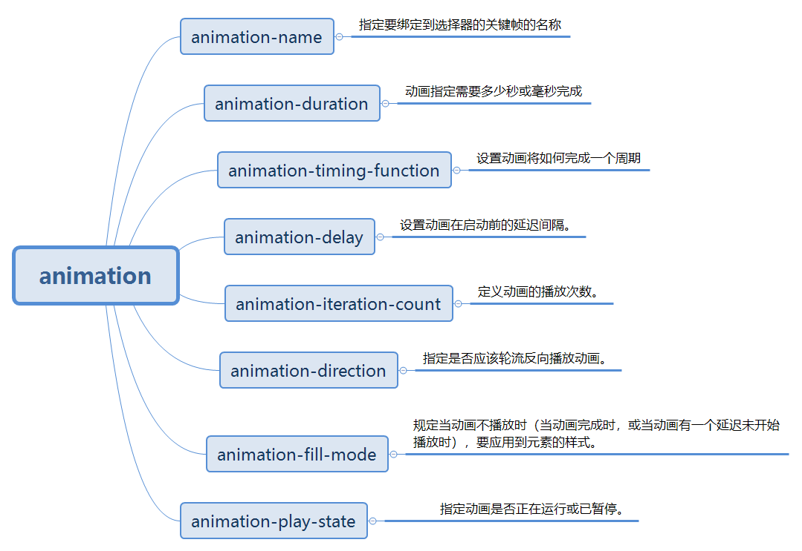

## CSS动画

### CSS动画——@keyframes

CSS动画使用的是 @keyframes 

@keyframes规则就是创建动画，把他绑定到一个选择器，规定动画名称和动画时长。配合animation相关属性来完成动画效果.

可以使用百分比，也可以使用from和to关键字.

如果只有两帧的动画，0%也就相当于from,100%相当于to。对于多帧的，就只能使用百分比形式了。

```css
div{
	width:100px;
	height:100px;
	background:red;
	position:relative;
	animation-name:myfirst;
	animation-duration:5s;
	animation-timing-function:linear;
	animation-delay:2s;
	animation-iteration-count:infinite;
	animation-direction:alternate;
	animation-play-state:running;
  /* animation: myfirst 5s linear 2s infinite alternate; 简写 */
}

@keyframes myfirst{
	0%   {background:red; left:0px; top:0px;}
	25%  {background:yellow; left:200px; top:0px;}
	50%  {background:blue; left:200px; top:200px;}
	75%  {background:green; left:0px; top:200px;}
	100% {background:red; left:0px; top:0px;}
}
```



这些属性，有一些是必须项，有一些是非必须项

必须项：animation-name、animation-duration 和 @keyframes规则

非必须项：animation-delay、animation-direction、animation-iteration-count、animation-play-state、animation-timing-function、animation-fill-mode，当然不是说它们不重要，只是不设置时，它们都有默认值


### 贝塞尔曲线

CSS3里内置一些动画运动函数。ease/ease-in/ease-out/ease-in-out/linear

ease:以低速开始，然后加快，在结束前变慢

ease-in:以低速开始

ease-out:以低速结束

ease-in-out:以低速开始和结束

linear:匀速

还可以使用 cubic-bezier() 方法自定义三次贝塞尔曲线

```js
animation-timing-function: cubic-bezier(0.1, 0.7, 1.0, 0.1);
```

### animation和transform配合使用

tansform属性应用于元素的2D或3D转换。这个属性允许你将元素旋转，缩放，移动，倾斜等。

transform属性：


transition是过度属性，强调过度，它的实现需要触发一个事件（比如鼠标移动上去，焦点，点击等）才执行动画

animation是动画属性，它的实现不需要触发事件，设定好时间之后可以自己执行，且可以循环一个动画。它也类似于flash的补间动画，但是它可以设置多个关键帧（用@keyframe定义）完成动画。

一起使用时：

```css
div{
		width: 100px;
		height: 100px;
		background: #0000FF;
		animation: myDiv 2s infinite linear;
	}
	@keyframes myDiv{
		from{
			transform: rotate(0deg);
		}
		to{
			transform: rotate(360deg);
		}
	}
```
上面的代码，div就会循环转圈。

## requestAnimationframe

MDN对这个方法的定义：

>window.requestAnimationFrame() 告诉浏览器——你希望执行一个动画，并且要求浏览器在下次重绘之前调用指定的回调函数更新动画。该方法需要传入一个回调函数作为参数，该回调函数会在浏览器下一次重绘之前执行。

requestAnimationFrame，顾名思义就是请求动画帧。就是为了实现动画效果。

前端实现的动画效果有js的setTimeout/setInterval,有css3的animation，HTML5还有canvas，为什么还要使用requestAnimationFrame呢？

这是因为电脑显示器的刷新频率是60Hz，大概相当于每秒钟重绘60次，所以最平滑动画的最佳循环间隔是1000ms/60，约等于16.6ms。

使用setTimeout和setInterval定时器不精确。由于事件循环机制的原因，它们的时间间隔并不是真正的时间间隔，而是在队列中。等队列前面的任务完成才执行动画。

requestAnimationFrame采用系统时间间隔，保持最佳绘制效率，不会因为间隔时间过短，造成过度绘制，增加开销；也不会因为间隔时间太长，使用动画卡顿不流畅，让各种网页动画效果能够有一个统一的刷新机制，从而节省系统资源，提高系统性能，改善视觉效果

使用：

requestAnimationFrame使用一个回调函数作为参数，这个回调函数会在浏览器重绘之前调用。

用法上和setTimeout/setInterval类似，只是不需要设置时间

实现一个进度条：

```html
<div id="myDiv" style="background-color: lightblue;width: 0;height: 20px;line-height: 20px;">0%</div>
<button id="btn">run</button>
<script>
var timer;
btn.onclick = function(){
    myDiv.style.width = '0';
    cancelAnimationFrame(timer);
    timer = requestAnimationFrame(function fn(){
        if(parseInt(myDiv.style.width) < 500){
            myDiv.style.width = parseInt(myDiv.style.width) + 5 + 'px';
            myDiv.innerHTML =     parseInt(myDiv.style.width)/5 + '%';
            timer = requestAnimationFrame(fn);
        }else{
            cancelAnimationFrame(timer);
        }    
    });
}
</script>
```
参考文章：[深入浅出 CSS 动画](https://juejin.cn/post/7052506940777168927#heading-19)


