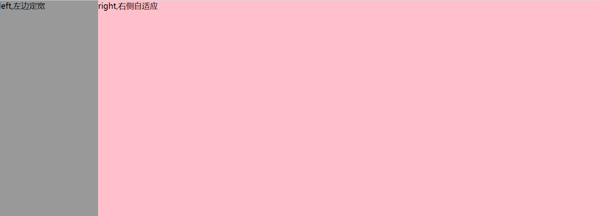
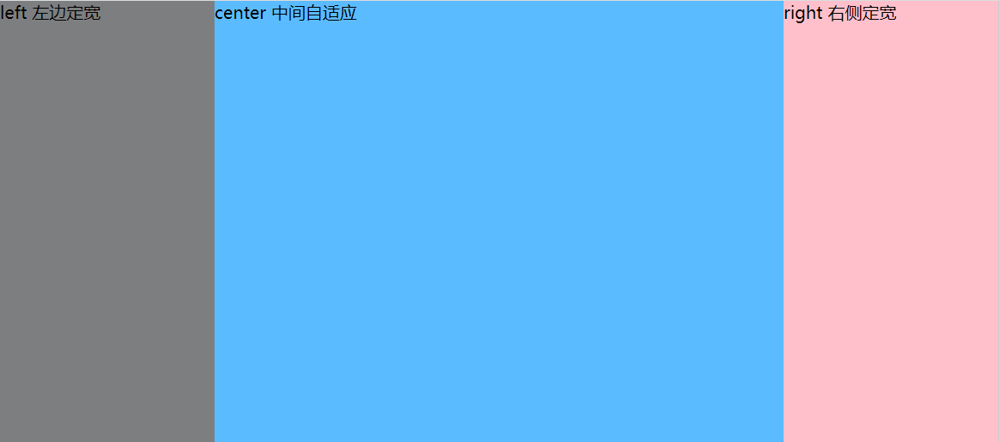

## 常见布局实现

### 两栏布局

两列布局常见于后台管理系统中。

#### 左侧定宽，右侧自适应

如图：




**1、float+margin方法**

```css
*{margin: 0;padding: 0;}
.left{
  width: 200px;
  /*高度铺满整个屏幕*/
  height: 100vh;
  background:#999999;
  float: left;
}
.right{
  background: pink;
  margin-left: 200px;
  height: 100vh;
}
```

**2、float+overflow方法**

```css
*{margin: 0;padding: 0;}
.left{
  width: 200px;
  /*高度铺满整个屏幕*/
  height: 100vh;
  background:#999999;
  float: left;
}
.right{
  background: pink;
  height: 100vh;
  overflow: hidden;
}
```

**3、table方法**

```css
*{margin: 0;padding: 0;}
#box{
  height: 100vh;
  display: table;
  width: 100%;
}
.left{
  width: 200px;
  height: 100%;
  background:#999999;
  display: table-cell;
}
.right{
  background: pink;
  height: 100%;
  display: table-cell;
}
```

利用table自动分割单元格的方法实现。设置margin麻烦，不推荐。

**4、postion方法**

```css
*{margin: 0;padding: 0;}
#box{
  position: relative;
}
.left{
  position: absolute;
  top: 0;
  left: 0;
  width: 200px;
  height: 100vh;
  background:#999999;
}
.right{
  position: absolute;
  left: 200px;
  top: 0;
  right: 0;
  background: pink;
  height: 100vh;
}
```

**5、flex方法**

```css
*{margin: 0;padding: 0;}
#box{
  display: flex;
  height: 100vh;
  width: 100%;
}
.left{
  width: 200px;
  height: 100%;
  background:#999999;
}
.right{
  /* 均分父元素其余空间 */
  flex: 1;
  background: pink;
  height: 100vh;
}
```

**6、grid方法**

```css
*{margin: 0;padding: 0;}
#box{
	display: grid;
	height: 100vh;
	width: 100%;
	grid-template-columns: 200px auto;
}
.left{
	background:#999999;
}
.right{
	background: pink;
}
```

总结：上面6种方法都可以实现左边定宽，右侧自适应的效果。工作中第一种和第五种方法使用较多。

### 三列布局

三列布局，就是左中右布局，其中左右定宽

如图：



**1、flex实现**

```css
*{margin: 0;padding: 0;}
#box{
	display: flex;
}
.left{
	width: 200px;
	height: 100vh;
	background: #7D7E80;
}
.right{
	width: 200px;
	height: 100vh;
	background: pink;
}
.center{
	flex: 1;//均分剩余的部分
	background: #5ABBFF;
}
```

**2、calc实现**

```css
*{margin: 0;padding: 0;}
#box{
	overflow: hidden;
}
.left{
	width: 200px;
	height: 100vh;
	background: #7D7E80;
	float: left;
}
.right{
	width: 200px;
	height: 100vh;
	background: pink;
	float: right;
}
.center{
	height: 100vh;
	/* //使用calc自动计算 */
	width: calc(100% - 400px);
	float: left;
	background: #5ABBFF;
}
```

**3、圣杯布局-需修改HTML结构**

```HTML
<div id='box'>
  <div class="center">center 中间自适应</div>
  <div class="left">left,左边定宽</div>
  <div class="right">right 右侧定宽</div>
</div>
```
```css
*{margin: 0;padding: 0;}
#box{
	overflow: hidden;
	/* padding设置左右的值等于left，right的宽度 */
	padding: 0 200px;
}
.left{
	width: 200px;
	height: 100vh;
	background: #7D7E80;
	float: left;
	/* margin-left:-100%,就可以让left往左移，一直移动到上面的最左边 */
	margin-left: -100%;
	position: relative;
	/* #box的padding左右缩小200px，left就往左200px，占据空出来的空白 */
	left: -200px;
}
.right{
	width: 200px;
	height: 100vh;
	background: pink;
	float: left;
	/* margin-left的值等于其宽度才行。因为left已经移动到上面最左边，这样right就会在上面一栏的最右边 */
	margin-left: -200px;
	position: relative;
	/* #box的padding左右缩放200px,right就往右边200px */
	right:-200px ;
}
.center{
	width: 100%;
	height: 100vh;
	float: left;
	background: #5ABBFF;
}
```

圣杯布局下，如果屏幕宽度缩放的比较小，这种方法还是有缺陷的，左右块还是会掉下来。

**4、双飞翼布局**

```html
<div class="container"> 
　　<div class="main">
    　　<div class="content">main</div> 
    </div>
　　<div class="left">left</div> 
　　<div class="right">right</div> 
</div>
```
```css
*{margin: 0;padding: 0;}
#box{
	overflow: hidden;
}
.left{
	width: 200px;
	height: 100vh;
	background: #7D7E80;
	float: left;
	/* margin-left:-100%,就可以让left往左移，一直移动到上面的最左边 */
	margin-left: -100%;
}
.right{
	width: 200px;
	height: 100vh;
	background: pink;
	float: left;
	/* margin-left的值等于其宽度才行。因为left已经移动到上面最左边，这样right就会在上面一栏的最右边 */
	margin-left: -200px;
}
.main{
	width: 100%;
	background: #5ABBFF;
	height: 100vh;
	float: left;
}
.center{
	/* 相当于圣杯布局的#box的padding的作用 */
	margin: 0 200px;
}
```

**5、绝对定位实现**

```html
<div id='box'>
  <div class="left">left 左边定宽</div>
  <div class="center">center 中间自适应</div>	
  <div class="right">right 右侧定宽</div>
</div>
```
```css
#box{
	position: relative;
	padding: 0 200px;
}
.left{
	width: 200px;
	height: 100vh;
	background: #7D7E80;
	position: absolute;
	left: 0;
}
.right{
	width: 200px;
	height: 100vh;
	background: pink;
	position: absolute;
	top: 0;
	right: 0;
}
.center{
	width: 100%;
	background: #5ABBFF;
	height: 100vh;
}
```

**6、grid实现**

```html
<div id='box'>
  <div class="left">left 左边定宽</div>
  <div class="center">center 中间自适应</div>	
  <div class="right">right 右侧定宽</div>
</div>
```

```css
*{margin: 0;padding: 0;}
#box{
	display: grid;
	width: 100%;
	grid-template-columns: 200px 1fr 200px;
	
}
.left{
	height: 100vh;
	background: #7D7E80;
}
.right{
	height: 100vh;
	background: pink;
}
.center{
	background: #5ABBFF;
	height: 100vh;
}

```