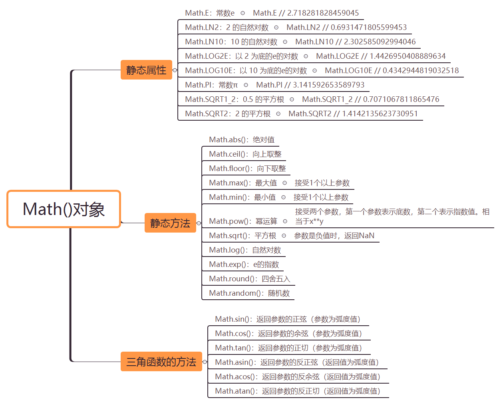
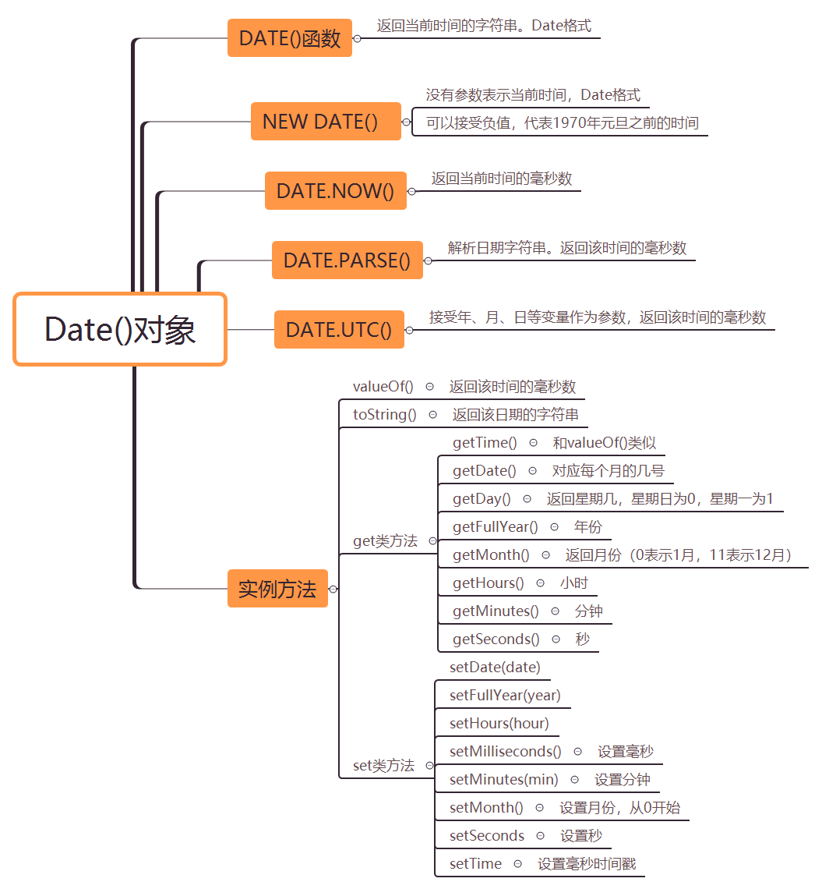

### Math()对象

Math是 JavaScript 的原生对象，提供各种数学功能。该对象不是构造函数，不能生成实例，所有的属性和方法都必须在Math对象上调用。

### Date()对象

Date对象是 JavaScript 原生的时间库。它以国际标准时间（UTC）1970年1月1日00:00:00作为时间的零点

关于日期对象的方法有很多，没有一一列举。详细可参考：[Date()对象](https://developer.mozilla.org/zh-CN/docs/Web/JavaScript/Reference/Global_Objects/Date)

开发中，经常使用常见的插件来进行处理，比较常用的有：`moment.js`/`day.js`

### RegExp()对象

对于正则表达式的方法，常用的就两个:`test()`和`exec()`

`test()`：返回一个布尔值，表示当前模式是否能匹配参数字符串

`exec()`：用来返回匹配结果。如果发现匹配，就返回一个数组，成员是匹配成功的子字符串，否则返回null

正则表达式规则：[正则表达式规则--MDN](https://developer.mozilla.org/zh-CN/docs/Web/JavaScript/Guide/Regular_Expressions)

正则表达式检测：[正则表达式检测-https://rubular.com/](https://rubular.com/)

