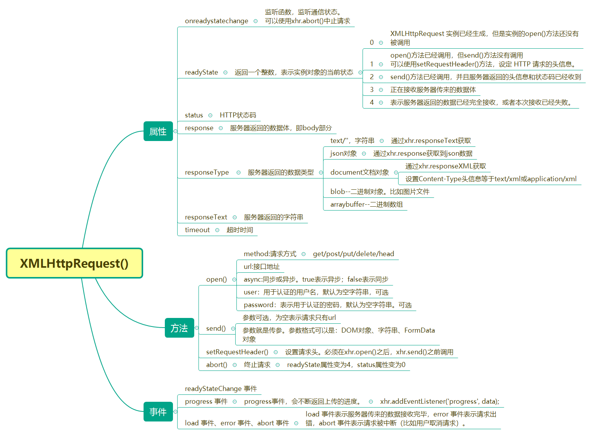

## 浏览器相关——XMLHttpRequest对象

### 来源

浏览器向服务器发出HTTP请求，服务器接收到请求，处理请求后，返回数据给客户端，更新当前网页的对应部分。不用刷新整个页面才更新网页数据。

只要是由网页向服务器发起请求的这个过程，我们称之为Ajax通信.

Ajax是通过原生的`XMLHttpRequest`对象发出的HTTP请求。用户浏览器和服务器之间的通信。

Ajax的特点就是：`异步加载，局部刷新`。不更新整个页面的前提下维护网页数据。

### Ajax优缺点

优点：

* 1、使用异步请求，实现局部刷新，提升用户体验

* 2、优化浏览器和服务器之间的传输，减少不必要的数据传递，减少带宽占用。

* 3、ajax在客户端使用，承担了一部分本来由服务器承担的工作，从而减少了大用户量下的服务器负载。

缺点：

* 1、ajax不支持浏览器back按钮

* 2、安全问题 Aajax暴露了与服务器交互的细节

* 3、对搜索引擎的支持比较弱

* 4、破坏了Back与History后退按钮的正常行为等浏览器机制

### Ajax通信流程

* 1、创建XMLHttpRequest对象(var xhr = new XMLHttpRequest())

* 2、创建新的HTTP请求，指定请求方式、URL、异步或同步(xhr.open()--建立请求)

* 3、设置请求头，发送HTTP请求 (xhr.open()--建立请求；xhr.send()--发出请求)

* 3、接收服务器传回的数据(xhr.responseText)

* 4、获取异步调用返回的数据

* 5、使用JavaScript和DOM实现局部刷新.

在第二个步骤中，我们还可以设置请求头；第三步，需要判断判断服务器的通信状态，判断服务器返回的状态码等。

一个简单完整的Ajax

```js
var xhr = new XMLHttpRequest()

// xhr.open()，建立请求，有3个参数，分别表示，请求方式get/post；请求地址，接口地址；异步或同步（true表示异步，false表示同步)
// get 请求需要带参数时，直接在接口地址后面拼接字符串
xhr.open('get','xxxx'，true)
// 发送请求。参数为null，表示不传参。如果是post请求需要传参，需要转换为字符串形式传递。
xhr.send(null)
// 事件监听，监听服务器通信状态
xhr.onreadystatechange = function(){
  // 通信返回的状态，成功时，状态值为4
  if (xhr.readyState === 4){
    if (xhr.status === 200){//服务器返回的状态码，200和304表示返回的是正常状态
      console.log(xhr.responseText);//从服务器接收到的字符串
    } else {
      console.error(xhr.statusText);
    }
  }
};
```

### XMLHttpRequest()实例属性和方法



### Ajax和Promise，Ajax和axios

首先我们要明白，ajax是一种客户端和服务端通信方式；通过`XMLHttpRequest()`对象来实现的；`promise`是一个对象，是为了解决异步编程一个媒介，也是为了解决ajax`回调地狱`的问题。

Axios是一个基于Promise的 HTTP库，也是对原生ajax的封装。axios底层还是使用原生的ajax，而ajax不只是axios。

### 同源策略

使用ajax访问服务端地址，必须坚持同源策略。否则会造成跨域问题。同源策略是为了防止某个文档或脚本从多个不同源装载。

同源策略：协议、域名、端口全部相同。只要有一个不相同就不是同源

参考：[跨域解决方案]()

