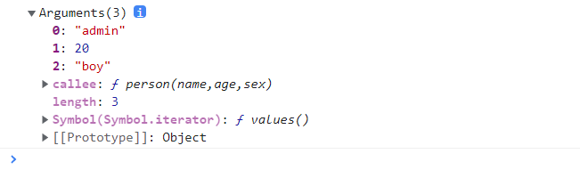

## arguments详解

### arguments是什么?

> arguments 是一个对应于传递给函数的参数的类数组对象。 ---来自MDN Arguments 对象

从这个概念上可以得出：arguments与函数有关；是一个类似于数组的对象；能获取传递给函数的每个参数.

```js
function person(name,age,sex){
  console.log(arguments)
}
person('admin',20,'boy')
```
打印如下：


如图，我们传递给person的参数都以一个有序的形式显示出来了，并且也有索引，而且有length属性。 并且`callee`属性指向了当前执行的函数；`[[Prototype]]`指向了`Object`.

### arguments的特点

`1、arguments对象与函数密不可分，只能在函数内部执行，不能显式地创建`

每个函数都有一个Arguments对象实例arguments，它引用着函数的实参，可以用数组下标的方式”[]“引用arguments的元素。arguments.length为函数实参个数。

```js
function person(){
  console.log(arguments)//Arguments ['name', callee: ƒ, Symbol(Symbol.iterator): ƒ]
}
person('name')
console.log(arguments)//arguments is not defined
```

`2、arguments是对象类型，类似于数组。除了length属性和索引之外没有任何数组属性和方法`

arguments是对象类型，但有数组的length属性和依靠索引取值修改值。但没有数组其他诸如push等方法

可以依靠索引来修改arguments的值

```js
function person(){
  console.log(arguments)//Arguments ['name', 'age',callee: ƒ, Symbol(Symbol.iterator): ƒ]
  console.log(Object.prototype.toString.call(arguments))//[object Object]
  console.log(arguments[0])//name
  console.log(arguments[1])//age
  arguments[1]='sex'
  console.log(arguments)//Arguments ['name', 'age',callee: ƒ, Symbol(Symbol.iterator): ƒ]
  arguments[3] = 11
  console.log(arguments)//Arguments(2) ['name', 'sex', 3: 11, callee: ƒ, Symbol(Symbol.iterator): ƒ]
  arguments.push(1)
  console.log(arguments)//arguments.push is not a function
}
person('name','age')
```
`3、可以将arguments转换为真实数组`

使用`Array.from()`或扩展运算符可以将arguments转换为真实数组

```js
function person(){
	console.log(arguments)
	var args = Array.from(arguments)
	// var args = [...arguments]
	console.log(Object.prototype.toString.call(args))
	args.push('sex')
	console.log(args)//['name', 'age', 'sex']
}
person('name','age')
```

`4、函数实参个数大于形参或实参可变，使用arguments很有用`

上面`person`函数没有形参，我们照样可以使用arguments获取它传递的实参

```js
function person(name){
  console.log(name)//xiaoming
  console.log(arguments)//Arguments(2) ['xiaoming', '20', callee: ƒ, Symbol(Symbol.iterator): ƒ]
}
person('xiaoming','20')
```
上面的代码，实参的个数大于形参的个数，我们照样可以在函数里使用arguments获取到函数传递的实参

`5、函数没有包含剩余参数、默认参数和解构赋值，那么arguments对象中的值会跟踪参数的值（反之亦然）`

```js
// 无默认参数下
function person(name){
  arguments[0]='admin'
  console.log(name)//admin
}
person('xiaoming')
// 无默认参数下
function person1(name){
  name='admin'
  console.log(arguments[0])//admin
}
person1('xiaoming')
// 有默认参数下
function person2(name='xiaoming'){
  name='admin'
  console.log(arguments[0])//xiao
}
person2('xiao')
// 有默认参数下
function person3(name='xiaoming'){
  arguments[0]='admin'
  console.log(name)//xiao.没有改变name的值
  console.log(arguments)//Arguments ['admin', callee: (...), Symbol(Symbol.iterator): ƒ]
}
person3('xiao')
// 有默认参数下
function person(name='xiaoming'){
  console.log(arguments[0])//undefined
}
person()
```
在有默认参数的情况下，arguments不会跟踪形参的变化，而是反应调用函数提供的参数变化。
### arguments的属性——callee

> arguments.callee指向参数所属的当前执行的函数。

`arguments.callee`既然返回的是当前函数，初始值是正被执行的这个函数。基于此就可以实现递归操作了。

```js
var sum = function (n) {
      if (1 == n) {
          return 1;
      } else {
          return n + arguments.callee(n - 1); //6 5 4 3 2 1
      }
  }
console.log(sum(6))//21
```
延伸阅读：[MDN中关于arguments.callee](https://developer.mozilla.org/zh-CN/docs/Web/JavaScript/Reference/Functions/arguments/callee)

