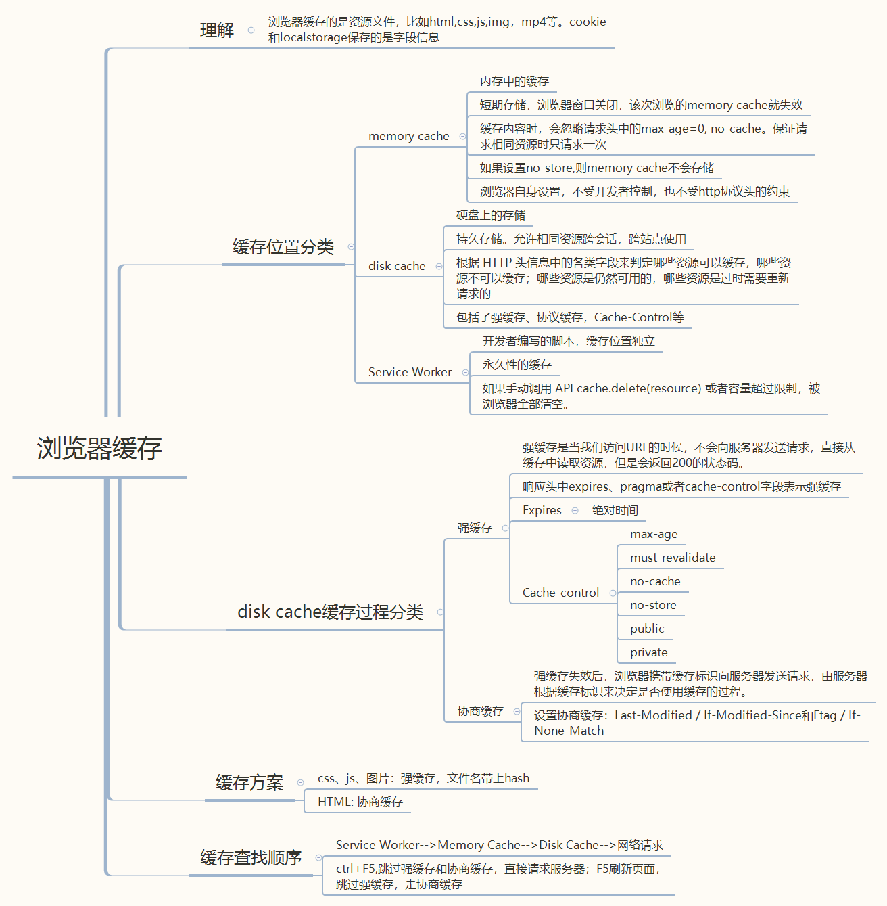
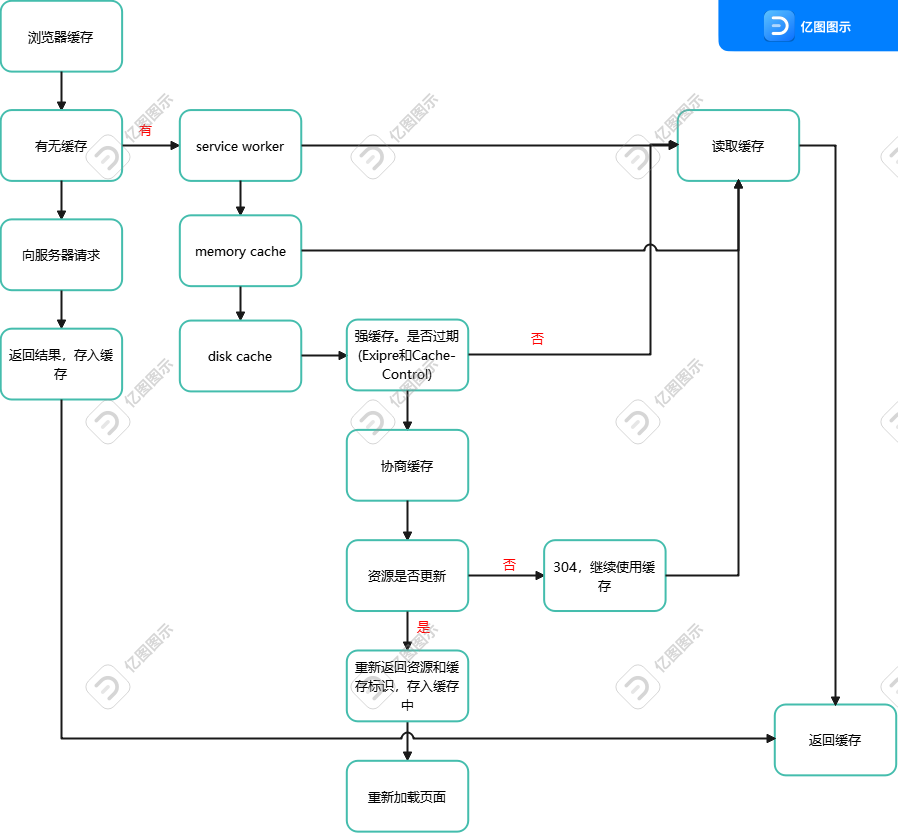

## 前端缓存机制

前端性能优化的解决方案中，缓存是一大重点。

如何使首屏加载更快？在刷新和关闭浏览器后如何保持数据状态？第二次打开页面更快？都要用到缓存。

网络上的缓存分为：DNS缓存、浏览器缓存、CDN缓存。

本地缓存分为：浏览器本地存储(cookie,localstorage)、离线存储。

### 一、DNS缓存

> DNS缓存是指正常访问网站后，系统会将这个IP存储起来，当再次访问时，系统就会直接把本地的DNS缓存提取出来，速度更快

DNS查询的基本步骤:

浏览器缓存--系统缓存--路由器缓存--ISP DNS缓存--根域名缓存

浏览器缓存：浏览器会检查是否在缓存中，没有则调用系统库函数进行查询

系统缓存：操作系统也有自己的 DNS缓存，但在这之前，会向检查域名是否存在本地的 Hosts 文件里，没有则向 DNS 服务器发送查询请求。

路由器缓存：路由器也有自己的缓存

ISP DNS缓存：ISP DNS 就是在客户端电脑上设置的首选 DNS 服务器，大多数情况下都会有缓存。

根域名服务器：本地 DNS 服务器会将请求转发到互联网上的根域
### 二、CDN缓存

在前端性能优化时，总有一条是'使用CDN加速'。那么，什么是CDN加速？
 
> CDN---内容分发网络。是构建在现有网络基础之上的智能虚拟网络。依靠部署在各个地方的边缘服务器，通过分布式存储、负载均衡、网络请求的重定向和内容管理等功能模块，以就近性和服务器负载的判断，确保内容以一种极为高效的方式为用户请求提供所需要的资源

也就是说，当加载某资源时，浏览器本地请求失效的情况下，CDN就会帮我们计算从哪里得到这些资源的路径更快。

CDN不仅解决了跨运营商和跨地域访问的问题，大大降低访问延时的同时，还起到了分流的作用，减轻了源服务器的负载

### 三、浏览器缓存

对于前端来说，更重要的是浏览器缓存。

### 浏览器检查缓存流程

以上就是总结的浏览器缓存知识点，需要注意的是：

`1、强缓存和协商缓存是服务器设置还是客户端设置呢？`

第一次的时候是服务器设置，通过请求体返回

`2、强缓存为什么要设置Expires和Cache-Control这两个值呢？`

因为有的浏览器不认识Cache-Control，只认识Expires，有的浏览器只认识Expires，不认识Cache-Control。因此要设置两个。同时设置时，Cache-Control优先级高于Expires

`3、强缓存特点`

缓存过期后，不管资源有没有变化，强缓存会重新发起请求，重新获取资源。

4、协商缓存---Last-Modified/If-Modified-Since它俩是成对的，是为了对比文件修改时间；ETag/If-None-Match，用来对比文件内容

5、优先查找强缓存，没有命中再查找协商缓存

6、强缓存不向服务器发请求；协商缓存会向服务器请求

7、大多数缓存方案： HTML使用协商缓存；css,image,js资源文件使用强缓存，文件名带上hash

### 
推荐看这几篇文章:

[一文读懂前端缓存](https://juejin.cn/post/6844903747357769742)

[彻底搞懂浏览器缓存机制](https://juejin.cn/post/6844903764566999054)

[前端浏览器缓存知识梳理](https://juejin.cn/post/6947936223126093861)

[五步吃透前端缓存，让页面飞起](https://juejin.cn/post/6993358764481085453)

[深入了解浏览器缓存机制](https://www.jianshu.com/p/54cc04190252)