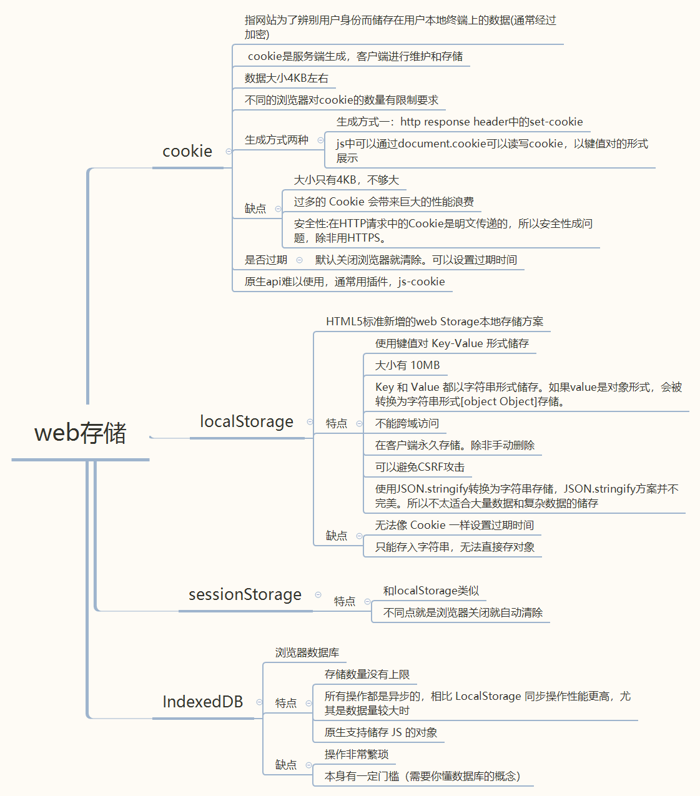

## web存储方案总结



### Cookie的安全问题

Cookie的安全问题体现在：

1、Cookie可以被服务器设置

2、浏览器每次请求会自动带上Cookie

Cookie 执行同源策略，但是可以设置第三方Cookie来实现不同网站展现同样的内容。

`网站a.com`和`网站b.com`各自只能访问自己的 Cookie，无法访问对方或者任何不属于自己的 Cookie。但是当`网站a.com`内嵌了一个`网站b.com`的页面，设一个网站b.com的Cookie，那么这个Cookie对于网站a.com来说就是第三方的Cookie。

这个安全性问题也是一把双刃剑。带来的好处就是在不同的网站可能看到同样的广告内容。

比如在网站a.com和网站b.com两个网站上都可以看到谷歌同样的广告内容，这是由于服务器可以向客户端返回带有`Set-Cookie`的HTTP请求，设置同样的用户ID，这样在不同网站上就可以看到是同样的Cookie，从而达到第三方Cookie的目的。

执行过程大概是这样的：

1、访问网站a.com时，用户向广告商发送请求。

2、广告商返回广告内容时，会顺带返回一个`Set-Cookie`的 HTTP 请求头，告诉浏览器设置一个源为`广告商.com`的Cookie，里面存上当前用户的 ID 等信息。这一步骤不需要用户手动设置，浏览器会自动设置。

3、当用户访问网站b.com时，也会向广告商发送请求。浏览器发现本地已经存储了cookie内容，就会把这个cookie发送过去

4、广告商接收到cookie后，发现网站a.com和网站b.com的用户是同一个，就返回了同样的广告内容。


由于Cookie这样的特点，会导致他人可以使用XSS获取到本地的Cookie，进而攻击网站。

谷歌浏览器升级后，现在已经限制第三方Cookie了。可以设置解决

### Cookie的配置

`1、SameSite`

返回请求的header里将SameSite设置为None，可以允许所有跨站访问。

最新版本的chrome浏览器，cookie的samesite属性默认是lax，lax模式在很多情况都是不允许跨域携带cookie。必须要把samesite设置为none，但是设置为none有一个要求，就是必须secure属性为true，也就是必须使用https。

`2、Secure`

Secure属性为true是只允许 Cookie 在 HTTPS 请求中被使用

`3、HttpOnly`

禁止使用 JS 访问 cookie

`4、设置过期时间`

通过Expires或者Max-Age设置Cookie有效期时

```js
//Expires：设置时间点
// 表示这个资源的失效时间，是一个绝对值
response.setHeader('Expires','Thu Jun 03 2021 00:00:00 GMT')

// Cache-Control:设置时间长度
// 是一个相对时间，代表资源的有效期是多少。比如下面的表示资源有效值是3600秒
response.setHeader('Cache-Control','max-age=3600')
```
### Cookie的使用

原生使用Cookie比较麻烦，推荐还是使用插件,比如 [js-cookie](https://www.npmjs.com/package/js-cookie)
### localStorage和sessionStorage使用方法

```js
// 设置存储
localStorage.setItem('mydata',JSON.stringify(data))
// 获取
localStorage.getItem('mydata')
// 删除所有localstorage
localStorage.clear()
// 设置存储
sessionStorage.setItem('mydata',JSON.stringify(data))
// 获取
sessionStorage.getItem('mydata')
// 删除所有sessionStorage
sessionStorage.clear()
```

### Cookie/localStorage/sessionStorage对比

`1、设置时间`

cookie：可设置失效时间，没有设置的话，默认是关闭浏览器后失效

localStorage：除非被手动清除，否则将会永久保存。

sessionStorage：仅在当前网页会话下有效，关闭页面或浏览器后就会被清除。

`2、存储大小`

cookie：4KB左右,不同浏览器对数量有限制要求

localStorage和sessionStorage：可以保存10MB的信息。

都存放在硬盘中

`3、http请求`

cookie：每次都会携带在HTTP头中，如果使用cookie保存过多数据会带来性能问题

localStorage和sessionStorage：仅在客户端（即浏览器）中保存，不参与和服务器的通信

`4、使用情况`

cookie：源生的Cookie的api不友好。要么自己封装要么使用第三方库

localStorage和sessionStorage：源生接口易用，对数组或特殊字段不友好，亦可再次封装支持Object和Array等数据格式
