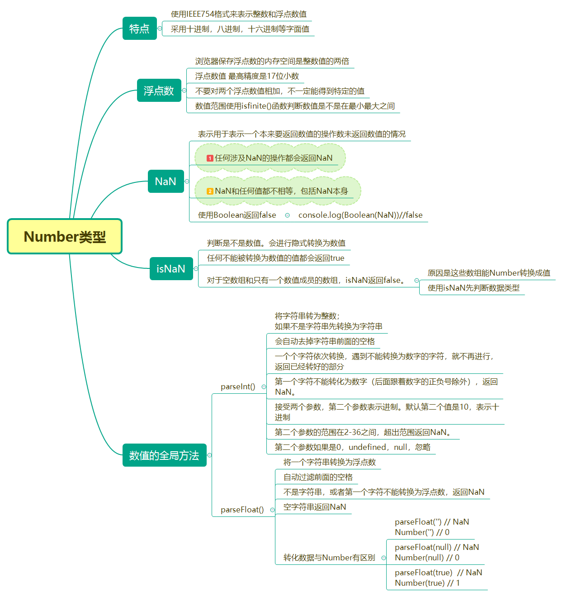
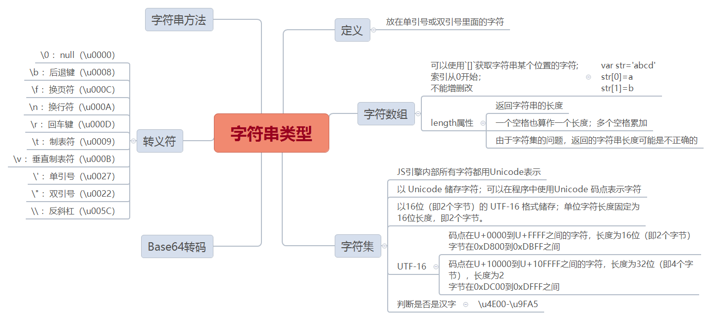
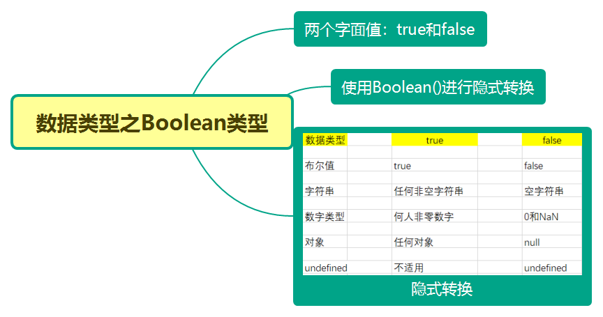
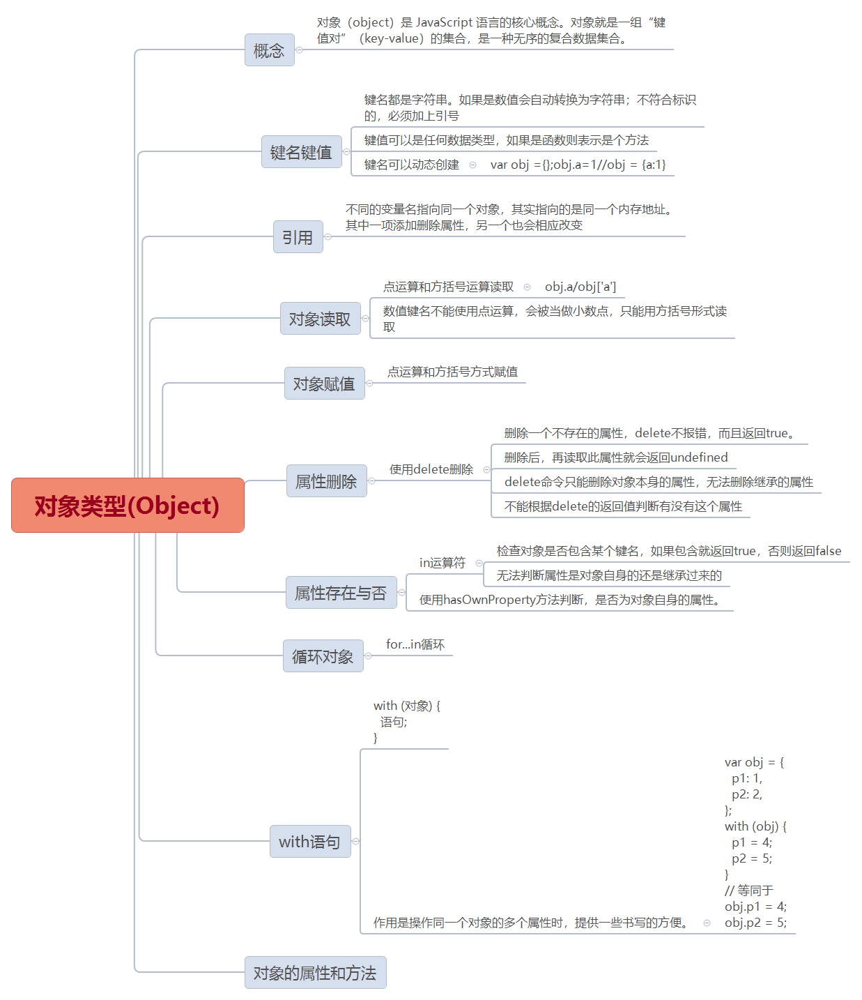

### JS数据类型

最新的 ECMAScript 标准定义了 8 种数据类型:分别是：Number类型、字符串类型、布尔类型、null、undefined、对象类型、Symbol(ES6新增)、BigInt

除了Object(对象)类型是引用数据类型，其他所有类型都是基本类型

### 一、Number类型



### 二、字符串类型



### 三、Boolean类型



### Object类型



### null和undefined

> null表示空，转换为数值时为0

> undefined表示定义未声明，转换为数值时为NaN

**1、null**

表示空值。声明变量时，如果不确定变量的初始值的数据类型，就可以声明为null,`var a = null`。

调用函数时，某个参数未设置任何值，就可以传入null

**2、undefined**

undefined表示声明未定义。有以下几种情况返回的是undefined

(1)、比如声明了变量，但没有赋值，返回的就是undefined

(2)、调用函数，参数未设置，访问该参数就是undefined

(3)、空对象但访问其中的键值，返回的是undefined

(4)、函数没有返回值的时候，调用时就返回undefined

```
var obj1;
console.log(obj1)//undefined

var obj2=function(x){
  return x
}
console.log(obj2())//undefined

var obj3={}
console.log(obj2.a)//undefined

function obj4(){}
console.log(obj4())//undefined
```

**3、null和undefined比较,数据转换**

null与undefined都可以表示'没有',数据转换时都是false，相等运算符(==)时，两者相等

```js
console.log(null==undefined)//true
console.log(!null)//true
console.log(!undefined)//true
```

```js
console.log(Number(null))//0
console.log(Number(undefined))//NaN
```

### Symbol

Symbol 是ES6新增的一种基本数据类型。我们可以通过调用内置函数 Symbol() 创建，`这个函数会动态的生成一个匿名、全局唯一的值`。

```js
const a = Symbol();
const b = Symbol();
a === b // false

const c = Symbol('c'); // Symbol(c)
```
Symbol 函数栈`不能用 new 命令`，因为 Symbol 是原始数据类型，不是对象。可以接受一个字符串作为参数，为新创建的 Symbol 提供描述，用来显示在控制台或者作为字符串的时候使用，便于区分。

Symbol最大的用处就是：`避免对象的键被覆盖`。

延伸阅读：[Symbol](https://es6.ruanyifeng.com/#docs/symbol)

### 基本数据类型和引用数据类型

基本数据类型

* 值被保存在栈内存中，占据固定大小的空间

* 按值访问，可操作保存在变量中实际的值

引用数据类型

* 保存在堆内存中，不能直接访问操作对象的空间

* 值是按引用访问的