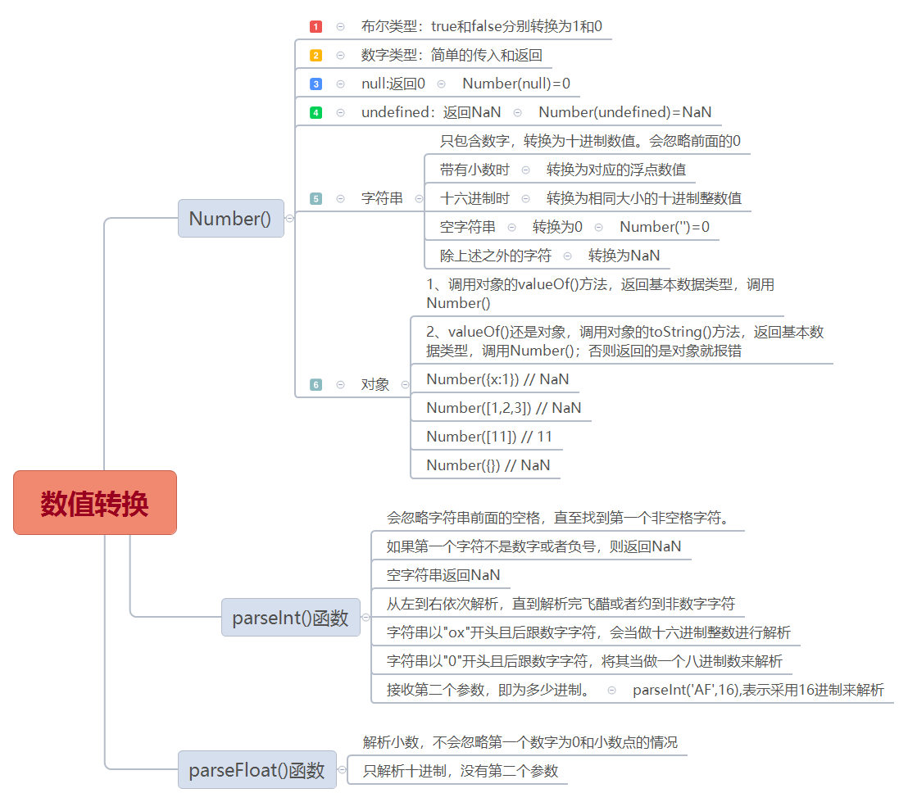
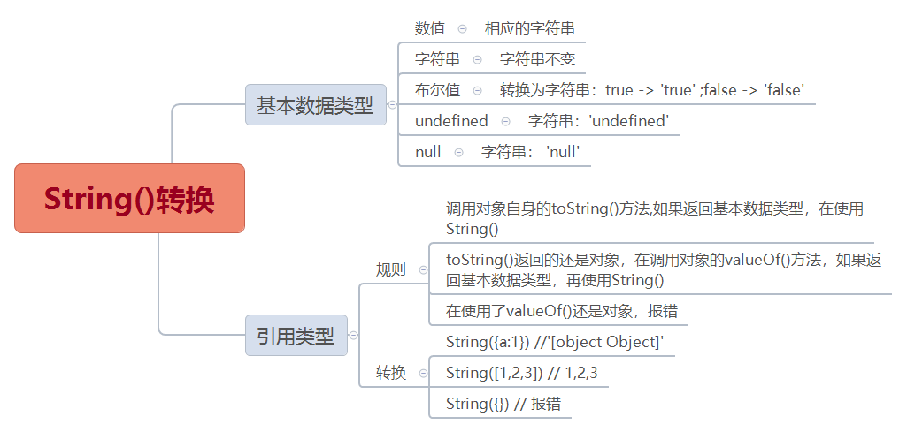

## 各类数据类型转换

### Number()转换


### String()转换




### Boolean()转换

> Boolean()转换

除了undefined、null、0、NaN、空字符串('')以及不传任何参数时，使用Boolean()转换为false，其他的全部是true


```js
console.log(Boolean())//false
console.log(Boolean(undefined))//false
console.log(Boolean(null))//false
console.log(Boolean(0))//false
console.log(Boolean(NaN))//false
console.log(Boolean(''))//false
```
### 运算转换

减法(-)、乘法(*)、除法(/)运算符都可以将符号两边自动转换成数字类型然后进行操作。最后的结果要么是数字类型，要么是NaN

数值运算(+)、负数运算(-)也可以将数字类型的字符串或布尔值转换为数字类型。

```js
'5'-1 //4
'5'-true // 4
'5'*[] // 0
'a'-'5' //NaN
null+1 // 1
undefined+1 //NaN
```


