## 弹性盒模型属性总结

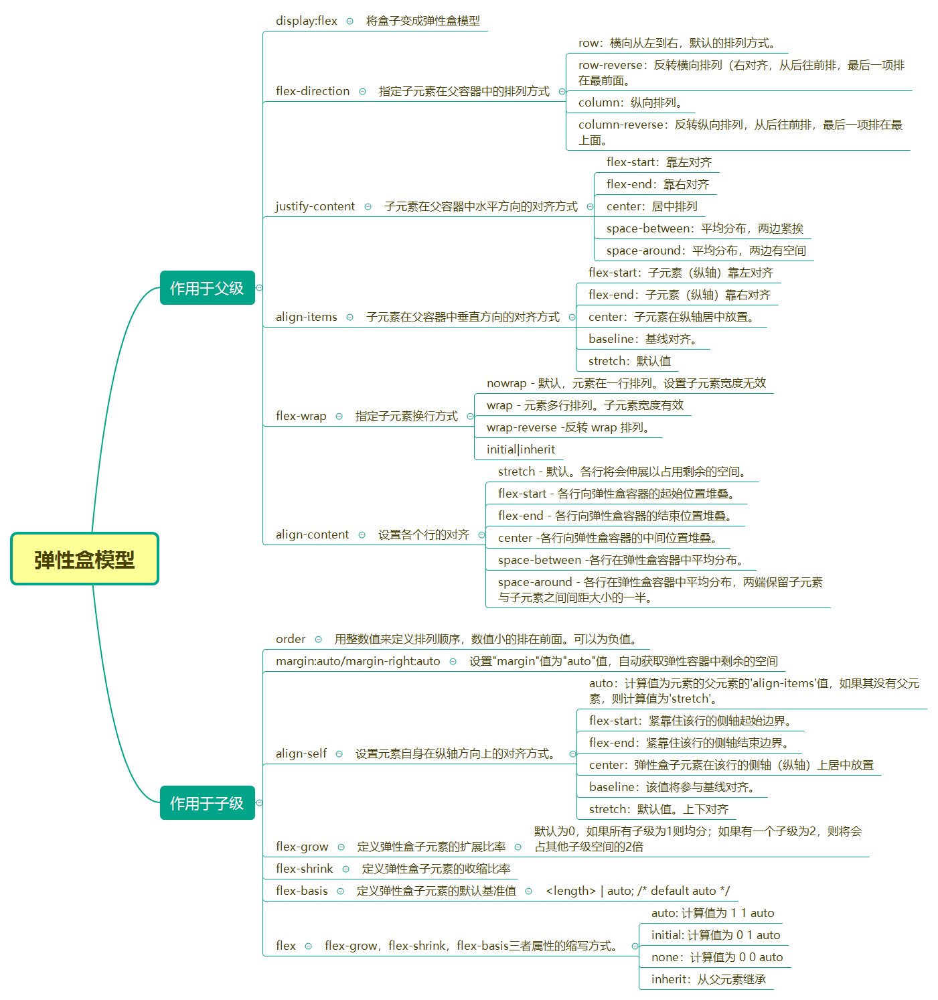

### flex-direction ———— 设置横纵方向，子元素采用哪个方向进行排列

> flex-direction: row | row-reverse | column | column-reverse

```html
<div class="parent">
	<ul>
		<li>1</li>
		<li>2</li>
		<li>3</li>
		<li>4</li>
		<li>5</li>
		<li>6</li>
		<li>7</li>
	</ul>
</div>
```

基本样式

```css
*{margin: 0;padding: 0;}
.parent{
	width: 600px;
	height: 300px;
	margin: 50px auto 0;
	border: 1px solid #7D7E80;
}
ul li{
	width: 50px;
	height: 40px;
	background: #ED6A0C;
	text-align: center;
	line-height: 40px;
	list-style: none;
	border: 1px solid #000;
}
```


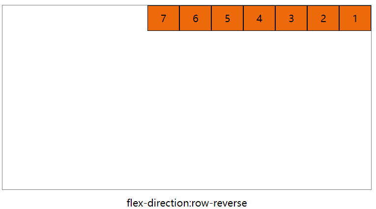

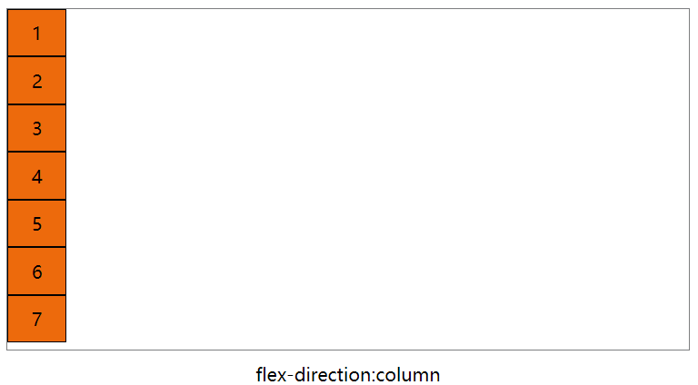

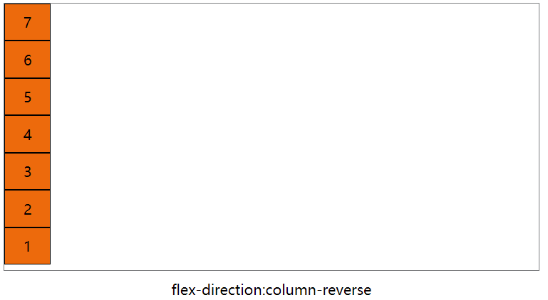


### justify-content ———— 子元素在水平方向的对齐方式

> justify-content: flex-start | flex-end | center | space-between | space-around

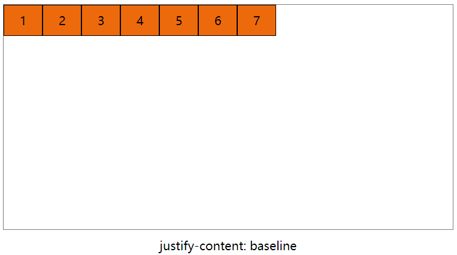

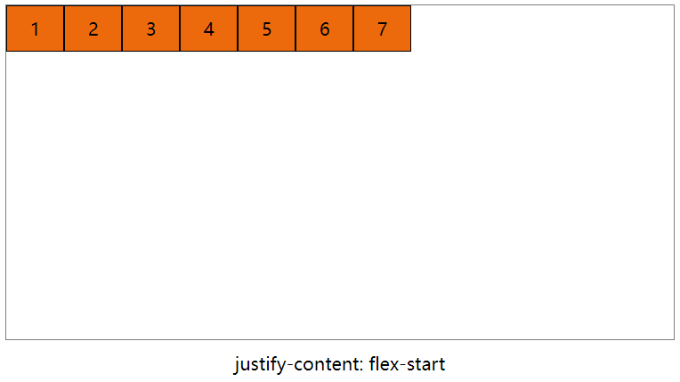

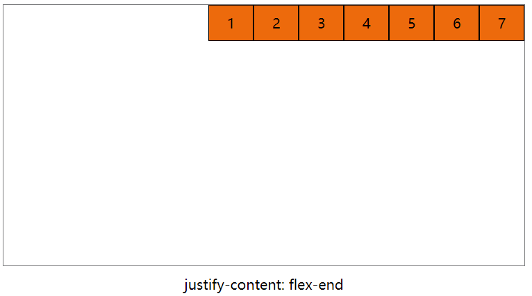

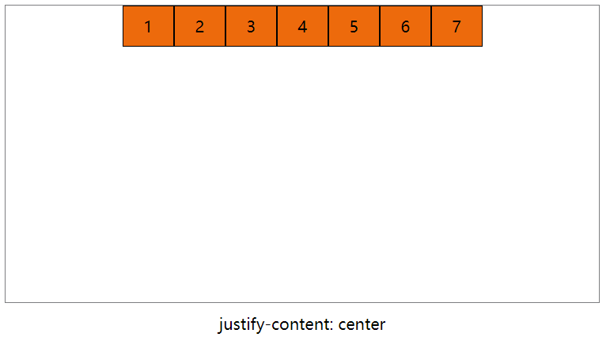

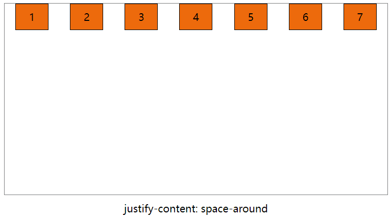


### align-items ———— 子元素在垂直方向的对齐方式

> align-items: flex-start | flex-end | center | baseline | stretch

为了直观方便，重新设置其中几个元素的高度

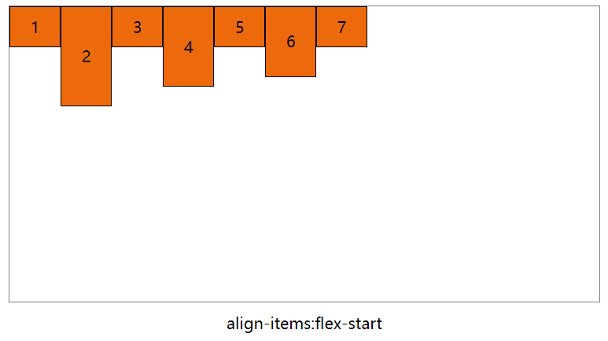

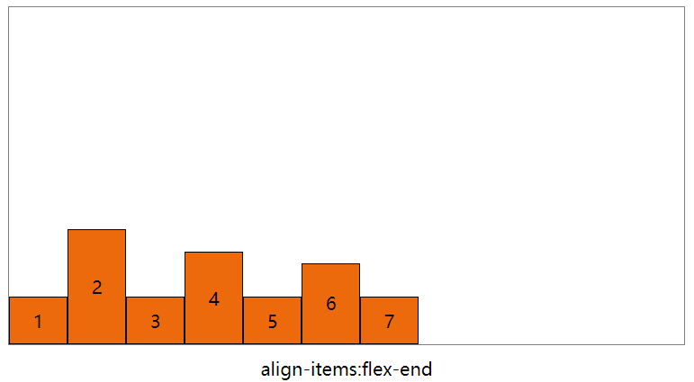

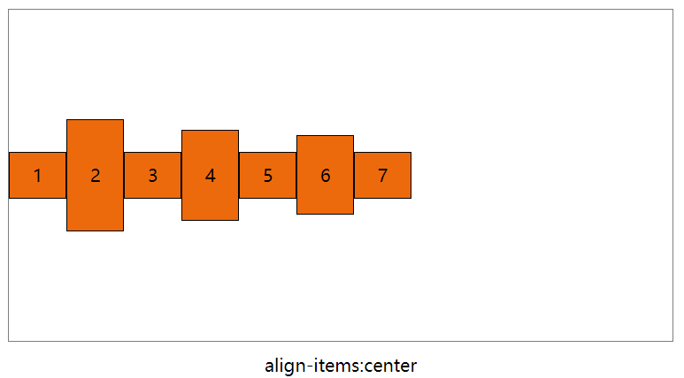

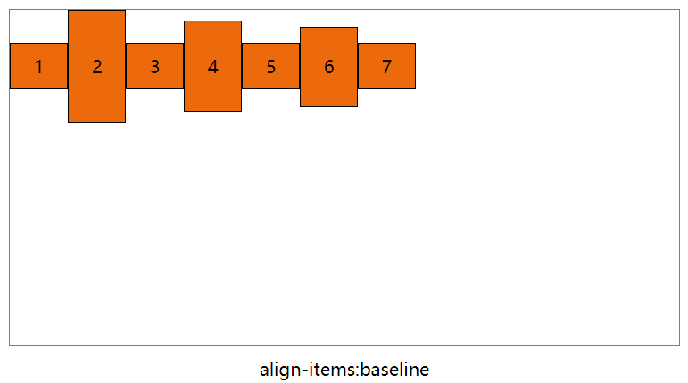

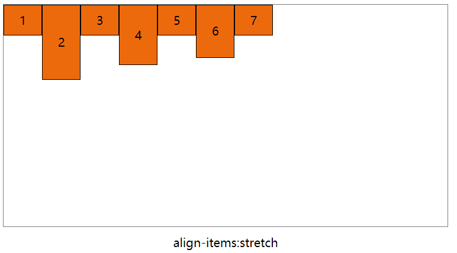

### flex-wrap ———— 子元素换行与否

> flex-wrap: nowrap|wrap|wrap-reverse|initial|inherit;

默认情况下，父元素设置了display:flex后，子元素的宽度就无效了，所有子元素都在一行排列。可以使用flex-wrap使子元素保持自己的宽度不变形。多余的子元素被放置新的一行。

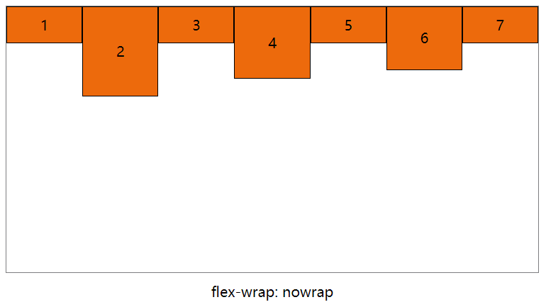

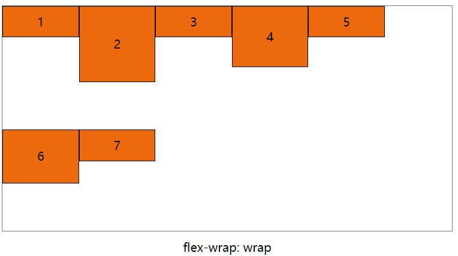

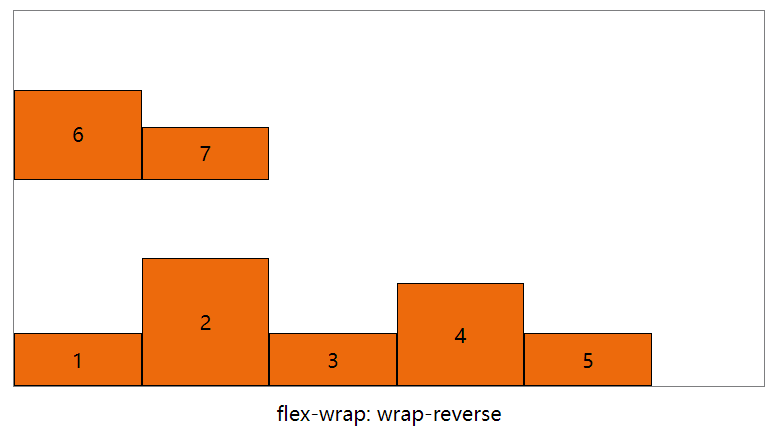

### align-content ———— 在垂直方向上设置每一行的对齐方式

> align-content: flex-start | flex-end | center | space-between | space-around | stretch

flex-wrap设置了子元素是否换行显示，align-content属性就是设置每一行的对齐方式。如果只有一行，align-content无效

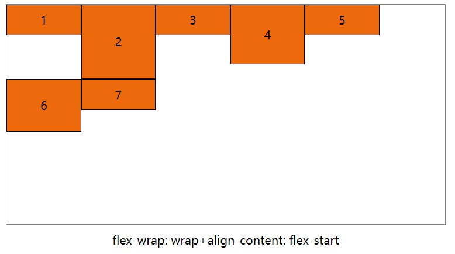

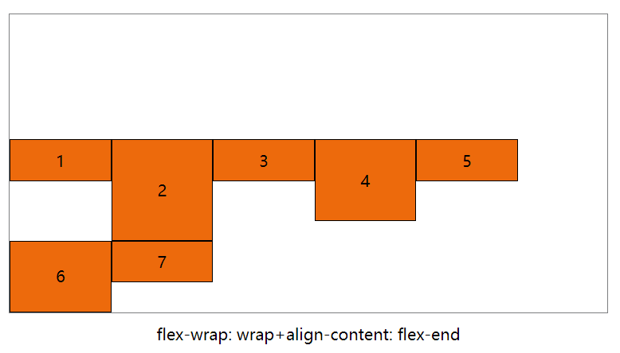

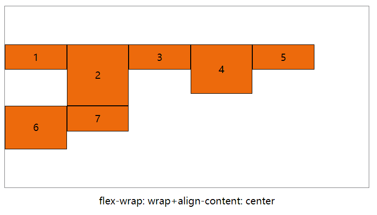

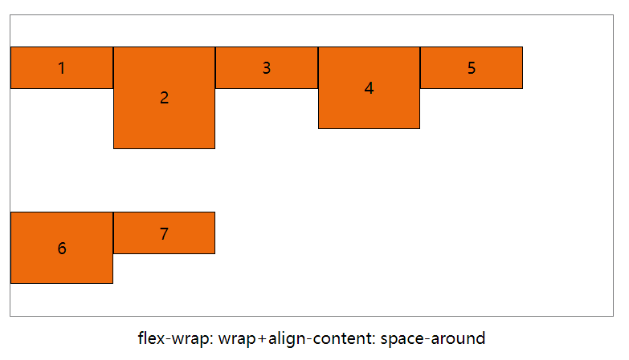

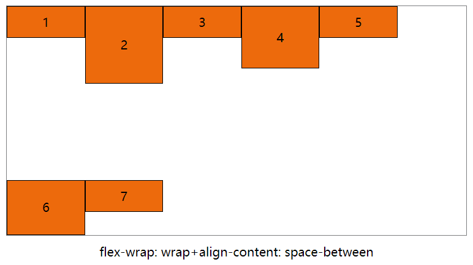


### order ————设置整数值，对子元素顺序进行排列，默认值为0

```css
ul li:nth-of-type(2){
	order: -2;
}
ul li:nth-of-type(4){
	order: 1;
}
ul li:nth-of-type(6){
	order: 10;
}
```
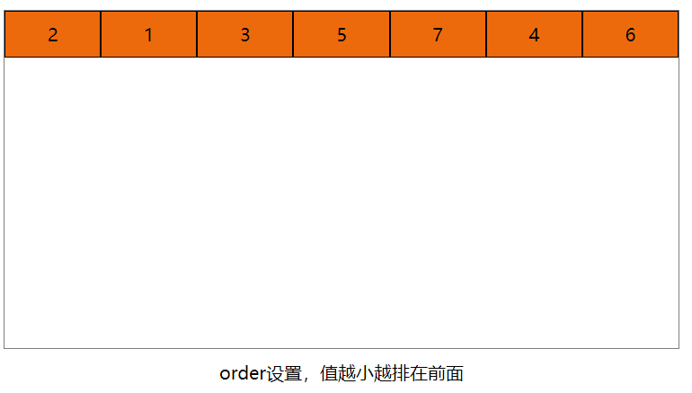

### align-self ———— 设置弹性元素自身在纵轴方向上的对齐方式

> align-self: auto | flex-start | flex-end | center | baseline | stretch

这个属性可以对子元素单个进行设置其对齐方式。

```css
*{margin: 0;padding: 0;}
.parent{
	width: 600px;
	height: 300px;
	margin: 50px auto 0;
	border: 1px solid #7D7E80;
}
ul li{
	width: 100px;
	min-height: 50px;
	background: #ED6A0C;
	text-align: center;
	line-height: 40px;
	list-style: none;
	border: 1px solid #000;
}
ul li:nth-of-type(1){
	align-self: auto;
}
ul li:nth-of-type(2){
	align-self: flex-start;
}
ul li:nth-of-type(3){
	align-self: flex-end;
}
ul li:nth-of-type(4){
	align-self: center;
}
ul li:nth-of-type(5){
	height: 100px;
	align-self: baseline;
}
ul li:nth-of-type(6){
	align-self: stretch;
}
ul{
	height: 100%;
	display: flex;
}
```

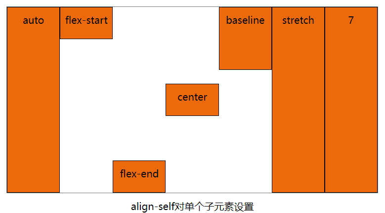

### flex-grow ———— 定义弹性盒子元素的扩展比率

扩展比率，也就是原本所有盒子占据的空间为1，设置其中一个元素的`flex-grow`为2，那么这个元素所占据的空间就是其他元素的两倍

设置此项，就是所有子元素的宽的和小于父元素的宽度。子元素如何分配父元素剩余空间。`flex-grow`默认值为0，表示不占据父元素剩余空间，值大于0，表示占据父元素剩余空间。值越大，占据的空间越大，可能会挤压其他子元素的宽度。

```css
*{margin: 0;padding: 0;}
.parent{
	width: 600px;
	height: 300px;
	margin: 50px auto 0;
	border: 1px solid #7D7E80;
}
ul li{
  /* 设置子元素的宽度为40，子元素的宽度之和小于父元素，使用flex-grow可以让其他元素占据剩余空间 */
	width: 40px;
	height: 100px;
	background: #ED6A0C;
	text-align: center;
	line-height: 40px;
	list-style: none;
	border: 1px solid #000;
}
ul li:nth-of-type(1){
	flex-grow: 1;
}
ul li:nth-of-type(2){
	flex-grow: 3;
}
ul{
	height: 100%;
	display: flex;
}
```
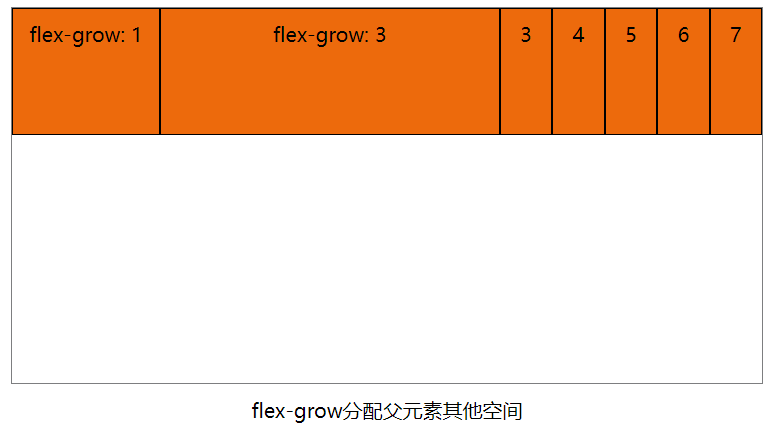

### flex-shrink ———— 定义弹性盒子元素的收缩比率

当父元素的宽度小于所有子元素的宽度之和时，可以使用`flex-shrink`对某个子元素进行收缩。其默认值为0，表示不收缩，值越大，收缩的越厉害。
```css
*{margin: 0;padding: 0;}
.parent{
	width: 600px;
	height: 300px;
	margin: 50px auto 0;
	border: 1px solid #7D7E80;
}
ul li{
	height: 100px;
	width: 200px;
	background: #ED6A0C;
	text-align: center;
	line-height: 40px;
	list-style: none;
	border: 1px solid #000;
}
ul li:nth-of-type(1){
	flex-shrink: 1;
}
ul li:nth-of-type(2){
	flex-shrink: 0;
}
ul{
	height: 100%;
	display: flex;
}
```
设置li的宽度为200px，会超出父级宽度，子元素就会被压缩，设置其中某几个元素的flex-shrink

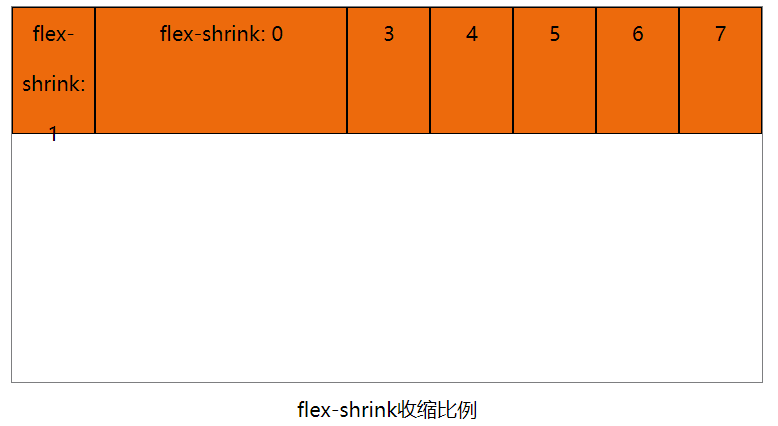

### flex

1、flex是flex-grow，flex-shrink，flex-basis三者属性的缩写方式。如果flex:none，则计算值是0 0 auto，和下面是等同的。

```css
li{
	flex:none
}
li{
	flex-grow: 0;
	flex-shrink: 0;
	flex-basis: auto;
}
```

2、当flex设置为auto时，计算值为1 1 auto，如下是等同的

```css
.li {flex: auto;}
.li {
    flex-grow: 1;
    flex-shrink: 1;
    flex-basis: auto;
```

3、当flex设置为1时，计算值为1 1 0%，如下是等同的

```css
.li {flex: 1;}
.li {
    flex-grow: 1;
    flex-shrink: 1;
    flex-basis: 0%;
```

设置flex为1，就可以实现左侧固定，右侧自适应的两栏布局了。

```html
<div class="parent">
	<div class="left"></div>
	<div class="right"></div>
</div>
```
```css
*{margin: 0;padding: 0;}
.parent{
	display: flex;
	height: 100vh;
}
.left{
	width: 200px;
	background: pink;
	height: 100%;
}
.right{
	flex: 1;
	background: #0570DB;
	height: 100%;
}
```

4、当 flex 取值为一个长度或百分比，则视为 flex-basis 值，flex-grow 取 1，flex-shrink取 1，有如下等同情况（注意 0% 是一个百分比而不是一个非负数字）：

```css
.item1 {flex: 0%;}
.item1 { flex-grow: 1; flex-shrink: 1; flex-basis: 0%;} 
.item2 {flex: 24px;} 
.item2 { flex-grow: 1; flex-shrink: 1; flex-basis: 24px;}
```

5、当 flex取值为两个非负数字，则分别视为 flex-grow和 flex-shrink的值，flex-basis取 0%，如下是等同的：

```css
.item {flex: 2 3;} 
.item { flex-grow: 2; flex-shrink: 3; flex-basis: 0%;} 
/* 当 flex取值为一个非负数字和一个长度或百分比，则分别视为 flex-grow和 flex-basis的值，flex-shrink取 1，如下是等同的：  */
.item {flex: 2333 3222px;} 
.item { flex-grow: 2333; flex-shrink: 1; flex-basis: 3222px;} 
```


### 简单的居中对齐方法

1、只需要设置子元素 margin: auto; 可以使得子元素在两上轴方向上完全居中，需要设置子元素的宽高。

```html
<div class="parent">
  <div class="content">我是内容我是内容我是内容我是内容</div>
</div>
```

```css
*{margin: 0;padding: 0;}
.parent{
	width: 300px;
	height: 300px;
	border: 1px solid #ccc;
	display: flex;
}
.content{
	width: 100px;
	height: 100px;
	border: 1px solid #2D8CF0;
	margin: auto;
}
```
2、父级设置`justify-content:center`和`align-items:center`也可以实现子元素水平垂直居中

```css
*{margin: 0;padding: 0;}
.parent{
	width: 300px;
	height: 300px;
	border: 1px solid #ccc;
	display: flex;
  justify-content:center;
  align-items:center
}
```


