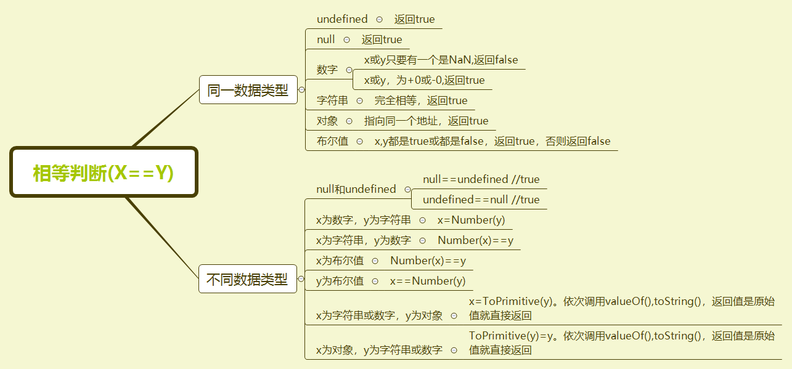

## 令人头痛的隐式转换

### 一元操作符

在前面操作符中，介绍过一元操作符——(+),一元操作符其实是调用了Number()方法，转换为数字。既然如此，如果是调用对象类型呢？

```js
console.log(+[])
console.log(+{})
console.log(+[1,2])
console.log(+[1])
```
上面的结果是如何呢？

既然是对象，对于对象的转换，分两步进行：先调用对象的`valueOf()`方法，如果返回一个基本数据类型，则返回；否则再调用`toString()`方法，如果返回一个基本数据类型则返回，否则报错。

拿上面的`+[]`为例，分以下几步：

1、`[]`是对象，调用对象的`valueOf()`方法，返回空数组，不是基本数据类型

2、空数组调用`toString()`方法，因为没有值，返回空字符串`''`

3、空字符串调用`Number()`方法，返回0，所以最终返回0

那么上面这几个例子的结果就出来了。

```js
console.log(+[])//0
console.log(+{})//NaN,valueOf方法返回对象{}，调用toString()返回字符串[object Object]，调用Number()方法，为NaN
console.log(+[1,2])//NaN,valueOf方法返回数组[1，2]，调用toString()返回字符串[1，2]，调用Number()方法，为NaN
console.log(+[1])//1
```

### 二元操作符 +

加号运算，在前面算术操作符中也有介绍。这里主要是来看看，null/undefined/对象之间的操作，看是如何进行运算的。

当计算`a+b`时，需要用到toPrimitive()内部函数，主要是将对象转换为原始值。

toPrimitive()内部函数的工作原理：

1、如果是原始值，则返回该值，调用`Number()`方法

2、如果是对象，先调用`valueOf()`方法，返回结果如果是原始值，直接返回，否则调用`toString()`方法

3、调用`toString()`方法，如果结果值是原始值，则直接返回，

4、否则报错

运算规则如下：

* 1、lprim = ToPrimitive(value1)

* 2、rprim = ToPrimitive(value2)

* 3、如果 lprim 是字符串或者 rprim 是字符串，那么返回 ToString(lprim) 和 ToString(rprim)的拼接结果

* 4、如果有一个是数字类型，则返回 ToNumber(lprim) 和 ToNumber(rprim)的运算结果

#### null和数字相加

```js
console.log(null+1)
```

1、null为基本类型，直接返回`null`，第二个数是数字类型，则null会调用`Number()`方法，为0

2、0+1=1，所以结果为1

#### 数组和数组相加

```js
console.log([]+[])
console.log([1]+[1])
console.log([1,2]+[]) 
```

1、`[]+[]`，首先这是两个对象，需要进行转换,`[]`调用对象的`valueOf()`方法后返回数组`[]`,然后调用`toString()`方法，返回空字符串`''`,第二个`[]`返回的也是空字符串，两个空字符串相加，最后结果是空字符串

2、对于另外一个也是如此操作。

3、针对`[1]+[1]`。第一个依次调用`valueOf()和toString()`返回字符串1，第二个也是返回字符串1，相加结果是11

4、针对`[1,2]+[]`。第一个返回字符串`1,2`,第二个返回空字符串，结果是字符串`1,2`

所以针对上面的结果：

```js
console.log([]+[])//''
console.log([1]+[1])//11
console.log([1,2]+[]) //1，2
```

#### 数组和对象相加

```js
console.log([]+{})//[object Object]
console.log({}+[])//[object Object]
```
1、两边都是对象形式，调用`valueOf()和toString()`,`[]`返回空字符串，`{}`返回`[object Object]`，相加得出的是字符串`[object Object]`

注意：直接在 Chrome 或者 Firebug 开发工具中的命令行直接输入`{}+[]`，结果是0。这是为什么呢？

可能在Chrome 或者 Firebug 开发工具中，`{}`被解析为了代码块，被解析为+,结果就是`+[]`，这最后的值是0

### 相等判断

当判断相等的时候`x==y`，也会将算式两边进行隐式转换。比较复杂，看图片吧




### -0和+0

在上面使用相等时，使用绝对相等判断时，有一个特殊的例子，就是`+0`和`-0`。它们通常情况下是相等的，比如

```js
console.log(-0===+0)//true

console.log((-0).toString()===(+0).toString())//true

console.log(-0 < +0)//false

console.log(+0 > -0)//false
```
但是这两个还是有点不一样，比如作为分母的时候。

```js
console.log(1/-0 ===1/+0)//false

console.log(1/-0)//-Infinity

console.log(1/+0)//Infinity
```

至于为什么会出现`-0`和`+0`,这是因为 JavaScript 采用了IEEE_754 浮点数表示法(几乎所有现代编程语言所采用)，这是一种二进制表示法，按照这个标准，最高位是符号位(0 代表正，1 代表负)，剩下的用于表示大小。而对于零这个边界值 ，1000(-0) 和 0000(0)都是表示 0 ，这才有了正负零的区别。

### null和undefined

`1、undefined`的意思是：声明了变量，但未定义的时候，调用的时候就是undefined。有以下四种情况会发生undefined

（1）声明了一个变量，但未定义

（3）函数定义了形参，但没有传递实参 

（4）使用void求值

```js
void 0 ; // undefined
void false; //undefined
void []; //undefined
void null; //undefined
void function fn(){} ; //undefined
```

void操作符对任何表达式求值都返回undefined，这个和函数执行操作后没有返回值的作用是一样的，JS中的函数都有返回值，当没有return操作时，就默认返回一个原始的状态值，这个值就是undefined，标明函数的返回值没有定义。

`2、null`

null的字面意思是：空值。表示一个变量被人为的重置为空对象，而非一个变量最原始的状态。在内存中表示就是栈中的变量没有指向堆中的内存对象。

(1)、`typeof null`//object

这是因为JS数据类型的底层是按照二进制的形式表示的，二进制的前三位为0的时候会被typeof判断为对象类型，而null的二进制恰好都是0，因此null被判断为object。

两者的区别和联系

```js
console.log(null==undefined)//true
console.log(null===undefined)//false
```

使用Number()进行转换后:

```js
console.log(Number(null))//0
console.log(Number(undefined))/NaN
```


