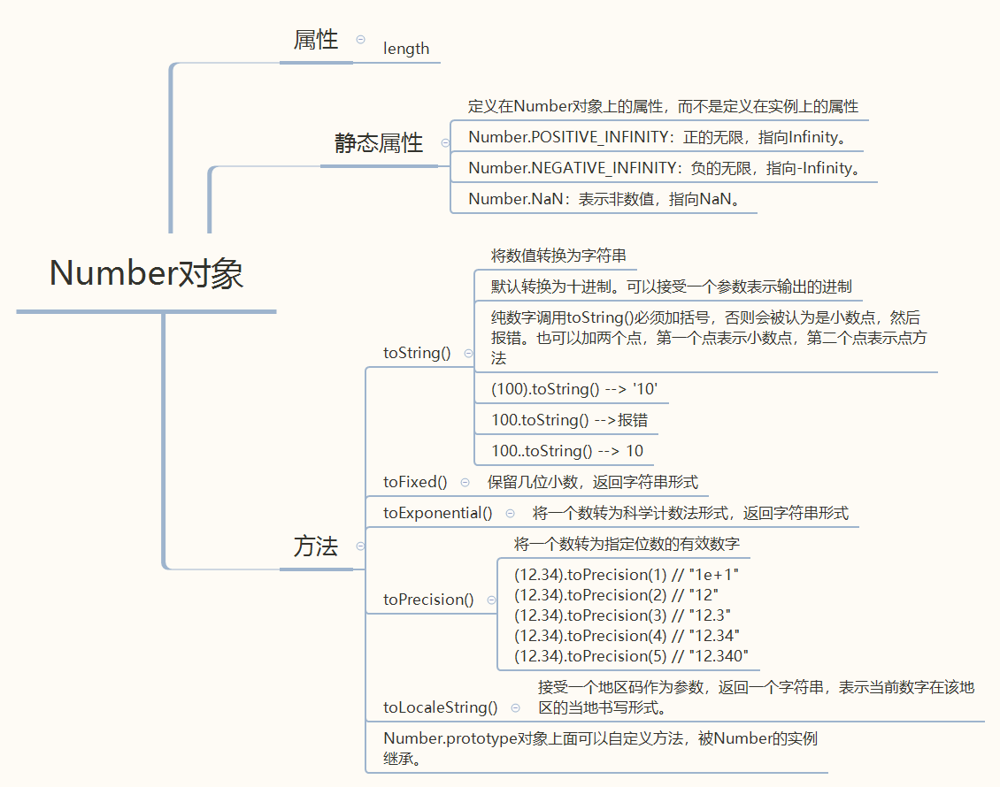
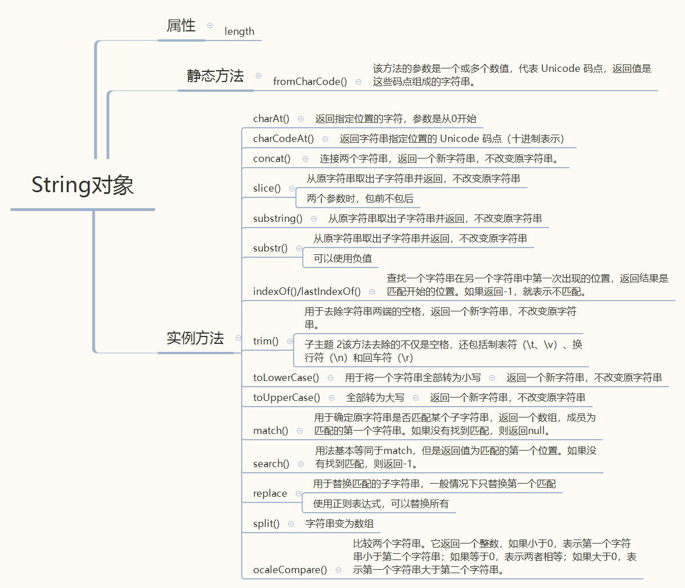
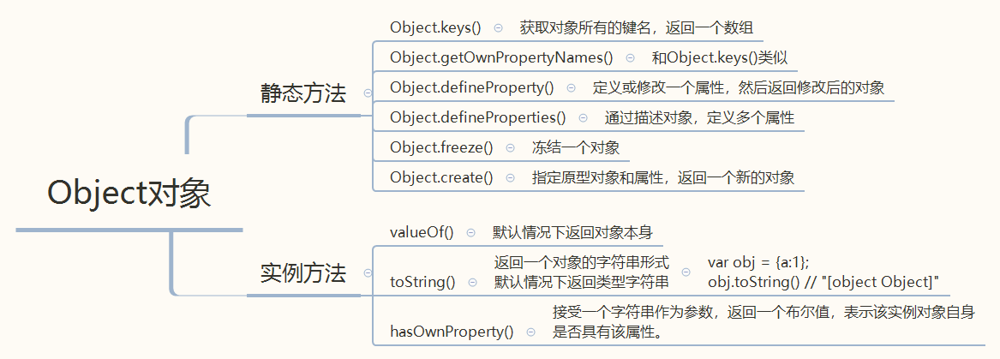

## JS对象属性和方法

JS中除了null，undefined这两种数据结构，其他数据结构都有相应的属性和方法。还有内置的属性方法，比如Math对象，Date对象等

### Number对象

### String对象

参考：[字符串方法总结](https://spring456.github.io/web_docs.github.io/#/FrontEnd/Basic/stringFun)

### Array对象

参考：[数组方法总结](https://spring456.github.io/web_docs.github.io/#/FrontEnd/Basic/arrr)

### Object对象

Object对象的属性和方法众多，这里只是选取了一部分。更多更详细的可参考MDN中Object对象 

[MDN-Object对象](https://developer.mozilla.org/zh-CN/docs/Web/JavaScript/Reference/Global_Objects/Object)