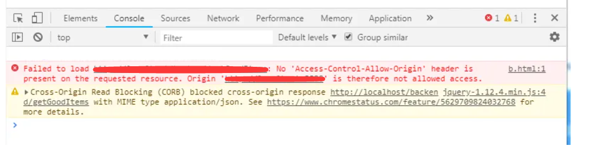
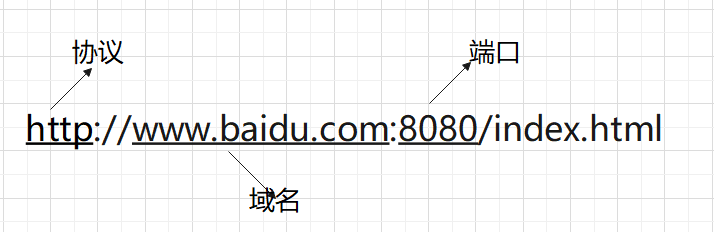

## 跨域的原理和解决办法

### 什么是跨域



比如上面，前端向后端请求接口时，控制台报错，出现类似上面的信息，出现这个错误就是跨域了。

> 跨域：浏览器不能访问其他执行其他网站的脚本

在前端领域，像a链接，表单提交；像`<link>`、`<script>`、``、`<frame>`等dom标签，还有样式中 background:url()、@font-face() 等嵌入的文件外链，又比如一些像  js 发起的ajax请求、dom 和 js 对象的跨域操作等等都是跨域。

我们通常所说的跨域，大多是针对访问请求。也就是A页面访问B页面或A页面请求接口等发生的跨域现象。

### 为什么会设置跨域

还是因为安全问题。

因为从客户端发送到后台的请求并不能区分发送者是谁。所以浏览器主动预防了。

浏览器设置了什么？可以主动预防

`同源策略`。是浏览器对JavaScript的安全限制。为了保护用户隐私

### 同源策略

> 同源：就是域名、协议、端口均相同



```js
// url
// 同一域名，不同文件，没有跨域，可以访问
http://www.baidu.com/index.html 
http://www.baidu.com/index2.html
http://www.baidu.com/login/index.html

// 同一域名，不同端口，有跨域，不能访问
http://www.baidu.com:8080/index.html
htpp://www.baidu.com

// 同一域名，不同协议，有跨域,不能访问
http://www.baidu.com
https://www.baidu.com

// 主域名相同，子域名不同.有跨域，不能访问
http://www.baidu.com/index.html
http://www.abc.baidu.com/index.html

```
从上面可以看出，要想不跨域，客户端地址和访问的地址前面必须一模一样。

1、为什么`http://www.abc.baidu.com`和`http://www.baidu.com`也是跨域

因为会存在共用服务器，只是使用服务器上不同空间的原因。这两个不一定是同一个网站，浏览器会认为这是两个不同的源

2、为什么不同端口也不行

一个端口一个公司的情况也是有的，也要杜绝这种情况

### 同源策略导致的问题

浏览器的同源策略主要限制以下几点：

1、Cookie/localStorage/sessionStrorage/IndexdDB等存储内容无法读取

2、DOM节点和JS对象无法获取

3、Ajax请求后，浏览器主动拦截，无法获取返回值

### 有什么是不跨域的吗？

使用`link`/`script`/`src`引入外部资源，是不跨域的。这是因为我们通过script、link、src引入外部资源，我们只是引用，并不知道其内容。不会发生跨域问题。

同源策略限制的是数据访问


### 解决跨域的方案

写在前面：其实在实际工作中，前端解决跨域的方案有限，要么鸡肋，要么难用。如果是协议或端口不一致的，更是无能为力。所以解决跨域的方案一般是服务端解决。这里介绍一些前端方案，仅做了解。

跨域的解决方案一般有以下9种方法;

* JSONP方法

* CORS方法

* postMessage

* websocket

* Node中间件代理(两次跨域)

* nginx反向代理

* window.name + iframe

* location.hash + iframe

* document.domain + iframe


参考文章:[跨域解决方案](https://segmentfault.com/a/1190000011145364)

延伸阅读：[CORS解决方案](https://zhuanlan.zhihu.com/p/149734572?from_voters_page=true)

根据实际项目总结：

1、JSONP方法只能使用get请求，逐渐淘汰

2、各种iframe方法，代码控制起来比较麻烦。而且需要不同的场景，使用较少。其中使用限制如下
```
document.domain + iframe：适用主域名相同，子域名不同的跨域场景

window.name + iframe：利用name值最长可以 2M ，并用不同页面或不同域名加载后依然存在的特性

location.hash + iframe：适用通过 C 页面来实现 A 页面与 B 页面通信的场景
```

3、nginx反向代理是绕过去的方式。反向代理也比较适合内部应用访问和共享。实际工作中使用较多。

4、CORS是支持所有类型的HTTP请求，是跨域HTTP请求的根本解决方案。因为请求存在跨域，结果是拿到了数据，也就是说服务器和浏览器之间进行了协商通信控制后，才得以允许或拒绝

5、解决跨域问题通常采用的是服务端代理转发和配置CORS两种方式。


### 问题：跨域时，请求到底发出去了吗？

结论：`请求会发出去`

首先同源策略是浏览器行为，客户端向服务端发送请求，HTTP Request中所有的Header都是可以被篡改的，服务端也根本判断不了请求是否跨域。

所以请求是可以发送出去的。

既然请求是可以发出去的，那么跨域请求时，是在什么时候被拦截了呢？被谁拦截了？

解决跨域的方法中，有一个方法就是设置CORS。

大概的原理就是客户端会通过服务端返回的一些请求头(Header)去判断请求是否允许跨域。比如，`Access-Control-Allow-Origin` 告诉客户端允许请求在哪些 Origin 下被发送，这些 Header 一般都是我们配在 Server 上的。既然客户端可以收到服务端返回的请求头，那么我们更加肯定：`请求是能发送的，服务器也能正常接收。如果请求有返回值，浏览器会把跨域请求回来的数据屏蔽掉了。`。


由于业务关系，不可能所有的请求都是同源的，所以跨域在不同的场景中必定存在，虽然跨域，但又要达到请求的目的。浏览器只是默认是拦截的，但开启跨域与否这个权限是交给开发人员的。

比如谷歌浏览器就可以通过设置关闭跨域。在49版本之前可以设置在属性栏加上`--disable-web-security`进行跨域设置。

### 第二个问题：跨域的请求一定会被服务器执行吗？

通过上面的分析，我们已经知道了，同源策略就是浏览器的策略。跨域请求由客户端发送，服务端接收并返回。如果有返回值，浏览器会把返回值屏蔽掉。

那么，请求发出去，服务端就一定会执行这条请求吗？

答案：不一定

实际开发中，有时候我们明明只请求了一次，但是在network里面却发现有两次请求，其中第一次请求的状态是`OPTIONS`。`OPTIONS`是一种安全的请求，不会修改服务器资源。其中有一个`重要用途就是：CORS中的预检请求`。

预检请求作用是：`询问服务端是不是允许跨域请求`

预检请求的过程：

如果是一个跨域请求，浏览器会自动在请求头上带上origin头部，标明当前请求的来源，服务器判断这个请求是否跨域，就会在返回时，选择是否带上`Access-Control-Allow-Origin`头部，浏览器通过判断这个请求头的信息就知道是否跨域了，会不会发送真正的请求。

好了，那我们可以回答这个问题了。

1、如果没有预检请求，那么浏览器发出请求，服务端一定能接收并执行，返回值被浏览器拦截

2、如果有预检请求，浏览器先发预检请求，服务端根据请求头信息判断是否要执行，否则只会告知浏览器是否允许。如果预检请求通过，浏览器才会发出真正的请求，服务端接收并执行返回。


### 第三个问题：所有请求都有预检请求吗？

答案：不一定

浏览器根据是否是简单请求或复杂请求来判断是否要发送预检请求

是否为简单请求？必须同时满足以下四个条件

1、使用GET/POST/HEAD这3个方法之一

2、只使用了以下安全的Header，不得人为设置其他Header

  * Accept
  * Accept-Language
  * Content-Language
  * Content-Type 的值仅限于下列三者之一：text/plain、multipart/form-data、application/x-www-form-urlencoded

3、请求中的任意 XMLHttpRequest 对象均没有注册任何事件监听器；XMLHttpRequest 对象可以使用 XMLHttpRequest.upload 属性访问。

4、请求中没有使用 ReadableStream 对象。


### 总结

1、浏览器的同源策略导致的跨域问题

2、跨域请求，浏览器端能发出请求，服务端能接受到请求。返回时被浏览器拦截

3、有9种方法可以解决跨域问题。比较常用的有Nginx反向代理和CORS方法

4、跨域请求时，有简单请求还是复杂请求，如果是复杂请求，浏览器就会先发送预检请求，预检请求通过后，服务端才会真正执行这个请求。