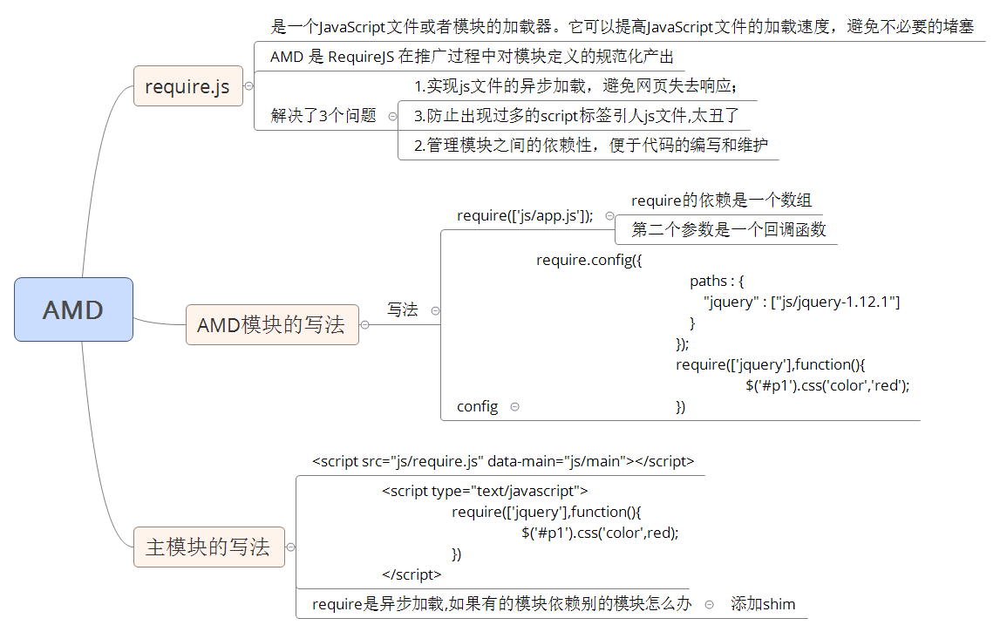
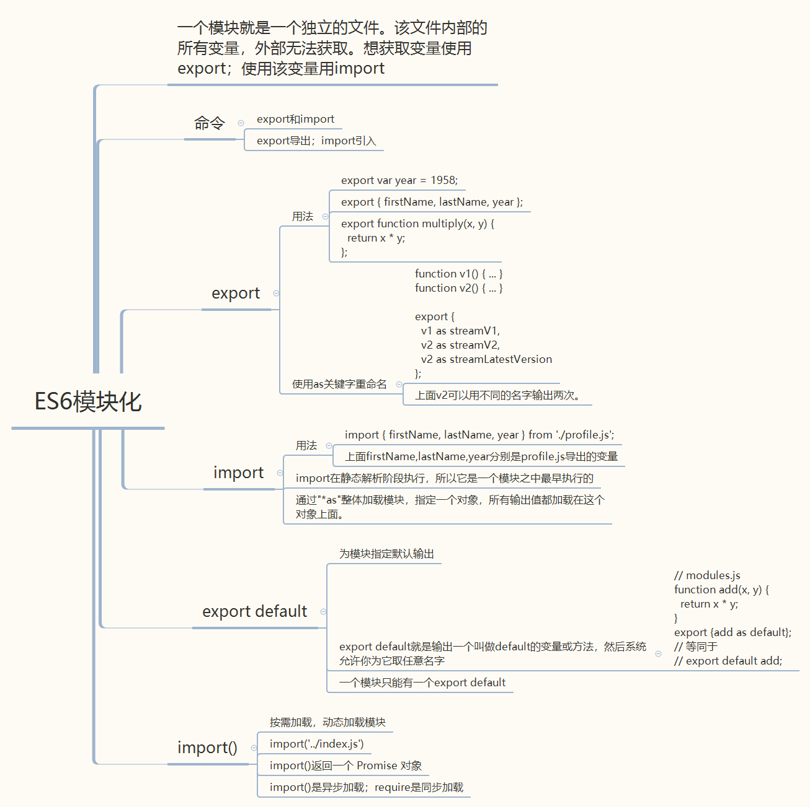

## 前端模块化开发

### 产生原因

1、项目复杂后，各个插件可能会使用同一个名称，导致的命名空间混乱

2、无法合理地管理项目的依赖和版本

3、无法方便的控制依赖的加载顺序

### CommonJS

CommonJS是一种广泛应用的JS模块化规范。

核心思想就是通过require方法来同步加载依赖的其他模块，通过module.exports导出需要暴露的接口。

```js
// 导入
const module1 = require('./module')
// 导出
module.exports = module1.fn
```

CommonJS特点：

1、在Node.js环境下运行

2、是一种同步任务

3、很多npm包都采用CommonJS规范

4、代码无法直接在浏览器上使用，需要转成ES5使用

### AMD

AMD也是一种JS模块化规范。最具代表性的实现是requirejs

```js
// 定义一个模块
define('module',['dep'],function(dep){
  retrun exports
})
// 导入使用
require(['module'],function(module){

})
```
AMD使用起来比CommonJS要复杂一些。与CommonJS相比，它的特点：

1、可以直接在浏览器中运行

2、异步加载

3、同时加载多个模块

4、可以再浏览器和Node.js环境下运行。

5、JS运行环境没有原生支持AMD，需要导入实现了AMD的库才行




### CMD

CMD规范是国内发展出来的，有个浏览器的实现SeaJS，SeaJS要解决的问题和requireJS一样，只不过在模块定义方式和模块加载（可以说运行、解析）时机上有所不同.

```js
// 基本语法
define(id?, dependencies?, factory)
```
factory 为对象、字符串时，表示模块的接口就是该对象、字符串。

factory 为函数时，表示是模块的构造方法。执行该构造方法，可以得到模块向外提供的接口。

factory 方法在执行时，默认会传入三个参数：require、exports 和 module：

使用：

```js
// 定义有依赖的模块  module.js
define(function(require, exports, module) {
  // 引入依赖模块，同步
  var $ = require('jquery.min.js')
  $('div').addClass('active');
  //引入依赖模块(异步)
    require.async('./module1', function (m) {
    })
  //暴露模块
  exports.xxx = value
});
 
// 加载模块
seajs.use(['module.js'], function(m){
 
});
```

Sea.js特点：

1、 推崇一个模块一个文件，遵循统一的写法

2、一个文件一个模块，所以经常就用文件名作为模块id

3、CMD推崇依赖就近，所以一般不在define的参数中写依赖，在factory中写

4、模块的加载是异步的，模块使用时才会加载执行

`AMD和CMD的区别：`

1、AMD推崇依赖前置，在定义模块的时候就要声明其依赖的模块

2、CMD推崇就近依赖，只有在用到某个模块的时候再去require
### ES6模块化开发



### ES6模块加载

1、浏览器加载

```js
<script type="module" src="./foo.js"></script>
```
`type='module'`表示引入了ES6模块，有以下特点：

a、异步加载，不会堵塞浏览器。即等到整个页面渲染完成，再执行js文件。相当于给`<script>`设置defer属性。

b、如果网页有多个`<script type="module">`，它们会按照在页面出现的顺序依次执行

c、使用了async属性，`<script type="module">`就不会按照在页面出现的顺序执行，而是只要该模块加载完成，就执行该模块

### ES6模块和CommonJS模块的差异

CommonJS 模块是 Node.js 专用的，与 ES6 模块不兼容。语法上面，两者最明显的差异是，CommonJS 模块使用require()和module.exports，ES6 模块使用import和export。

`1、CommonJS 模块输出的是一个值的拷贝，ES6 模块输出的是值的引用。`

CommonJS 模块输出的是值的拷贝，也就是说，一旦输出一个值，模块内部的变化就影响不到这个值

ES6 模块不会缓存运行结果，而是动态地去被加载的模块取值，并且变量总是绑定其所在的模块。由于 ES6 输入的模块变量，只是一个“符号连接”，所以这个变量是只读的，对它进行重新赋值会报错

`2、CommonJS 模块是运行时加载，ES6 模块是编译时输出接口。`

CommonJS 加载的是一个对象（即module.exports属性），该对象只有在脚本运行完才会生成。而 ES6 模块不是对象，它的对外接口只是一种静态定义，在代码静态解析阶段就会生成

`3、CommonJS 模块的require()是同步加载模块，ES6 模块的import命令是异步加载，有一个独立的模块依赖的解析阶段`

4、Node.js里对ES6模块和CommonJS模块的分类

Node.js要求`.mjs文件`总是以 ES6 模块加载，`.cjs文件`总是以 CommonJS 模块加载，`.js文件`的加载取决于package.json里面type字段的设置。如果设置`type='module'`,设置这个属性，该项目的js文件就会被解释为ES6模块。


参考文章：[阮一峰--es6](https://es6.ruanyifeng.com/#docs/module)

