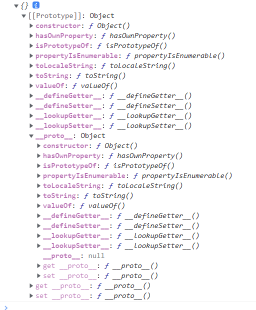
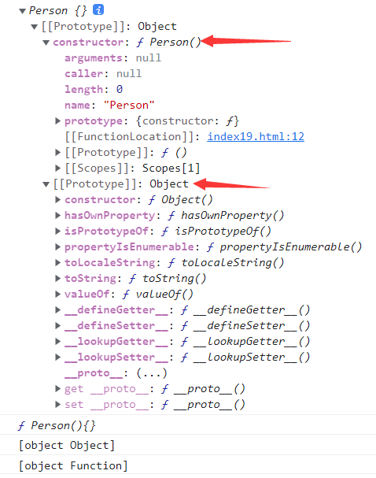

### new操作符做了什么

> new操作符是创建了一个对象类型的实例，具有构造函数的内置对象。

这个概念初听起来不容易理解。那一步一步来看看。

#### 1、new Object()看new操作符之后有什么

当我们需要创建一个空对象时，有两种方法：一种是直接使用字面量，`var obj = {}`;另一种就是使用构造函数:`var obj = new Object()`这种方式，然后我们就可以使用Object上的属性或方法了。

对于第二种创建对象的方法，我们不禁有疑问了： `Object()是一个函数形式，为什么通过new操作符调用后，就变成了对象了呢？`

打印obj对象。如图



我们发现，对象obj有Object上所有的属性，然后其`constructor`指向了Object,也就是说对象obj的构造函数是Object()。

Object()是js内置的，那我们再新建一个函数，使用new创建构造函数Person。

```js
function Person(){}

var person = new Person()

console.log(person)

console.log(Person)

console.log(Object.prototype.toString.call(person))//[object Object]

console.log(Object.prototype.toString.call(Person))//[object Function]

console.log(person._proto_===Person.prototype)//true
```



看到上面返回的值，Person是一个函数，通过new调用之后，生成了一个对象——person。这个对象的`[[Prototype]]`指向了Object，其`Person`,那我们可以得出如下结论：

1、函数经过new操作符调用后，可以生成一个全新的对象

2、该函数被称为构造函数。生成的对象的`_proto_属性`与构造函数的prototype全等

#### Person里面的this指向

还是上面的例子，我们在Person里使用this，看这个this到底是指向哪个。

不传参的情况下：

```js
function Person(){
    console.log(this)//{}
}
var person = new Person()
```
如果直接打印this,返回的是空对象。既然Person()是函数，那么就可以传参，我们传参试试

```js
function Person(name){
    console.log(this,'加载之前')//{}
    this.personName = name
    this.personSay = function(){
        console.log(this.personName)
    }
    console.log(this,'加载之后')//{personName:'小明'}
}
var person = new Person('小明')
console.log(Person,'打印Person')//整个构造函数
console.log(person,'打印person')//{personName:'小明'}
```
打印this和person，我们发现其实函数Person中的this指向了person对象。

#### Person函数使用prototype

```js
function Person(name){
    this.personName = name
    this.personSay = function(){
        console.log('姓名-'+this.personName)
    }
}
Person.prototype.age=20

var person1 = new Person('小明')

person1.personSay()//姓名-小明

console.log(person1.personName,person1.age)//小明 20

var person2 = new Person('小红')

person2.personSay()//姓名-小红

console.log(person2.personName,person2.age)//小红 20

console.log(person1.__proto__ === Person.prototype)//true

console.log(person2.__proto__ === Person.prototype)//true
```
新生成的对象的_proto_指向了构造函数的prototype。那么构造函数原型上的属性和方法，通过new操作符调用之后的对象，都可以访问到。那么对于我们来说，就可以将很多共有的方法或属性都可以放到构造函数的原型上。

那上面的例子可以改造成这样：
```js
function Person(name){
    this.personName = name
    this.personSay = function(){
        console.log('姓名-'+this.personName)
    }
}
Person.prototype.age=20
var person1={}
person1.__proto__ = Person.prototype
Person.call(person1,'name','小明')
console.log(person1)
```


总结来说，new操作符做了如下几个事情：

1、创建一个新对象

2、链接到原型。该对象的`_proto_`属性值等于构造函数的`prototype`

3、绑定this。构造函数里使用的this会绑定到创建的对象上并且调用构造函数

4、返回该对象

### 手动实现一个new操作符

按照上面4步，我们就可以实现一个new操作符。

```js
function myNew(){
    // 新建一个对象
    var obj={}
    // 获取构造函数
    // arguments是函数的实参集合，是类数组对象。
    // [].shift.call(arguments)的作用是把类数组对象转为数组对象，删除数组的第一项并返回删除项
    var conFun = [].shift.call(arguments)
    // 对象的_proto指向构造函数的prototype
    obj._proto_ = conFun.prototype
    // 改变this指向,将函数conFun里面的this指向指给obj
    var result = conFun.apply(obj,arguments)
    // 返回，确保是对象
    return typeof result==='object'?result:obj
}
// 使用myNew
function Person(name){
    this.name = name
}
var person = myNew(Person,'小明')
console.log(person.name)//{name:'小明'}
```

### 实际开发中使用new

需求：在一个区域内，点击区域，动态生成10个小球，并且这些小球随机颜色和随机方向运动。

如果不使用new，对于这个需求我们可能会这么写：

```js
// 建立共有属性
var boll={
    widht:'',
    height:'',
    background:''
}
// 生成小球
function parint(){
    // ...生成小球,style,appendChild方法挂载到某个id下
    move()

}
// 小球运动
function move(){
    setInterval(()=>{
        // ...运动的代码
    })
}
// 点击事件生成，调用上面的方法
xx.onclick=function(){
    for(let i=0;i<10;i++){
        parint()
    }
}
```
以上这种方法可以实现需求。但不好维护，不能直接复用；而且生成小球的方法和属性都放在循环中生成。如果使用new方法来实现。

```js
// 小球的共有属性
function boll(){
    this.width = width
    this.height = height
    this.background = background
}
boll.prototype.parint = function(){
    // 生成小球的相关属性，并appendChild到某个id下
}

boll.prototype.move = function(){
    // move方法。可以使用this.xxx
}
// 点击事件生成小球
for(let i=0;i<10;i++){
    var newBoll = new boll()
    newBoll.parint()
    newBoll.move()
}
```

### 思考：为什么new操作符调用后返回的是对象？

以下内容来自：[你真的了解JS里的"new"吗？](https://www.jianshu.com/p/0b31c965f9ce?utm_campaign=maleskine&utm_content=note&utm_medium=seo_notes&utm_source=recommendation)

> 前言
> 我们常常喜欢用new关键字去创建一些对象如new Vue()，但是这个关键字的背后究竟做了什么其实没太多人去关注。

> 想象我们是苹果公司，要生产30部iPod，规定：

> * 每台iPod都会有自己的ID
> * 每台iPod都是一样的制造商：Apple
> * 每台iPod的功能都是一样的（函数一样）
> ```
>    let iPod= {
>        // 制造商不会变
>        manufacturer: 'Apple',
>        // 播放音乐
>        play: function () { },
>        // 暂停
>        pause: function () { },
>        // 继续播放
>        resume: function () { }
>    }
> ```
> 好了，现在我们开始生产吧。

> 简单生产
> 要生产那么多iPod，那就循环30次吧。每次循环都创建一个对象，将这个对象加入到数组里就行了。
> let box = []
> let iPod

> for (let i = 0; i < 30; i++) {
>    iPod= {
>        // 每次都改变 ID
>        id: i,
>        // 制造商不会变
>        manufacturer: 'Apple',
>        // 播放音乐
>        play: function () {},
>        // 暂停
>        pause: function () {},
>        // 继续播放
>        resume: function () {}
>    }
>
>    box.push(iPod)
> }
>
> Manufacturer.deliver(box)
> 但是，这里有一个问题：每次都会新创建play()，pause()，resume()这些函数，manufacturer的值也是一样，没必要重新建。

> 使用原型改进
> 使用原理链，我们可以将上面说到的共有函数，属性放在一个共有对象里，然后用iPod.__proto__指向这个iPodCommon不就好了吗？所以现在代码可以改写成这样：
> let box = []
> let iPod
>
> let iPodCommon = {
>    // 制造商不会变
>    manufacturer: 'Apple',
>    // 播放音乐
>    play: function () {},
>    // 暂停
>    pause: function () {},
>    // 继续播放
>    resume: function () {}
> }

> for (let i = 0; i < 30; i++) {
>    iPod= {
>        // 每次都改变 ID
>        id: i,
>    }

>    iPod.__proto__ = iPodCommon
>
>    box.push(iPod)
> }
>
> Manufacturer.deliver(box)
> 这样就好多了，省了很多空间。但是这个iPod对象的代码有点太分散了，跟for循环耦合在一起了。学习重构时听得最多的一句就是重复代码最好用函数包起来，所以我们可以试着传入要改变的属性（ID）用函数来返回iPod对象。，

> 函数返回对象
> 我们可以用一个函数返回iPod对象，这样就不用每次都在for循环里去定义对象了。
> function iPod(id) {
>    let tempObj = { }
>    // 自有属性
>    tempObj.id = id
>    // 共有属性，函数
>    tempObj.__proto__ = iPod.common
>
>    return tempObj
> }
>
> iPod.common = {
>    // 制造商不会变
>    manufacturer: 'Apple',
>    // 播放音乐
>    play: function () {},
>    // 暂停
>    pause: function () {},
>    // 继续播放
>    resume: function () {}
>}
> // 保存为 iPod.js 文件
> 然后在创建时候引入这个文件，再去生成iPod。
> let box = []

> for (let i = 0; i < 30; i++) {
>    box.push(iPod(i))
> }
>
> Manufacturer.deliver(box)
> 有没有感觉这样清爽了很多？我们将所有有关iPod的逻辑都放在一个文件里，这样就和主文件完全解耦了。

> 上面是很清爽，但是每次都要写创建一个临时对象好麻烦。这时候JS的new就上场了，它的作用如下：

> 帮你创建临时对象tempObj，函数里的this绑定为这个tempObj
> 统一共有属性所在对象的名字叫prototype而不是comon
> 帮你完成原型的绑定
> 帮你返回临时对象tempObj
> 现在iPod.js文件可以写成这样
>function iPod(id) {
>    this.id = id
> }
>
>// 共有属性
> iPod.prototype = {
>    // 制造商不会变
>    manufacturer: 'Apple',
>    // 播放音乐
>    play: function () {},
>    // 暂停
>    pause: function () {},
>    // 继续播放
>    resume: function () {}
> }
> // 保存为 iPod.js 文件
> 使用new再次生产iPod
> let box = []

> for (let i = 0; i < 30; i++) {
>    box.push(new iPod(i))
> }
>
> Manufacturer.deliver(box)
> 这就是new的由来，不过是一种语法糖，和Java里面的new是完全不一样的东西，希望大家不要混为一谈。当然了，最后的这个iPod函数也就成了我们所说的构造函数。

上面的文章就说明了new操作符调用函数之后为什么返回的是对象。究其原因就是函数调用，return出一个对象，这个对象可以访问函数身上的属性和方法。
