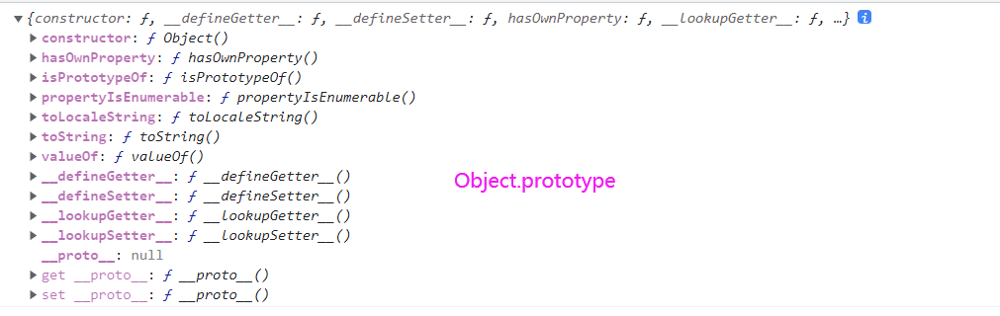

## JS进阶之原型和原型链(__proto__和prototype)

### 先来了解几个概念吧

**1、构造函数和实例对象**

```js
function Person(){
  this.name = name
}
var person1 = new Person()
```
通过new调用，Person()就称之为构造函数;person1称之为实例对象

**2、__proto__属性和prototype属性**

JS中每个对象都有_proto_属性，这个属性指向其构造函数的prototype

每个函数都有prototype这个属性，而且只有函数有这个属性。当通过new操作符调用后，就会创建实例对象，这个实例对象的的__proto__指向构造函数的prototype属性。

这两个属性都是对象形式。
```js
var obj=new Object()
var arr=new Array()
var fn = function(){}
console.log(obj.__proto__===Object.prototype)//true
console.log(arr.__proto__===Array.prototype)//true
console.log(fn.__proto__===Funtion.prototype)//true
```
**3、JS中的内置引用类型的构造函数**

JS中内置的构造函数有：Number()/String()/Object()/Array()/Function()/Date()/RegExp()

既然是函数，它们都有prototype属性。

### 使用instanceof来判断

instanceof 运算符用于检测构造函数的 prototype 属性是否出现在某个实例对象的原型链上。
```js
[] instanceof Object//true
[] instanceof Array//true
```
为了后面判断是否在原型链上找到该prototype
### 开始理解—— __proto__和prototype的指向问题

规则：

**`1、引用类型的__proto__属性指向它的构造函数的prototype属性。`**

```js
function Person(){}
var person = new Person()
console.log(person.__proto__===Person.prototype)//true
```
**`2、实例对象的__proto__的构造器属性constructor指向自己的构造函数`**

```js
function Person(){}
var person = new Person()
console.log(person.__proto__.constructor===Person.prototype)//true
```

**`3、构造函数除了Object外其他的prototype的__proto__都指向Object.prototype`**

```js
console.log(Array.prototype.__proto__===Object.prototype)//true
console.log(Number.prototype.__proto__===Object.prototype)//true
console.log(String.prototype.__proto__===Object.prototype)//true
console.log(Boolean.prototype.__proto__===Object.prototype)//true
console.log(Date.prototype.__proto__===Object.prototype)//true
console.log(Function.prototype.__proto__===Object.prototype)//true
console.log(RegExp.prototype.__proto__===Object.prototype)//true
```

那Object.prototype.__proto__指向哪里呢？

**`3、原型链的顶端是Object.prototype,所有对象均从Object.prototype继承属性`**

```js
console.log(Object.prototype.__proto__)//null
console.log(Object.prototype)//如下图
```


**`4、内置函数的__proto__都指向Function的prototype`**

内置函数`Object,Function,Number,String,Boolean,Array,Date,RegExp`都是函数也是对象，那么他们也有__proto__属性。

内置函数的__proto__都是`ƒ () { [native code] }`,他们的__proto__指向Function的prototype

```js
console.log(Object.__proto__ === Function.prototype)//true
console.log(Array.__proto__ === Function.prototype)//true
console.log(Number.__proto__ === Function.prototype)//true
console.log(String.__proto__ === Function.prototype)//true
console.log(Boolean.__proto__ === Function.prototype)//true
console.log(Date.__proto__ === Function.prototype)//true
console.log(Function.__proto__===Function.prototype)	//true
console.log(RegExp.__proto__===Function.prototype)//true

cosnole.log(Array.__proto===Object.prototype)//false
```

内置函数中除了Function外，其他的内置函数的__proto__只指向Function的prototype。并不会直接指向Object.prototype。

Function是所有函数的构造函数，但是Function也是函数，Function的__proto__指向他本身的prototype,`Function.__proto__===Function.prototype`

**`5、Function.prototype直接继承Object.Prototype`**

```js
console.log(Function.prototype.__proto__===Object.prototype)//true
console.log(Function.prototype instanceof Object)//true
console.log(Function.prototype instanceof Functino)//false
```

### 深入Function()和Object()

既然Function是一个对象，而且Object()又是一个构造函数,那他们在原型链上查找的时候是否是相等？

```js
console.log(Function instanceof Object)//true
console.log(Object instanceof Function)//true
```

可以看到两者在原型链上都是可以找到对应的实例的。

回归到规范来看这两者的区别：

[Object规范](https://262.ecma-international.org/5.1/#sec-15.2)

[Function规范](https://262.ecma-international.org/5.1/#sec-15.3)

对于Function的描述，在15.3.3开始

> The Function prototype object is itself a Function object (its [[Class]] is "Function") that, when invoked, accepts any arguments and returns undefined.

> The value of the [[Prototype]] internal property of the Function prototype object is the standard built-in Object prototype object (15.2.4). The initial value of the [[Extensible]] internal property of the Function prototype object is true.

> The Function prototype object does not have a valueOf property of its own; however, it inherits the valueOf property from the Object prototype Object.

从上面可以得知：

1、Function 原型对象本身就是一个 Function 对象，当被调用时，它接受任何参数并返回undefined。

2、Function 构造函数的 [[Prototype]] 内部属性的值是标准的内置 Function 原型对象

也就是:`Function.__proto__===Function.prototype`

2、Function 原型对象的 [[Prototype]] 内部属性的值是标准的内置 Object 原型对象

也就是`Function.prototype === Object.prototype`

对于Object的描述,在15.2.3和15.2.4

>The value of the [[Prototype]] internal property of the Object constructor is the standard built-in Function prototype object.---Object 构造函数的 [[Prototype]] 内部属性的值是标准的内置 Function 原型对象。

>The value of the [[Prototype]] internal property of the Object prototype object is null, the value of the [[Class]] internal property is "Object", and the initial value of the [[Extensible]] internal property is true.----Object 原型对象的 [[Prototype]] 内部属性值为null， [[Class]] 内部属性"Object"值为 ， [[Extensible]] 内部属性初始值为 true。

从上面得知:

1、Object.__proto__===Function.prototype

2、Object.prototype.__proto__==null

所以到此，我们就可以得出一个原型链的顺序：

Object.prototype-->Function.prototype-->Function|Array|String...

## 总结

1、`每个对象`都有__proto__属性，`每个函数`都有prototype属性，而且只有函数有这个prototype属性

2、实例对象的__proto__指向其构造函数的prototype

3、内置函数的__proto__都指向Function的prototype

4、Funtion的prototype的__proto__指向Object.prototype

5、原型链的顶端是Object.prototype。它的__proto__等于null.`Object.prototype.__proto__=null`

6、原型链的顺序是：Object.prototype-->Function.prototype-->Array|Function|Object...


