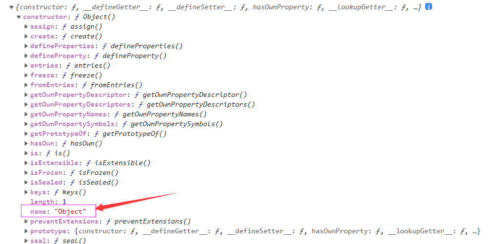

### 判断数据类型的方法

#### typeof

> typeof 可以用来检测基本数据类型和funtion类型的检测。`除了null、数组、对象`

```js
console.log(typeof 1)//数字类型 number
console.log(typeof '1')//字符串 string
console.log(typeof true)//布尔值 boolean
console.log(typeof null)//object
console.log(typeof undefined)//undefined
console.log(typeof 3n) //bigint
console.log(typeof Symbol(2))//symbol

const arr = [1]
console.log(typeof arr)//object

const obj={a:1}
console.log(typeof obj)//object

const fn = function(){}
console.log(typeof fn)//function

const day = new Date()
console.log(typeof day)//object
```
`typeof``对于null，数组，对象，日期的检测返回的都是object`。数组和对象好理解，都是对象形式返回的自然是object。但是对于null，是因为null在编译时，转为二进制则表示全为0，如果前三个均为0，js就会把它当作是对象，这是js早期遗留下来的bug。

### instanceof

1、instanceof用来判断A是否为B的实例，`但不能判断一个对象实例属于什么类型`。判断对象类型，不能判断基本类型

2、检测的是原型，一直找到原型链的顶端Object.prototype为止。如果没有，则返回null

```js
[] instanceof Array; // true
[] instanceof Object; // true
new Date() instanceof Date;//true
new Date() instanceof Object;//true
new Function() instanceof Function;//true
new Function() instanceof Object//true
function Person() {};
const person = new Person();

person instanceof Person; // true
person instanceof Object; // true
```

上图，因为[]的原型指向Array.prototype，间接指向Object.prototype, 因此 [] instanceof Array 返回true， [] instanceof Object 也返回true。同样的Date()、Function()都指向object.prototype，

person是Person的实例，所以`person instanceof Person`为true，同样的Person和Object是原型链的关系，因此`person instanceof Object`也为true

`特殊的null`

```js
null instanceof Object//false
typeof null=='object'//true
null instanceof null//报错
```

首先null数据类型和Object不是一个数据类型，null值并不是以Object为原型创建出来的。所以`null instanceof Object`为false

null数据类型可以表示为不存在的对象的占位符。所以执行`typeof null`为object，

null数据类型是没有原型的，因此`null instanceof null`会报错
### constructor

constructor是原型prototype的一个属性，可以通过constructor来访问它的构造函数。

缺点：`constructor不能用来检测null和undefined这两种数据类型，因为这两种数据类型没有constructor`

```js
const obj = {}
console.log(obj.__proto__)
console.log(obj.constructor)//ƒ Object() { [native code] }
console.log(obj.constructor.name)//Object
```


```js
console.log({}.constructor==Object)//true
console.log([].constructor==Array)//true
console.log([].constructor==Object)//false
console.log(''.constructor==String)//true
console.log((1).constructor==Number)//true
console.log(true.constructor==Boolean)//true
console.log(new Date().constructor==Date)//true
console.log(new Function().constructor==Function)//true
console.log(null.constructor)//Cannot read properties of null (reading 'constructor') 报错
console.log(undefined.constructor)//Cannot read properties of undefined (reading 'constructor') 报错
```

数据的prototype可以被重写，原有的constructor会丢失。为了规范开发，在重写对象原型时一般都需要重新给 constructor 赋值，以保证对象实例的类型不被篡改。

### toString()方法

在前面介绍数据类型转换或者对象自身的属性和方法的时候，除了`null`和`undefined`之外所有的数据类型都有toString()方法，返回的是对象的类型字符串。我们可以利用结果值来检测数据类型。

toString() 是 Object 的原型方法，调用该方法，默认返回当前对象的 [[Class]] 。这是一个内部属性，其格式为 [object Xxx] ，其中 Xxx 就是对象的类型。

实例对象有可能会自定义toString方法，会覆盖Object.prototype.toString，所以在使用时，最好加上call。

```js
Object.prototype.toString.call('') ;   // [object String]
Object.prototype.toString.call(1) ;    // [object Number]
Object.prototype.toString.call(true) ; // [object Boolean]
Object.prototype.toString.call(Symbol()); //[object Symbol]
Object.prototype.toString.call(undefined) ; // [object Undefined]
Object.prototype.toString.call(null) ; // [object Null]
Object.prototype.toString.call(new Function()) ; // [object Function]
Object.prototype.toString.call(new Date()) ; // [object Date]
Object.prototype.toString.call([]) ; // [object Array]
Object.prototype.toString.call({}) ; // [[object Object]
Object.prototype.toString.call(new RegExp()) ; // [object RegExp]
Object.prototype.toString.call(new Error()) ; // [object Error]
Object.prototype.toString.call(document) ; // [object HTMLDocument]
Object.prototype.toString.call(window) ; //[object global] window 是全局对象 global 的引用
```
 使用toString()方法可以完美的检测数据类型。推荐使用。

 ### 其他方法

 #### Array.isArray()——判断是不是数组

 判断一个变量是不是数组，除了上面的instanceof/constructor/toString()方法,还有一个es6出来的新方法：Array.isArray()

Array.isArray()返回true或false。

```js
console.log(Array.isArray([1,2])) //true
console.log(Array.isArray(2)) //false
```

#### 判断是不是空数组

判断是不是空数组，可以有`JSON.stringify()`方法，`length`方法等

```js
console.log(JSON.stringify(arr)=='[]')//true

console.log(!arr.length)//true
```

### 判断是不是空对象

判断是不是空对象，可以用`JSON.stringify()`,`Object.keys()`,循环等

```js
var obj={}
console.log(JSON.stringify(obj)=='{}')//true

console.log(Object.keys(obj).length==0)//true

var isEmptyObj = function(){
  for(var i in obj){
    return false
  }
  return true
}
console.log(isEmptyObj())//true
```

### 判断一个数据是不是NaN

NaN：不是一个数字但属于数字类型。而且不等于自身

```js
let a=NaN
console.log(a==a)//false，自身不等于自己，那就是NaN

// 使用Object.is
console.log(1,NaN)//false
console.log(NaN,NaN)//true
```


